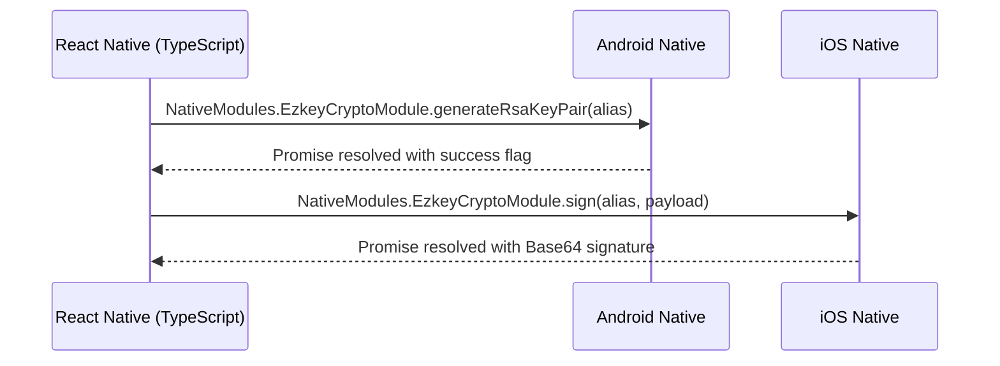

<!--
  Ezkey - Open Source MFA/Passkey Alternative
  Copyright (c) 2025 Ezkey contributors
  Licensed under the MIT License. See LICENSE file in the project root for full license information.
-->

# Native Modules Overview

> Reference guide for Ezkey Mobile native integrations and their interaction with the JavaScript runtime.

## Modules at a Glance

| Module | Platform | Responsibility | Entry Point |
|--------|----------|----------------|-------------|
| `EzkeyCryptoModule` | Android (Kotlin) | RSA key pair lifecycle (generate, read, sign, delete) | `android/app/src/main/java/com/ezkeymobile/crypto/EzkeyCryptoModule.kt` |
| `EzkeyCryptoModule` | iOS (Swift) | Secure Enclave/Keychain-backed RSA operations | `ios/EzkeyMobile/Crypto/EzkeyCryptoModule.swift` |
| `EzkeyCryptoPackage` | Android (Kotlin) | Registers crypto module with React Native | `android/app/src/main/java/com/ezkeymobile/crypto/EzkeyCryptoPackage.kt` |
| `EzkeyQrFrameProcessorPlugin` | Android (Kotlin) | Decodes QR payloads via Vision Camera frame processors | `android/app/src/main/java/com/ezkeymobile/qr/EzkeyQrFrameProcessorPlugin.kt` |
| `EzkeyCryptoModuleBridge` | iOS (Objective-C) | Exposes Swift crypto module to React Native bridge | `ios/EzkeyMobile/Crypto/EzkeyCryptoModuleBridge.m` |

## Communication Flow

- JavaScript calls are issued through `app/services/crypto/nativeCrypto.ts`.
- Android uses Android Keystore (`AndroidKeyStore`) with StrongBox when supported; iOS leverages Secure Enclave with `.rsaSignatureMessagePKCS1v15SHA256`.
- QR scanning is Android-only today; iOS uses JS-based fallbacks until a Swift counterpart is implemented.

## Security Alignment

- RSA configuration matches [`docs/CRYPTO.md`](../../docs/CRYPTO.md): 2048-bit keys, SHA256withRSA signatures, Base64 transport.
- Enrollment and authentication payloads follow [`docs/features/AUTH_SECURITY.md`](../../docs/features/AUTH_SECURITY.md) to prevent proof-token reuse and enumeration.
- Native modules never persist sensitive payloads; only aliases and deterministic metadata are stored, with private keys remaining inside the platform keystore.
- Error messages are intentionally generic in production to avoid leaking device state; detailed logs are limited to development builds.

## iOS Documentation Guidance

- Adopt Swift Quick Help comments (`///`) for public symbols, referencing the same docs noted above.
- Include `@since 2025` and mention security constraints wherever signatures or tokens are manipulated.
- Objective-C bridge files should contain header comments that mirror the Kotlin equivalents for parity.

## Testing Notes

- Android modules can be unit-tested with Robolectric or instrumentation tests targeting the Keystore API.
- iOS modules should include XCTests verifying key generation and signing round trips using the Bridge module.
- Use Detox or end-to-end tests to validate the JavaScript ↔ native contract during enrollment and pending-auth flows.

@since 2025

