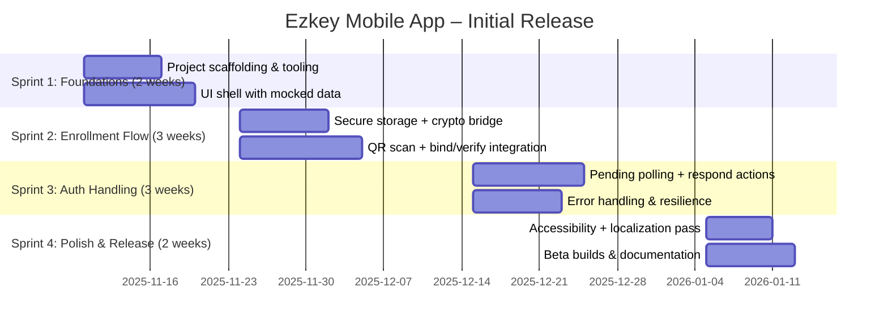

# Ezkey Mobile App – Delivery Plan

## 1. Objectives
- Deliver a production-ready React Native app that supports Ezkey enrollment and authentication flows.
- Showcase a polished end-user experience for demos and pilot customers.
- Establish a maintainable codebase with automated tests, release scripts, and documentation.

## 2. Milestones & Timeline (indicative)

## 3. Workstreams

- **Product & Design**: User flows, UI kit, copy, accessibility review.
- **Mobile Engineering**: React Native implementation, native modules, testing, CI/CD.
- **Backend Support**: Sandbox environment upkeep, API contract clarifications, rate limit tuning.
- **DevOps & Release**: Build pipelines, beta distribution, release checklists.

## 4. Backlog (MVP Scope)

| Priority | Item | Owner | Status |
|----------|------|-------|--------|
| P0 | Project bootstrap (RN 0.76+, TypeScript, lint/test tooling) | Mobile | Planned |
| P0 | Secure storage abstraction (Keychain/Keystore) | Mobile | Planned |
| P0 | Enrollment QR scanning flow (permission, scanner, bind, verify) | Mobile | Planned |
| P0 | Local persistence layer (AsyncStorage/SQLite mixin) | Mobile | Planned |
| P0 | Pending auth polling + respond | Mobile | Planned |
| P0 | Error and empty state UX | Product | Planned |
| P1 | Base URL override (env-configurable without UI switcher) | Mobile | Planned |
| P1 | Toast-based error feedback (offline/backend unavailable) | Mobile | Planned |
| P2 | History view placeholder & future API contract | Product | Backlog |
| P2 | Manual enrollment entry (QR fallback) | Mobile | Backlog |

## 5. Environment Strategy

- **Primary base URL**: `https://goateed-katalina-monsoonal.ngrok-free.dev`
- **Configuration**: `.env` per developer; CI injects via secrets.
- **Certificates**: Trust default ngrok cert for MVP, plan TLS pinning later.
- **Test Data**: Create enrollments/auth attempts manually via existing backend tools as needed (single maintainer workflow).

## 6. Quality Gates

- Unit tests (>70% coverage for services/hooks).
- Component snapshot + interaction tests for key screens (Home, Enrollment detail, Pending auth).
- Detox happy path (enrollment + approve) on iOS simulator and Android emulator.
- Manual QA checklist covering permissions, offline handling, error states.
- Security review of key storage implementation.

## 7. Risks & Mitigations

| Risk | Impact | Mitigation |
|------|--------|------------|
| Changing API contract | High | Generate TS types from OpenAPI; add CI smoke tests against sandbox. |
| Secure storage limitations on older Android devices | Medium | Provide fallback encrypted storage with warning, document unsupported cases. |
| ngrok downtime | Medium | Add config to switch to self-hosted tunnel quickly; document fallback. |
| QR format drift | Medium | Add schema validation, maintain compatibility helper mirroring Kotlin demo. |
| Team unfamiliarity with RN 0.76 new architecture | Low | Schedule knowledge share, leverage RN docs and upgrade helper. |

## 8. Deliverables Checklist

- [ ] PRD, README, plan documents committed (initial version)
- [ ] Wireframes + design tokens approved
- [ ] React Native project scaffolded with CI lint/test pipeline
- [ ] Enrollment flow implemented end-to-end (iOS + Android)
- [ ] Pending auth approval/denial flow implemented
- [ ] Comprehensive error handling and English-only copy strings
- [ ] Beta builds distributed (TestFlight/Internal testing)
- [ ] Release notes, store assets stub, support playbook drafted

## 9. Communication & Reporting

- Solo maintainer cadence: capture progress notes directly in repo commits/issues as needed.
- Decision log appended to this file as major choices are locked in.

---
_Last updated: 2025-11-05 by Ezkey Mobile Squad_
