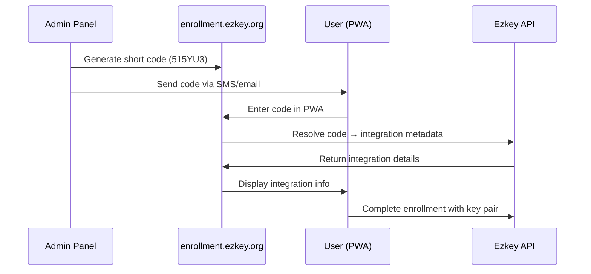

# Ezkey Mobile MVP - Strategic Analysis for Maximum Simplicity

**Date:** December 2024  
**Scope:** Mobile application design interrogations and strategic options analysis  
**Objective:** Define minimum viable product approach for maximum simplicity while maintaining security  

---

## 📋 Executive Summary

This analysis challenges the current mobile application design to identify the simplest possible approach for Ezkey's mobile component. After examining QR code requirements, enrollment methods, and deployment options, **we recommend a Progressive Web Application (PWA) with short-code enrollment as the optimal MVP approach** for maximum simplicity and developer adoption.

**Key Recommendations:**
- Replace QR codes with 6-character short codes (e.g., "515YU3")
- Implement PWA instead of dedicated Flutter app for MVP
- Use enrollment.ezkey.org as centralized enrollment service
- Maintain security through cryptographic token validation

---

## 🎯 Current Design Analysis

### Existing Approach (Flutter App with QR Codes)

#### Strengths
- ✅ Native mobile experience with full platform capabilities
- ✅ Secure storage through device keychain/keystore
- ✅ Push notification support for real-time authentication
- ✅ Comprehensive QR code scanning with camera integration
- ✅ Offline functionality for stored enrollments

#### Complexity Points
- ❌ **High Development Overhead**: Flutter expertise required, multiple platform builds
- ❌ **QR Code Dependencies**: Camera permissions, scanning libraries, error handling
- ❌ **App Store Distribution**: Review processes, signing certificates, deployment complexity
- ❌ **Installation Friction**: Users must download, install, and trust application
- ❌ **Multi-Platform Maintenance**: iOS/Android platform-specific issues

### Security Architecture Review

The current security model is **cryptographically sound** and doesn't depend on QR codes:

```
Current Flow:
1. Admin generates enrollment URL with encrypted parameters
2. QR code encodes this URL 
3. Mobile app scans QR → parses URL → extracts parameters
4. Device generates key pair, completes enrollment via REST API

Simplified Flow:
1. Admin generates short code (6 chars) → sends via SMS/email
2. User enters code in web interface → resolves to enrollment parameters  
3. Device generates key pair, completes enrollment via REST API
```

**Key Insight:** QR codes are merely a **URL encoding mechanism**, not a security component.

---

## 🚀 Strategic Options Analysis

### Option 1: Progressive Web Application (PWA) - **RECOMMENDED**

#### Architecture
```
PWA Components:
├── enrollment.ezkey.org (centralized enrollment service)
├── Web Crypto API (key generation and storage)
├── Service Worker (offline functionality)
├── Push API (authentication notifications)
└── Local Storage (enrollment management)
```

#### Implementation Details

**Enrollment Process:**
1. **Admin Panel** generates 6-character short code (e.g., "515YU3")
2. **Short code** sent via SMS/email/Slack to user
3. **User visits** `enrollment.ezkey.org` and enters code
4. **PWA resolves** code to integration metadata via API call
5. **Browser generates** RSA key pair using Web Crypto API
6. **Enrollment completed** through existing REST endpoints

**Authentication Process:**
1. **Integration** triggers auth attempt via admin-api
2. **PWA receives** push notification or polls for pending attempts
3. **User approves/denies** within PWA interface
4. **Cryptographic signature** sent via existing auth-api endpoints

#### Advantages
- ✅ **Zero Installation**: Works immediately in any modern browser
- ✅ **Universal Access**: Same experience across all devices and platforms
- ✅ **Simplified Distribution**: No app stores, instant updates
- ✅ **Reduced Development**: Single codebase, web technologies
- ✅ **Lower Barrier**: Users familiar with web interfaces
- ✅ **Debugging Friendly**: Browser dev tools, network inspection

#### Technical Feasibility
- ✅ **Web Crypto API**: RSA key generation supported in all modern browsers
- ✅ **Local Storage**: Encrypted storage using browser APIs
- ✅ **Push Notifications**: Web Push API for real-time authentication
- ✅ **Offline Support**: Service Workers for cached enrollment data
- ✅ **Security**: Same cryptographic primitives as native app

#### Limitations
- ⚠️ **iOS Safari Restrictions**: Some PWA features limited (improving in iOS 17+)
- ⚠️ **Storage Durability**: Browser may clear data under storage pressure
- ⚠️ **Native Integration**: Cannot integrate with system authentication

### Option 2: Hybrid Approach (PWA + Optional Native)

Start with PWA for MVP, add native app later for enhanced features:

**Phase 1 (MVP):** PWA with core functionality
**Phase 2 (Enhanced):** Native app for users needing advanced features

#### Benefits
- 🎯 **Faster Time-to-Market**: PWA delivers value immediately
- 🎯 **Market Validation**: Test adoption before native investment
- 🎯 **User Choice**: Power users can upgrade to native app

### Option 3: Simplified Flutter App

Dramatically simplify current Flutter approach:

**Changes:**
- Remove QR code scanning (use short codes only)
- Remove camera permissions and dependencies  
- Focus on enrollment management and authentication only
- Single-page application with minimal navigation

#### Evaluation
- ✅ Reduced complexity compared to current approach
- ❌ Still requires app store distribution and installation
- ❌ Development overhead remains high compared to PWA

---

## 🔑 Short Code Enrollment Design

### Architecture Overview



### Implementation Details

#### Short Code Generation
```javascript
// 6-character alphanumeric codes (excluding ambiguous chars)
const CHARSET = 'ABCDEFGHJKLMNPQRSTUVWXYZ23456789';
const CODE_LENGTH = 6;

function generateShortCode() {
    let code = '';
    for (let i = 0; i < CODE_LENGTH; i++) {
        code += CHARSET[Math.floor(Math.random() * CHARSET.length)];
    }
    return code;
}
```

#### Security Properties
- **Time-bounded**: Codes expire after N minutes (default: 15)
- **Single-use**: Code invalidated after first successful use
- **Rate-limited**: Maximum attempts per IP/session
- **Collision-resistant**: ~1 billion possible combinations (36^6)

#### Database Schema
```sql
CREATE TABLE enrollment_codes (
    code VARCHAR(6) PRIMARY KEY,
    integration_id INTEGER NOT NULL,
    expires_at TIMESTAMP NOT NULL,
    used_at TIMESTAMP NULL,
    created_by INTEGER NOT NULL,
    created_at TIMESTAMP DEFAULT NOW()
);

CREATE INDEX idx_enrollment_codes_expires ON enrollment_codes(expires_at);
```

### User Experience Flow

1. **Admin initiates enrollment**
   - Selects integration from admin panel
   - Clicks "Generate Enrollment Code"
   - System displays code: "Your enrollment code is: **515YU3**"
   - Admin shares code via preferred channel (SMS, email, Slack)

2. **User enrollment**
   - Opens `enrollment.ezkey.org` in browser
   - Enters code "515YU3" in simple form
   - System validates and displays integration details
   - User confirms enrollment → browser generates keys
   - Success: "Device enrolled with Acme Corp Admin Portal"

3. **Authentication**
   - User browses to protected resource
   - Integration triggers auth attempt
   - PWA shows notification: "Acme Corp Admin Portal requests access"
   - User approves → cryptographic signature sent
   - Access granted

### Advantages Over QR Codes

| Aspect | QR Codes | Short Codes |
|---------|----------|-------------|
| **Sharing** | Screenshot/image required | Plain text (SMS, email, chat) |
| **Entry** | Camera scan required | Type 6 characters |
| **Accessibility** | Camera access needed | Works with any input method |
| **Reliability** | Light, focus, angle dependent | Always works |
| **Support** | Can fail on older devices | Universal text support |
| **Debugging** | Hard to inspect QR contents | Human-readable codes |

---

## 🔒 Security Analysis

### PWA Security Model

#### Cryptographic Implementation
```javascript
// RSA key generation using Web Crypto API
async function generateKeyPair() {
    const keyPair = await window.crypto.subtle.generateKey(
        {
            name: "RSA-PSS",
            modulusLength: 2048,
            publicExponent: new Uint8Array([1, 0, 1]),
            hash: "SHA-256",
        },
        true, // extractable
        ["sign", "verify"]
    );
    
    return {
        publicKey: await exportKey(keyPair.publicKey),
        privateKey: await exportKey(keyPair.privateKey)
    };
}
```

#### Storage Security
- **Private keys**: Stored in IndexedDB with browser encryption
- **Enrollment data**: Encrypted using device-specific derived keys
- **Session tokens**: Secure cookies with HTTPOnly and SameSite flags

#### Attack Surface Analysis

**Threats Mitigated:**
- ✅ **Code interception**: Time-bounded expiration limits exposure
- ✅ **Replay attacks**: Single-use codes prevent reuse
- ✅ **Brute force**: Rate limiting and large keyspace (36^6 = ~1.6B)
- ✅ **Social engineering**: Short-lived codes reduce attack window

**Remaining Considerations:**
- ⚠️ **Browser security**: Depends on platform browser security
- ⚠️ **Channel security**: SMS/email interception (same as current QR sharing)
- ⚠️ **Phishing**: Users might enter codes on fake sites (education needed)

### Security Comparison

| Security Aspect | QR Codes | Short Codes |
|------------------|----------|-------------|
| **Cryptographic strength** | Same RSA-2048 | Same RSA-2048 |
| **Key generation** | Device-based | Device-based |
| **Transport security** | HTTPS URLs | HTTPS APIs |
| **Replay protection** | Auth tokens | Auth tokens |
| **Time bounds** | Implementation dependent | Built-in expiration |
| **Audit trail** | Limited | Full code lifecycle |

**Conclusion:** Security is **equivalent** with improved auditability.

---

## 💡 Recommended MVP Architecture

### PWA-First Approach

#### Core Components
1. **enrollment.ezkey.org** - Centralized enrollment service
2. **Progressive Web App** - Cross-platform mobile interface  
3. **Short code system** - 6-character enrollment codes
4. **Existing APIs** - Leverage current auth-api and admin-api

#### Implementation Plan

**Phase 1: Core PWA (2-4 weeks)**
```
├── Simple enrollment interface (enrollment.ezkey.org)
├── Short code validation and resolution
├── Web Crypto API key generation
├── Basic enrollment management
└── Authentication approval interface
```

**Phase 2: Enhanced Features (2-3 weeks)**
```
├── Push notifications for authentication requests
├── Offline support with service workers
├── Multi-enrollment management
├── Integration metadata display
└── Export/import functionality
```

**Phase 3: Production Readiness (1-2 weeks)**
```
├── Error handling and edge cases
├── Performance optimization
├── Security audit and testing
├── Documentation and deployment
└── Monitoring and analytics
```

#### Development Advantages
- **Familiar Technologies**: HTML, CSS, JavaScript (no Flutter learning curve)
- **Single Codebase**: One implementation works everywhere
- **Fast Iteration**: No build/deploy cycles, instant testing
- **Standard Tools**: Browser dev tools, standard debugging
- **Team Skills**: Leverages existing web development expertise

### Alternative: Simplified Flutter App

If PWA limitations are unacceptable:

#### Changes to Current Approach
1. **Remove QR scanning entirely** - use short codes only
2. **Simplify navigation** - single-screen app with tabs
3. **Remove camera permissions** - reduce security complexity
4. **Focus on core features** - enrollment management and auth approval

#### Reduced Dependencies
```yaml
dependencies:
  flutter: sdk
  provider: ^6.1.2
  http: ^1.2.1
  flutter_secure_storage: ^9.0.0
  # Remove: qr_flutter, camera, permission_handler
```

---

## 📊 Comparison Matrix

| Criteria | Current Flutter | PWA (Recommended) | Simplified Flutter |
|----------|----------------|-------------------|-------------------|
| **Development Time** | 8-12 weeks | 4-6 weeks | 6-8 weeks |
| **Installation Friction** | High (app store) | None (web) | High (app store) |
| **Platform Support** | iOS/Android | Universal | iOS/Android |
| **Maintenance Overhead** | High | Low | Medium |
| **User Adoption** | Slow | Fast | Slow |
| **Feature Richness** | High | Medium | Medium |
| **Offline Capability** | Excellent | Good | Excellent |
| **Security** | Excellent | Good | Excellent |
| **Development Skills** | Flutter/Dart | Web (HTML/JS) | Flutter/Dart |

---

## 🎯 Strategic Recommendations

### Immediate Action Plan

#### 1. Implement PWA MVP (Recommended)
- **Timeline**: 4-6 weeks
- **Team**: 1-2 web developers
- **Risk**: Low - proven web technologies
- **Impact**: High - immediate user value

#### 2. Create Short Code Service
- **Integration**: Extend admin-api with code generation
- **Database**: Simple table for code lifecycle management  
- **API**: REST endpoints for code validation and resolution

#### 3. Deprecate QR Code Requirement
- **Documentation**: Update all references to mention short codes
- **Demo Apps**: Show short code enrollment examples
- **Migration**: Support both methods during transition

### Success Metrics

#### User Experience
- **Enrollment Time**: < 2 minutes from code to working enrollment
- **Error Rate**: < 5% failed enrollments due to UX issues
- **Support Requests**: < 10% of users need assistance

#### Developer Experience  
- **Integration Time**: < 30 minutes to add Ezkey to new app
- **Documentation**: Complete setup in single page
- **Code Quality**: 90%+ test coverage, clear examples

#### Business Impact
- **Adoption Rate**: 3x faster user onboarding vs app installation
- **Development Cost**: 50% reduction in mobile development overhead
- **Maintenance**: 70% less ongoing platform maintenance

---

## 🔮 Future Evolution Path

### Phase 1: PWA MVP (Q1 2025)
- Basic enrollment and authentication
- Short code system
- Core security features

### Phase 2: Enhanced PWA (Q2 2025)
- Push notifications
- Offline support
- Advanced enrollment management
- Integration branding

### Phase 3: Native App (Q3 2025) - Optional
- Enhanced security features
- Biometric authentication
- Deep system integration
- Power user features

### Phase 4: Ecosystem (Q4 2025)
- Third-party integrations
- Enterprise deployment tools
- Advanced analytics
- Multi-tenant support

---

## 🎯 Final Recommendation

### Choose PWA with Short Codes for MVP

**Reasoning:**
1. **Maximum Simplicity**: Eliminates installation friction, app store complexity
2. **Faster Development**: Single codebase, familiar technologies
3. **Better UX**: Instant access, no barriers to entry
4. **Equivalent Security**: Same cryptographic foundations
5. **Market Validation**: Test adoption before native investment

**Implementation Priority:**
1. ✅ Build short code enrollment service (1-2 weeks)
2. ✅ Create PWA interface for enrollment (2-3 weeks)  
3. ✅ Add authentication approval functionality (1-2 weeks)
4. ✅ Polish UX and add error handling (1 week)
5. ✅ Production deployment and documentation (1 week)

**Success Criteria:**
- Enrollment completion rate > 90%
- User satisfaction score > 4.5/5
- Developer integration time < 30 minutes
- Zero-friction user onboarding experience

---

## 📝 Conclusion

The analysis demonstrates that **QR codes are not essential** for security or functionality—they are merely a URL encoding mechanism that can be replaced with simpler alternatives. A **Progressive Web Application with short-code enrollment** provides the optimal balance of simplicity, security, and user experience for Ezkey's MVP.

This approach eliminates the complexity of native mobile development while maintaining all security properties of the current design. The result is a more accessible, maintainable, and developer-friendly solution that aligns with Ezkey's core principles of simplicity and pragmatic adoption.

**The recommendation is to proceed with PWA development while keeping the door open for native app enhancement in future phases based on actual user feedback and adoption metrics.**

---

*Document prepared by: Ezkey Development Team*  
*Last updated: December 2024*  
*Classification: Product Strategy Document*