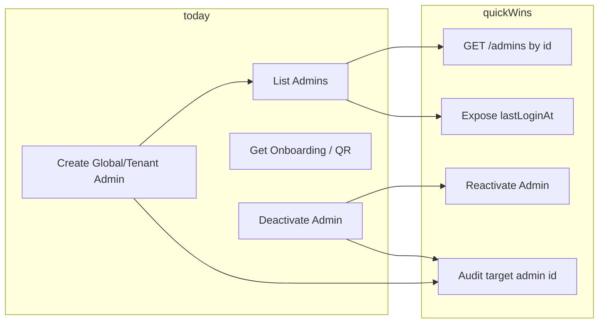

# Administrator Management: Gap Analysis, SOC 2 Alignment, and Quick Wins

## 1. Current State Summary

**Provisioning Admin capabilities (today):**

| Capability                 | Status | Notes                                                                                                                                                   |
| -------------------------- | ------ | ------------------------------------------------------------------------------------------------------------------------------------------------------- |
| Create Global Admin        | Yes    | `POST /api/v1/admins/global` (GlobalAdmin only), limits enforced                                                                                        |
| Create Tenant Admin        | Yes    | `POST /api/v1/admins/tenant` (GlobalAdmin or TenantAdmin for same tenant)                                                                               |
| List admins                | Yes    | `GET /api/v1/admins` with pagination, filters: `active`, `adminType`                                                                                    |
| Get onboarding credentials | Yes    | `GET /api/v1/admins/{id}/onboarding` (credentials separated from create response)                                                                       |
| Get QR code                | Yes    | `GET /api/v1/admins/{id}/onboarding/qrcode`                                                                                                             |
| Deactivate admin           | Yes    | `POST /api/v1/admins/{id}/deactivate` with optional `reason` (10–500 chars), tokens revoked, min global admin limit enforced, self-deactivation blocked |

**Audit:** `ADMIN_CREATED` and `ADMIN_DEACTIVATED` (success/failure) are logged in [AdminProvisioningController](ezkey-admin-api/src/main/java/org/ezkey/admin/controller/AdminProvisioningController.java); actor `adminId` and optional `reason` are stored. The **target** admin (e.g. deactivated admin id) is only in `eventDetails` as text, not as a structured field.

**Data model:** [EzkeyAdmin](ezkey-core/src/main/java/org/ezkey/integration/domain/entity/EzkeyAdmin.java) has `lastLoginAt`; it is **not** exposed in [AdminResponseDto](ezkey-admin-api/src/main/java/org/ezkey/admin/dto/response/AdminResponseDto.java) (list response).

---

## 2. Gaps vs Comparable Products (Angles morts)

Reference: IAM/MFA products (Okta, Auth0, Duo, Keycloak) and [AUDIT_LOG_ENRICHMENT_ANALYSIS.md](docs/AUDIT_LOG_ENRICHMENT_ANALYSIS.md) (event-centric, target entities).

**Likely blind spots:**

- **GET /api/v1/admins/{id}** — No single-admin fetch. List does not filter by id; UIs and automation often need “admin detail” (e.g. who was deactivated, profile view). **Quick win.**
- **Reactivate admin** — Only deactivate exists; comparable products allow reactivation (mistaken deactivation, re-onboarding). Reversible lifecycle improves operability. **Quick win** (set `active = true`, no token re-issue needed).
- **Last login in API** — `lastLoginAt` exists in DB but is not in list/detail responses. Access reviews and SOC 2 “discontinue access” often rely on “last activity”. **Quick win** (expose in list + any future GET by id).
- **Audit: target admin id** — For `ADMIN_CREATED` / `ADMIN_DEACTIVATED`, the “target” admin is only in `eventDetails`. No dedicated column (e.g. `target_admin_id`) for “all events affecting admin X” without parsing text. Aligns with [AUDIT_LOG_ENRICHMENT_ANALYSIS.md](docs/AUDIT_LOG_ENRICHMENT_ANALYSIS.md) (enrich with known context). **Quick win** if audit schema can accept an optional FK or equivalent.

**Not recommended for 80/20 (avoid accidental complexity):**

- Full “access review” workflow (periodic certification) — document as procedure first; automate later.
- Extra admin roles beyond Global / Tenant — current model suffices for most deployments.
- “Reason” on admin **creation** — optional; deactivation reason is the higher-value audit requirement.

---

## 3. SOC 2 Alignment (Admin Management)

Relevant criteria from [SOC2_PREPARATION.md](docs/SOC2_PREPARATION.md) (CC6, CC7):

| Criterion | Requirement                           | EZKey posture                                                                                                                                             | Gap / action                                                                                                          |
| --------- | ------------------------------------- | --------------------------------------------------------------------------------------------------------------------------------------------------------- | --------------------------------------------------------------------------------------------------------------------- |
| **CC6.1** | Logical access controls               | Role-based (GlobalAdmin / TenantAdmin), passwordless, tokens                                                                                              | OK                                                                                                                    |
| **CC6.2** | Authorize, modify, remove access      | Create + list + deactivate; tenant scoping for TenantAdmin                                                                                                | OK                                                                                                                    |
| **CC6.3** | Provision and deprovision credentials | Create admin (provision); deactivate revokes tokens (deprovision); onboarding credentials separate from create                                            | OK; optional: document “credentials issued once at create” in procedures                                              |
| **CC6.5** | Discontinue logical access            | Deactivate sets `active = false`, revokes all tokens, idempotent if already inactive                                                                      | OK                                                                                                                    |
| **CC7.2** | Monitor system components             | Audit: `ADMIN_LOGIN`, `ADMIN_LOGOUT`, `ADMIN_RECOVERY_USE`, `ADMIN_CREATED`, `ADMIN_DEACTIVATED`; retention (e.g. 90 days), optional reason on deactivate | OK; strengthen by exposing `lastLoginAt` and (if feasible) target admin id in audit for easier “who did what to whom” |

**Conclusion:** Admin lifecycle is well aligned with SOC 2 for provisioning and deprovisioning. Remaining improvements are **operability and audit usability** (GET by id, lastLoginAt, reactivate, target_admin_id) rather than missing controls.

---

## 4. Recommended Quick Wins (Pragmatic, 80/20)

- **GET /api/v1/admins/{id}**
Return single admin (same shape as list item). Authorization: GlobalAdmin any; TenantAdmin only own tenant. Enables detail UIs and “who is this admin” in audit context.
- **Expose `lastLoginAt`**
Add to [AdminResponseDto](ezkey-admin-api/src/main/java/org/ezkey/admin/dto/response/AdminResponseDto.java) (and to GET by id when added). Ensures “last activity” is visible for access reviews and procedures.
- **Reactivate admin**
`POST /api/v1/admins/{id}/activate` (GlobalAdmin only): set `active = true`. Idempotent if already active. No token re-creation; admin logs in again. Improves recoverability from mistaken deactivation.
- **Audit: target admin id for admin lifecycle events**
For `ADMIN_CREATED` and `ADMIN_DEACTIVATED`, store the created/deactivated admin id in a structured way (e.g. new column or existing extensible field) so “all events affecting admin X” is queryable without parsing `eventDetails`. Optional body in CREATE could reference “created admin id” similarly.
- **Documentation**
  - [ENDPOINT.md](docs/ENDPOINT.md): add GET /api/v1/admins/{id} and, if implemented, POST …/activate; document `lastLoginAt` in responses.
  - Procedures: “Admin provisioning and deprovisioning” (who can create/deactivate, use of reason, where to find audit events).

---

## 5. Out of Scope / Do Not Add (Avoid Complexity)

- **No** extra admin roles or custom permissions in this phase.
- **No** automated access review engine; keep “quarterly review” as a documented procedure using list + filters + audit log.
- **No** “reason” mandatory on create; keep optional reason on **deactivate** only.
- **No** change to passwordless model or token semantics for admins.

---

## 6. Architecture Snapshot (Admin Lifecycle)

---

## 7. Implementation Order (Suggested)

1. **GET /api/v1/admins/{id}** — Small, high value for UIs and operations.
2. **Expose `lastLoginAt`** in AdminResponseDto and in GET by id response.
3. **POST /api/v1/admins/{id}/activate** — Reversible deactivation.
4. **Audit enrichment** — Target admin id for ADMIN_CREATED / ADMIN_DEACTIVATED (schema + code).
5. **Docs** — ENDPOINT.md + short procedure for provisioning/deprovisioning and SOC 2.

All items stay developer-friendly, secure, and within the current security model without introducing new roles or heavy process.
