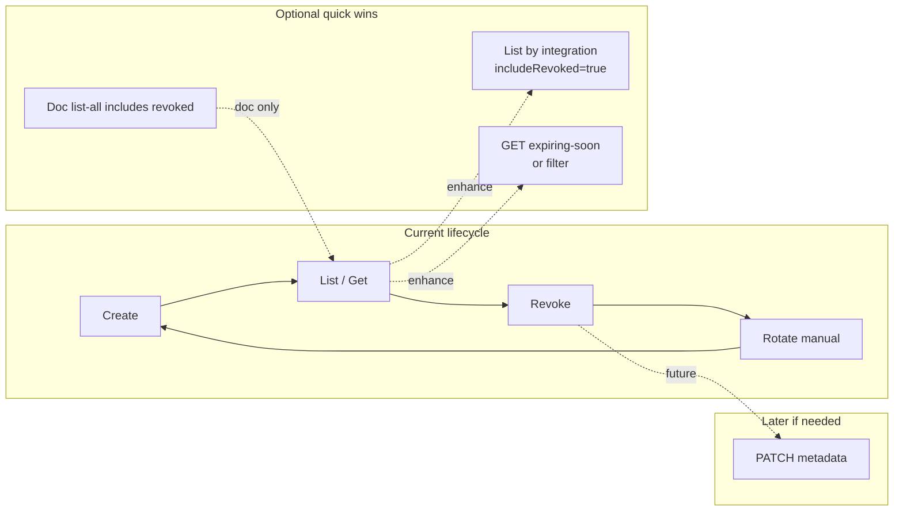

# API Key Lifecycle – Strategic Review and Improvement Plan

## 1. Current State Summary

### Operations (Admin API)

| Operation                 | Endpoint                                | Purpose                                                                                     |
| ------------------------- | --------------------------------------- | ------------------------------------------------------------------------------------------- |
| **Create**                | `POST /api/v1/api-keys`                 | Generate key pair; secret shown once                                                        |
| **List (all)**            | `GET /api/v1/api-keys`                  | All keys for current admin (Global: all tenants; Tenant: own tenant) — **includes revoked** |
| **List (by integration)** | `GET /api/v1/api-keys/integration/{id}` | **Active keys only** for one integration                                                    |
| **Get**                   | `GET /api/v1/api-keys/{keyId}`          | Single key details (no secret)                                                              |
| **Revoke**                | `DELETE /api/v1/api-keys/{keyId}`       | Immediate revocation; optional `reason` (10–500 chars) for audit                            |

No **Update (PATCH)** and no **Reactivate**. Rotation is manual: create new key, deploy, then revoke old (documented zero-downtime flow; max 5 active keys per integration).

### Entity Attributes ([ApiKey.java](ezkey-core/src/main/java/org/ezkey/integration/domain/entity/ApiKey.java))

- **Identity / link**: `apiKeyId`, `integration`, `integrationKey`, `secretKeyHash`
- **Metadata**: `description`, `createdByAdmin`, `createdAt`
- **Security**: `expiresAt`, `ipWhitelist`, `active`
- **Usage / audit**: `lastUsedAt`, `revokedAt`, `revokedByAdmin`

All of these are already exposed in [ApiKeyResponseDto](ezkey-admin-api/src/main/java/org/ezkey/admin/dto/response/ApiKeyResponseDto.java) (except secret). Audit events: `API_KEY_CREATED`, `API_KEY_REVOKED`, `API_KEY_EXPIRED`, `API_KEY_AUTH_SUCCESS`, `API_KEY_AUTH_FAILED`, `API_KEY_IP_BLOCKED` ([EventType](ezkey-core/src/main/java/org/ezkey/audit/domain/EventType.java)).

### Relation to Other Entities

- **Integration**: One API key belongs to one Integration; multiple keys per integration (rotation). Consistent with M2M “application” identity.
- **Admin**: `createdByAdmin`, `revokedByAdmin` for full audit. Aligned with tenant scoping (Global vs Tenant admin) in [ApiKeyController](ezkey-admin-api/src/main/java/org/ezkey/admin/controller/ApiKeyController.java).
- **Enrollment**: No direct link. API keys authenticate the **integration** (backend app); enrollments are end-user devices. Separation is correct.

---

## 2. Benchmark: What the Market and Norms Expect

### Lifecycle Operations (typical)

- **Create** – present
- **List / Get** – present (list all + by integration + by id)
- **Revoke** – present (with reason in audit)
- **Rotate** – supported via create + revoke and limit of 5 active keys per integration
- **Update metadata** (description, expiry, IP) – **absent**; many vendors allow PATCH for non-secret attributes
- **Reactivate** – absent; most treat revoke as final (acceptable for SOC2 and simplicity)

### Attributes and Behaviours

- **Audit trail**: Created/revolved by, timestamps, reason on revoke – covered.
- **Expiration**: Optional `expiresAt`; cleanup job deactivates expired keys ([ApiKeyService](ezkey-core/src/main/java/org/ezkey/integration/service/ApiKeyService.java)).
- **IP restriction**: Optional `ipWhitelist` (CIDR).
- **Usage signal**: `lastUsedAt` updated on each successful auth – good for “stale key” detection.
- **“Expiring soon”**: Service has `findKeysExpiringSoon(days)` but **no API endpoint** exposes it; docs mention 30/7/1-day warnings.

### SOC2-Oriented Checklist

- Access control (admin-only management, tenant scoping): yes
- Audit of create/revoke with who/when/reason: yes
- Credential rotation capability: yes (manual flow + optional expiration)
- No reversible storage of secret: yes (BCrypt, show-once)
- Unchangeable audit trail: consistent with existing audit design

Conclusion: **Revoke-only (no reactivate) is sufficient** and aligned with common practice. The main open points are: (1) optional **update of metadata** vs explicit “immutable by design”, and (2) **visibility of revoked keys and “expiring soon”** for operations and compliance.

---

## 3. Gaps and Angles Morts

| Gap                                                    | Severity | Notes                                                                                                                                                                   |
| ------------------------------------------------------ | -------- | ----------------------------------------------------------------------------------------------------------------------------------------------------------------------- |
| **List by integration returns only active keys**       | Low      | Revoked keys for an integration are visible only via “list all” and client-side filter. For audit or rotation follow-up, “all keys for this integration” can be useful. |
| **No “expiring soon” in API**                          | Low      | Backend has `findKeysExpiringSoon(days)` but no endpoint. Clients can derive from `expiresAt`; an endpoint or filter would convenience dashboards and automation.       |
| **No PATCH for description / expiresAt / ipWhitelist** | Low      | Today: revoke + create to change. Alternative: document as intentional immutability (simpler model, stronger audit).                                                    |
| **Revoke reason optional**                             | None     | Reason is optional; when provided it is stored in audit. Acceptable; can recommend in docs to always send a reason.                                                     |

No critical missing operation for a Developer First, PME-oriented product. The combination with Integration, Admin, and Enrollment is coherent; no structural blind spots identified.

---

## 4. Recommendations

### 4.1 Keep As-Is (No Code Change)

- **No reactivate**: Revoke remains final; aligns with norms and SOC2 expectations.
- **Rotation**: Keep manual (create → deploy → revoke); already documented and supported by “max 5 active per integration”.
- **Attributes**: Current set is sufficient for operability and audit; no new attributes required for the stated goals.

### 4.2 Quick Wins (Minimal Complexity)

1. **List by integration including revoked (optional)**
  - Add query param: `GET /api/v1/api-keys/integration/{id}?includeRevoked=true`.
  - Default `false` (current behaviour: active only).
  - Enables “full history for this integration” without new endpoint.
  - Implementation: in [ApiKeyController](ezkey-admin-api/src/main/java/org/ezkey/admin/controller/ApiKeyController.java), branch on `includeRevoked` and call existing `findByIntegration_Id` when true, else `listActiveApiKeys`.
2. **Expose “expiring soon”**
  - Option A: Query param on list: e.g. `GET /api/v1/api-keys?expiringWithinDays=30` (and/or on `GET .../integration/{id}`) to filter keys with `expiresAt` in the next N days.
  - Option B: Dedicated endpoint `GET /api/v1/api-keys/expiring-soon?days=30` using existing [ApiKeyService.findKeysExpiringSoon(int)](ezkey-core/src/main/java/org/ezkey/integration/service/ApiKeyService.java).
  - Recommendation: Option B (single place, clear intent; reuse existing service).
3. **Document “list all” includes revoked**
  - In [API_KEYS_GUIDE.md](docs/API_KEYS_GUIDE.md) and [ENDPOINT.md](docs/ENDPOINT.md), state that `GET /api/v1/api-keys` returns all keys (active and revoked) for the admin’s scope; contrast with `GET /api/v1/api-keys/integration/{id}` (active only unless `includeRevoked=true`).

### 4.3 Optional (Later, If Value Proven)

- **PATCH for metadata**: If customers ask to change description/expiry/IP without revoking, add `PATCH /api/v1/api-keys/{keyId}` for these fields only (no secret change). Not required for SOC2 or current positioning; adds a small amount of complexity (validation, audit event “API_KEY_UPDATED”).
- **Stronger “reason” guidance**: In docs and possibly OpenAPI description, recommend always supplying a reason on revoke for SOC2 and incident review.

---

## 5. Summary Diagram

---

## 6. Conclusion

- **Cycle de vie**: Create, List, Get, Revoke + rotation manuelle couvrent les besoins opérationnels et les attentes courantes (y compris SOC2). Pas besoin d’ajouter une opération “reactivate”.
- **Attributs**: Les champs actuels de l’entité API Key et du DTO sont suffisants pour l’opérabilité, l’audit et le positionnement Developer First PME.
- **Cohérence**: La liaison Integration / Admin / Enrollment est claire et sans angle mort fonctionnel.
- **Quick wins recommandés**: (1) `includeRevoked=true` sur le list par intégration, (2) exposition de “expiring soon” (endpoint dédié ou paramètre de filtre), (3) documentation explicite du comportement de “list all” (inclut révoquées).
- **Complexité**: Rester minimal: pas de PATCH ni de réactivation tant que le besoin métier n’est pas démontré; garder le modèle simple et évolutif pour la suite.

