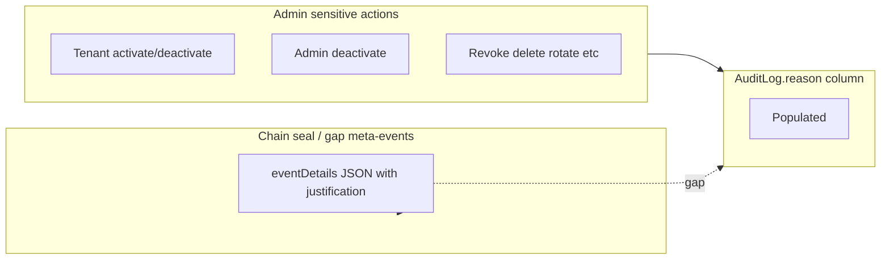

# Audit log “reason” consistency and Admin UI visibility

## Current state (verified in code)

### Dedicated `reason` column (normative target)

- Entity: `[ezkey-core/src/main/java/org/ezkey/audit/domain/entity/AuditLog.java](ezkey-core/src/main/java/org/ezkey/audit/domain/entity/AuditLog.java)` — column `reason` (500 chars), included in HMAC canonical form (field 15 per `[AuditHmacService](ezkey-core/src/main/java/org/ezkey/audit/integrity/AuditHmacService.java)`).
- API response: `[AuditLogResponseDto](ezkey-core/src/main/java/org/ezkey/audit/dto/AuditLogResponseDto.java)` includes `reason`; `[AuditLogMapper](ezkey-core/src/main/java/org/ezkey/audit/mapper/AuditLogMapper.java)` maps entity → DTO (same property names — no extra MapStruct work expected unless a mismatch appears in generated code).

### Where `reason` is populated (examples)

- Tenant activate/deactivate: `[TenantController](ezkey-admin-api/src/main/java/org/ezkey/admin/controller/TenantController.java)` passes `body.reason()` into `.reason(reason)`.
- Admin **deactivate**: `[AdminProvisioningController](ezkey-admin-api/src/main/java/org/ezkey/admin/controller/AdminProvisioningController.java)` passes optional `reason` query param into `.reason(reason)`.
- Other flows: API key revoke, enrollment delete/revoke/deactivate, integration delete, encryption key rotate, bulk enrollment ops — see `[AuditReasonPropagationTest](ezkey-admin-api/src/test/java/org/ezkey/admin/controller/AuditReasonPropagationTest.java)` and services/controllers using `.reason(`.

### Inconsistency A — Admin UI never shows `reason`

`[ezkey-admin-ui/src/pages/audit-logs.tsx](ezkey-admin-ui/src/pages/audit-logs.tsx)` — `AuditLogDetailDialog` renders `eventDetails`, `errorMessage`, IDs, etc., but **does not render `log.reason`**. That matches the QE finding: JSON from `GET /api/v1/audit-logs` includes `reason`, but operators cannot see it in the UI.

Optional follow-ups (same page): add a **Reason** column or tooltip on the paginated table (narrow layout risk); show reason in dashboard “Recent activity” only if you want parity there (currently `[dashboard.tsx](ezkey-admin-ui/src/pages/dashboard.tsx)` shows event/status/api only).

### Inconsistency B — `justification` inside `eventDetails` JSON vs `reason` column

`[AuditLifecycleService](ezkey-core/src/main/java/org/ezkey/audit/integrity/AuditLifecycleService.java)` builds meta–audit entries for **archive seal** and **gap declaration** with `eventDetails` JSON containing `"justification":"..."` but **does not set** `AuditLog.reason`. Operators searching or scanning the `reason` field will miss chain lifecycle justifications unless they read raw JSON in **Details**.

**Design choice to align normatively (recommended):** when creating those meta-entries, also set `.reason(request.justification())` so the same human text is in the dedicated column (and HMAC), while keeping structured fields in `eventDetails` for machine parsing. This is a small behavioral change: HMAC payload already includes `reason` (empty string if null); setting it should improve consistency without dropping JSON.

### Inconsistency C — Admin activate has no reason capture

- **Deactivate** accepts optional `reason` (query param) and logs it.
- **Activate** (`[activateAdmin](ezkey-admin-api/src/main/java/org/ezkey/admin/controller/AdminProvisioningController.java)`) logs success with `eventDetails("Admin ID: " + id)` only — **no `reason`** and no request parameter.

For symmetry with tenant activate/deactivate and admin deactivate, consider adding an optional `reason` (query param or small JSON body) with the same validation rules as other endpoints (`@Size(min = 10, max = 500)` when present), and pass it to `.reason(...)`.

### Inconsistency D — “reason” inside JSON `event_details` for system events

Examples: `[KeyRotationService](ezkey-core/src/main/java/org/ezkey/security/KeyRotationService.java)` uses `AuditDetailsBuilder` keys like `reason` **inside** structured `event_details` JSON. That is **not** the same as the top-level `reason` column (automated/system narrative vs admin-supplied justification). **Do not merge blindly** — document the distinction for operators (help text) or leave as-is for system events.

### API search / filtering

`[AuditLogController.getAuditLogs](ezkey-admin-api/src/main/java/org/ezkey/admin/controller/AuditLogController.java)` + `[AuditLogService.findByFilters](ezkey-core/src/main/java/org/ezkey/audit/service/AuditLogService.java)` support filters by event type, status, API, IDs, date range — **no** `reason` / full-text filter. If compliance needs “find entries whose justification contains X”, that is a **new** optional query param + JPA predicate (e.g. `LIKE` on `reason`, with index/perf note). Lower priority than UI + lifecycle alignment.

---

## Recommended implementation order

1. **Admin UI — show `reason`**
  - In `AuditLogDetailDialog`, add an `InfoRow` when `log.reason` is present (and i18n keys in `[ezkey-admin-ui/src/locales/en/audit-logs.json](ezkey-admin-ui/src/locales/en/audit-logs.json)` and `fr`).
  - Optionally add a compact column or “reason present” indicator in the table.
2. **Backend — lifecycle meta-entries**
  - In `AuditLifecycleService`, set `.reason(request.justification())` on the two `AuditLog.builder()` meta-entries (seal + gap), keeping existing `eventDetails` JSON unchanged for structured data.
3. **Backend — admin activate**
  - Add optional `reason` to `activateAdmin`, validate like other endpoints, log with `.reason(reason)`.
4. **Tests**
  - Extend or add unit/integration coverage: lifecycle meta-entry has `reason` set; admin activate with reason propagates to `AuditLog`.
  - UI: minimal test or manual QA checklist (Orval types may need regen by maintainer per OpenAPI workflow — **do not hand-edit** `[specs/](specs/)` per project rules).
5. **Optional later**
  - `GET /api/v1/audit-logs?reasonContains=` (or similar) + UI filter.
  - Product copy / help: explain admin `reason` vs system JSON `event_details`.

---

## Mermaid — data shape today vs target

Target: lifecycle flows also populate `columnReason` so one field is consistently used for human justification in the UI and in exports.
