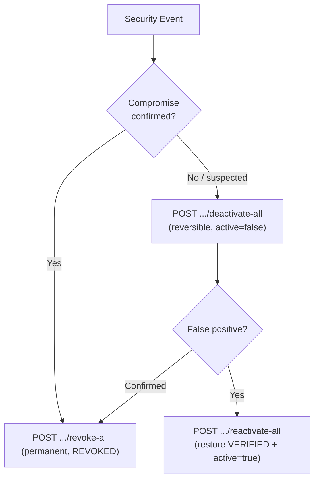

# Bulk Deactivate/Reactivate Enrollments

## Problem Summary

`revoke-all` is permanent. After it fires, every affected user must re-enroll from scratch. For precautionary lockdowns (unconfirmed threat, emergency maintenance), a reversible path is needed: `deactivate-all` / `reactivate-all`.

## Design




## Scope of Changes

### 1. `AdminAuditConstants.java`

Add 4 new constants (mirroring existing revoke-all pair):

- `ENROLLMENT_DEACTIVATE_ALL` = `"enrollment_deactivate_all"`
- `ENROLLMENT_DEACTIVATE_ALL_FAILED` = `"enrollment_deactivate_all_failed"`
- `ENROLLMENT_REACTIVATE_ALL` = `"enrollment_reactivate_all"`
- `ENROLLMENT_REACTIVATE_ALL_FAILED` = `"enrollment_reactivate_all_failed"`

### 2. `EnrollmentRevocationService.java`

Add two new `@Transactional` public methods, mirroring `revokeAllByIntegration()`:

`**deactivateAllByIntegration()**`

- Guard: throws `SystemIntegrationRevocationException` if `isSystemIntegration=true`
- Fetches `VERIFIED + active=true` enrollments (same query as revoke-all)
- For each: calls existing `deactivate()` logic (sets `active=false`, preserves `VERIFIED` status, sets `deactivatedAt`/`deactivatedByAdminId`, invalidates admin tokens)
- Self-enrollment: **skipped with warning** (same pattern as revoke-all)
- Audit: `EventType.ENROLLMENT_DEACTIVATED` / `ENROLLMENT_DEACTIVATE_ALL` with deactivated+skipped count

`**reactivateAllByIntegration()`**

- No system-integration guard needed (reactivation cannot cause lockout)
- Fetches `VERIFIED + active=false` enrollments (uses `findByIntegrationIdAndStatusAndActive(..., false)`)
- For each: calls existing `reactivate()` logic (sets `active=true`, clears `deactivatedAt`/`deactivatedByAdminId`)
- Self-enrollment: not a risk here — no skip needed
- Audit: `EventType.ENROLLMENT_REACTIVATED` / `ENROLLMENT_REACTIVATE_ALL` with reactivated count

### 3. `IntegrationController.java`

Add two new endpoints after `revokeAllEnrollments()`:

```
POST /api/v1/integrations/{id}/enrollments/deactivate-all
  ?reason (optional, max 500 chars) → 204 No Content

POST /api/v1/integrations/{id}/enrollments/reactivate-all
  ?reason (optional, max 500 chars) → 204 No Content
```

- Same access control as revoke-all: `accessControlService.canAccessIntegration(auth, id)`
- Same `ClientContext` extraction pattern
- `reason` is **optional** (reversible ops are lower severity; matches individual deactivate/reactivate behavior)

### 4. `EnrollmentExceptionHandler.java`

Verify `SystemIntegrationRevocationException` is already handled (it is — reuse for `deactivate-all`). No changes needed.

### 5. Tests

`**EnrollmentRevocationServiceTest.java`** — add test cases for:

- `deactivateAllByIntegration`: happy path (N deactivated, 1 skipped self-guard), system integration guard, empty list (no-op)
- `reactivateAllByIntegration`: happy path (N reactivated), empty list (no-op)

`**EnrollmentControllerAuditTest.java**` (or new focused test) — controller-level audit propagation for both bulk endpoints.

### 6. Postman — `EZ Key Integrations admin.postman_collection.json`

Add two new request objects in the `item` array, after `revoke all enrollments` and before `delete`:

`**deactivate all enrollments**`

- `POST {{base_url_admin_api}}/api/v1/integrations/:id/enrollments/deactivate-all?reason=Emergency+lockdown+-+threat+under+investigation`
- Test scripts: expect 204 (success), 403 (system integration guard or access denied), 404 (not found)

`**reactivate all enrollments**`

- `POST {{base_url_admin_api}}/api/v1/integrations/:id/enrollments/reactivate-all?reason=Threat+cleared+-+restoring+access`
- Test scripts: expect 204, 403, 404

## Files to Change

- `[ezkey-admin-api/src/main/java/org/ezkey/admin/constants/AdminAuditConstants.java](ezkey-admin-api/src/main/java/org/ezkey/admin/constants/AdminAuditConstants.java)`
- `[ezkey-admin-api/src/main/java/org/ezkey/admin/service/EnrollmentRevocationService.java](ezkey-admin-api/src/main/java/org/ezkey/admin/service/EnrollmentRevocationService.java)`
- `[ezkey-admin-api/src/main/java/org/ezkey/admin/controller/IntegrationController.java](ezkey-admin-api/src/main/java/org/ezkey/admin/controller/IntegrationController.java)`
- `[ezkey-admin-api/src/test/java/org/ezkey/admin/service/EnrollmentRevocationServiceTest.java](ezkey-admin-api/src/test/java/org/ezkey/admin/service/EnrollmentRevocationServiceTest.java)`
- `[postman/collections/v2.1/EZ Key Integrations admin.postman_collection.json](postman/collections/v2.1/EZ Key Integrations admin.postman_collection.json)`

## Behavioral Contract Summary


| Endpoint         | Target enrollments      | Effect                       | Reversible | Self-guard |
| ---------------- | ----------------------- | ---------------------------- | ---------- | ---------- |
| `revoke-all`     | VERIFIED + active=true  | → REVOKED, active=false      | No         | Skip       |
| `deactivate-all` | VERIFIED + active=true  | active=false (VERIFIED kept) | Yes        | Skip       |
| `reactivate-all` | VERIFIED + active=false | → active=true                | N/A        | Not needed |


