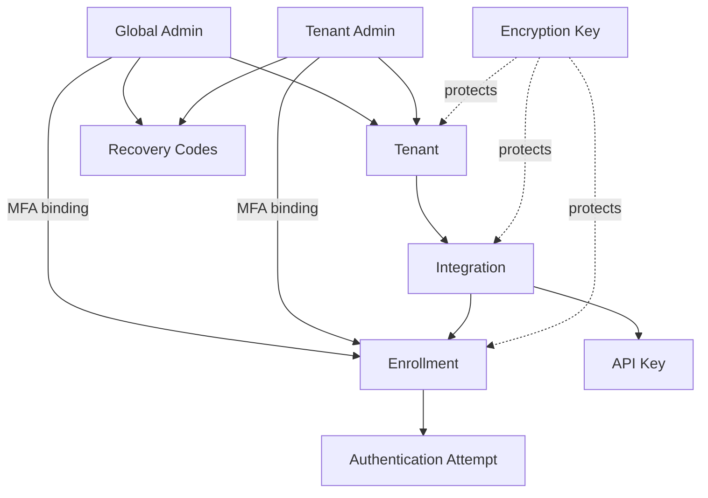
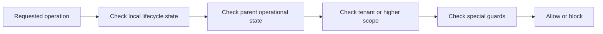

# Entity Lifecycle Governance - Transverse Design V1

## 1. Purpose and scope

This document is the first synthesis artifact for transverse lifecycle governance across Ezkey.

Its purpose is to:

- define a common lifecycle vocabulary,
- describe a target decision model that stays simple and operator-friendly,
- compare the target model with the current implementation and documentation,
- expose the remaining structural decisions explicitly,
- prepare phased backend, UI, audit, test, and documentation follow-up work.

This is intentionally not an implementation plan and not a per-attribute specification.
It is a product and domain design document meant to become the reference layer above later code-fix plans.

## 2. Design stance

The target model should remain aligned with Ezkey's product DNA:

- backend first,
- developer first,
- self-hostable,
- pragmatic and opinionated,
- simple enough to stay maintainable for a solo-led product with coding assistants.

The main operating stance recommended in this v1 is:

- prefer a small number of stable lifecycle actions,
- prefer finite-state transitions over ad hoc boolean accumulation,
- prefer local persistent state transitions plus derived runtime blocking over broad persistent cascades,
- prefer reversible actions during investigation,
- reserve irreversible actions for confirmed compromise or definitive removal,
- require reasons where they help reconstruct the real operational story, not for compliance theater.

## 3. Prioritized source set

### Canonical framing

- `.github/prompts/plan-ezkeyEntityLifecycleGovernance.prompt.md`
- `PRD.md`
- `README.md`

### Transverse documentation

- `docs/ENDPOINT.md`
- `docs/ADMIN_UI.md`
- `docs/ADMIN_PROVISIONING_DEPROVISIONING_PROCEDURE.md`
- `docs/API_KEYS_IMPLEMENTATION.md`
- `docs/API_KEYS_HOW_IT_WORKS.md`
- `docs/RECOVERY_CODES_LIFECYCLE_ANALYSIS.md`
- `docs/SPEC_ENCRYPTION_KEY_LIFECYCLE_STRATEGY.md`

### Curated plan corpus

- `plans/tenant_lifecycle_revision_plan_b3e5bdea.plan.md`
- `plans/enrollment_lifecycle_revocation_b476b2e1.plan.md`
- `plans/api_key_lifecycle_review_40070814.plan.md`
- `plans/key_lifecycle_strategy_e4debaae.plan.md`
- `plans/reason_ux_review_53ddefc2.plan.md`
- `plans/admin_management_gaps_and_soc2_36506da5.plan.md`
- `plans/system_tenant_semantic_rules_ce3ff3d1.plan.md`
- `plans/bulk_deactivate_reactivate_enrollments_8b203bfc.plan.md`
- `plans/integration_delete_constraint_ux_658880a2.plan.md`

### Implementation anchors

- `ezkey-admin-api/src/main/java/org/ezkey/admin/service/TenantService.java`
- `ezkey-admin-api/src/main/java/org/ezkey/admin/service/AdminProvisioningService.java`
- `ezkey-admin-api/src/main/java/org/ezkey/admin/service/EnrollmentRevocationService.java`
- `ezkey-admin-api/src/main/java/org/ezkey/admin/service/EnrollmentUpdateService.java`
- `ezkey-core/src/main/java/org/ezkey/integration/service/IntegrationService.java`
- `ezkey-core/src/main/java/org/ezkey/integration/service/ApiKeyService.java`
- `ezkey-core/src/main/java/org/ezkey/authattempt/service/AuthAttemptService.java`
- `ezkey-admin-ui/src/pages/tenant-detail.tsx`
- `ezkey-admin-ui/src/pages/integration-detail.tsx`
- `ezkey-admin-ui/src/pages/enrollment-detail.tsx`
- `ezkey-admin-ui/src/pages/api-key-detail.tsx`

## 4. Common vocabulary

The target model should stop reusing words loosely. Each term below should have one meaning.

| Term | Meaning | Reversible | Persistent state change | Runtime effect | Reason default |
| --- | --- | --- | --- | --- | --- |
| Create | Instantiate a new entity in a valid initial state | No | Yes | Makes future use possible | No |
| Activate | Transition an inactive but recoverable entity back to operational use | Yes | Yes | Restores eligibility for future operations | Optional |
| Deactivate | Reversible operator action that turns off operational use without destroying identity | Yes | Yes | Blocks future use while preserving history | Optional, but recommended for sensitive entities |
| Reactivate | Reverse a prior deactivation | Yes | Yes | Restores effective use | Optional |
| Revoke | Irreversible security action that permanently invalidates a credential or trust object | No | Yes | Immediately blocks future use; often should invalidate current sessions or tokens too | Required |
| Retire | Remove an entity from normal operational use while preserving historical identity and audit value | Usually no, but could be reopened only if explicitly supported | Yes | Blocks new use; historical references remain | Required or strongly recommended |
| Soft delete | Hide or logically remove an entity without physical deletion, for cleanup or operator error recovery | Potentially | Yes | Usually removed from active listings and operations | Conditional |
| Hard delete | Physical or near-physical final removal when the entity is disposable and safe to erase | No | Yes | Entity no longer exists | Required for sensitive or exceptional deletes |
| Expire | Automatic time-based transition driven by policy rather than direct operator intent | Usually no | Yes | Future use blocked after deadline | No at runtime; policy reason implicit |
| Runtime block | Effective inability to use an entity because an ancestor, dependency, or context is blocking it | Derived | No, unless separately materialized | Yes | Not applicable |

### Core distinction

Three layers must remain distinct throughout the model:

1. persistent lifecycle state,
2. effective operational capability,
3. UI-visible operator status.

These layers often correlate, but they must not be treated as synonyms.

## 5. Domain dependency view

> **Correction (April 2026):** The original diagram linked Recovery Codes to Enrollment (`E --> RC`).
> In the actual implementation, recovery codes are a property of the Admin entity, not of Enrollment.
> Regular user enrollments have no recovery codes. The diagram has been corrected to reflect this.

### Reading of the hierarchy

- Tenant is the main organizational parent.
- Integration is the main application and enrollment container.
- Enrollment and API Key are security credentials with different lifecycles and threat models.
- Authentication Attempt is not a durable operator-managed lifecycle object; it is an event object strongly constrained by parent state.
- Encryption Key is a platform protection asset, not a tenant child in the same sense as Integration.
- Recovery Codes are a break-glass mechanism attached to Admin accounts, independent of the enrollment lifecycle.

## 6. Target lifecycle model

### 6.1 Common design rule

The target design should aim for a simple finite-state discipline:

- when an entity truly has a lifecycle, prefer a small enum over growing boolean flags,
- when an entity only needs an operational guard, avoid inventing a new persisted state,
- when parent state should influence child behavior, prefer runtime eligibility checks before introducing persistent cascades.

### 6.2 Default stance on parent-child blocking

Recommended default:

- local transition on the acted-on entity,
- derived runtime block on dependent entities,
- no automatic persisted cascade unless the business meaning would otherwise become misleading or unsafe.

This favors simpler code, more predictable rollback, and clearer audit history.

### 6.3 Candidate unified action families

| Family | Typical entities | Notes |
| --- | --- | --- |
| Operational toggle | Tenant, Enrollment, possibly Admin | Reversible on/off semantics |
| Terminal trust invalidation | Enrollment, API Key, some admin access artifacts | Revocation is final |
| Decommissioning | Integration, Encryption Key, some disposable records | Usually retire before final delete |
| Cleanup removal | Disposable Integration, obsolete Enrollment, some generated artifacts | Only where operationally justified |

## 7. Entity-by-entity target decision matrix

### 7.1 Tenant

| Operation | Target rule | Rationale | Child impact |
| --- | --- | --- | --- |
| Create | Allowed | Core onboarding action | Creates new scope |
| Deactivate | Allowed except system tenant | Crisis stop, offboarding, temporary suspension | Default: runtime block on integrations, admins, enrollments, API keys; no broad persistent cascade |
| Reactivate | Allowed | Reverse mistaken or temporary stop | Restores effective use without child mutation |
| Revoke | Not applicable | Tenant is not a credential | None |
| Retire | Not applicable in Phase 1 | Deactivation covers offboarding; archival is a future concern | None |
| Delete | Not in Phase 1 | High blast radius, audit and legal implications; deactivation covers all current needs | Out of scope |

Decision (locked):

- keep tenant state simple: `active` boolean toggle,
- use tenant deactivation as a master organizational stop,
- runtime eligibility service handles all derived child blocking — no persistent cascade,
- no materialized child statuses in Phase 1,
- no soft delete concept, no hard delete in Phase 1.

### 7.2 Global Admin and Tenant Admin

| Operation | Target rule | Rationale | Notes |
| --- | --- | --- | --- |
| Create / provision | Allowed with role-specific constraints | Administrative onboarding | Already audit-sensitive |
| Deactivate | Allowed with safety guards | Temporary suspension or investigation | Should not silently violate minimum-admin safety rules |
| Reactivate | Allowed | Restore administrative function | Keep idempotent |
| Revoke | Via enrollment revocation, not identity destruction | Admin identity and admin MFA enrollment remain separated | Revoke the credential, preserve the identity |
| Delete | Not in Phase 1 | Dangerous for audit continuity; deactivation + enrollment revocation cover all operational needs | Out of scope |

Decision (locked):

- keep admin identity lifecycle separate from admin MFA enrollment lifecycle,
- treat enrollment revocation as the primary security-invalidating action,
- deactivation covers temporary suspension and investigation,
- no soft delete, no hard delete in Phase 1,
- preserve minimum-admin and system-tenant protections.

### 7.3 Integration

| Operation | Target rule | Rationale | Child impact |
| --- | --- | --- | --- |
| Create | Allowed | Standard setup action | Enables enrollments and API keys |
| Retire | Allowed and primary decommissioning action | Best fit for replaced, sunset, or phased-out applications | Blocks new operational use while keeping history |
| Delete | Allowed only after RETIRED + zero enrollments | Cleanup for disposable or mistaken integrations | Must block when enrollments still exist; reason required |

Decision (locked):

- lifecycle states: `ACTIVE` and `RETIRED` only — `INACTIVE` removed from `IntegrationLifecycleStatus` enum,
- no reversible deactivation for integrations; operators manage child entities (enrollments, API keys) directly,
- `retire` is the main non-destructive end-of-life action,
- `delete` is physical cleanup only, guarded by RETIRED status + zero enrollment count + required reason,
- no soft delete concept.

### 7.4 Enrollment

| Operation | Target rule | Rationale | Parent impact |
| --- | --- | --- | --- |
| Create | Allowed | Bind a user device or admin MFA device | Requires operational parent context |
| Deactivate | Allowed | Investigation, lost device, temporary hold | Blocks new auth attempts |
| Reactivate | Allowed only from deactivated verified state | Simple reversible path | Restores use |
| Revoke | Allowed and terminal | Confirmed compromise or permanent withdrawal | Immediately invalidates trust; reason required |
| Delete | Physical cleanup only | For mistaken or unused records that never became operationally meaningful | Guarded: no auth history + not linked as admin enrollment; reason required |

Decision (locked):

- enrollment is the clearest security-state finite-state machine in Ezkey,
- revoke and deactivate remain distinct operations with distinct semantics,
- no soft delete — delete is physical removal for error cleanup only,
- delete preconditions: zero auth attempts + not linked as any admin's MFA enrollment,
- reason required for revoke and delete.

### 7.5 Authentication Attempt

| Operation | Target rule | Rationale |
| --- | --- | --- |
| Create | Conditional | Only when all required parent checks pass |
| Deactivate / Reactivate / Revoke | Not applicable as operator-facing lifecycle actions | This is an event object, not a managed credential |
| Expire | Allowed and natural | Time-bounded request lifecycle |
| Delete | Not primary concept | Retention policy should govern this later, not operator workflow |

Recommendation:

- keep auth attempt lifecycle event-driven,
- apply runtime eligibility checks from enrollment, integration, and tenant.

### 7.6 API Key

| Operation | Target rule | Rationale |
| --- | --- | --- |
| Create | Allowed | Standard machine credential issuance |
| Deactivate | Usually no | Adds complexity without strong value if revoke plus rotation already covers the real cases |
| Reactivate | No | Same reason |
| Revoke | Allowed and terminal | Standard machine-credential security action |
| Expire | Allowed and policy-driven | Useful for rotation and stale credential control |
| Delete | No | Revoked keys preserved for audit; no cleanup value justifies deletion |

Decision (locked):

- API key lifecycle is intentionally asymmetric: create, revoke, expire — no reactivation, no delete,
- revoked keys are preserved permanently for audit traceability,
- reason required for revoke.

### 7.7 Encryption Key

| Operation | Target rule | Rationale |
| --- | --- | --- |
| Create | Allowed | Rotation and initialization |
| Activate / Primary promotion | Allowed | Determines write role |
| Disable | Allowed | Stops future use but may preserve historical decryption role depending on key strategy |
| Retire / Decommission | Recommended as explicit concept | Needed once zero-remaining-usage evidence exists |
| Hard delete | Delayed and highly guarded | Must follow verified drain and audit evidence |

Recommendation:

- maintain a two-layer model separating cryptographic role and operator lifecycle,
- decommission only after evidence that remaining protected data count is zero or otherwise safely controlled.

### 7.8 Recovery Codes

| Operation | Target rule | Rationale |
| --- | --- | --- |
| Generate | Allowed | Bootstrap or replacement action |
| Replace / rotate | Allowed | Common recovery management |
| Revoke | Implicit through replacement or explicit invalidation | Depends on final API surface |
| Reactivate | Usually no | Recovery codes are consumable emergency artifacts |
| Delete | Usually replace rather than delete | Simpler operator story |

Recommendation:

- keep recovery codes simple and mostly consumable,
- avoid over-modeling them with heavy lifecycle semantics unless operators truly need it.

## 8. Blast radius matrix

The model should document blast radius by separating persistent change from effective blockage.

| Parent action | Child persistent change by default | Child runtime impact by default | Recommendation |
| --- | --- | --- | --- |
| Tenant deactivated | None | Integrations, admin access, enrollments, API key use, and new writes may be blocked by runtime checks | Preferred default |
| Tenant reactivated | None | Effective use restored if child local state permits it | Preferred default |
| Integration retired | None on enrollments by default | New enrollment creation and auth traffic should be blocked according to integration operational rules | Preferred default |
| Enrollment revoked | Direct local change on enrollment only | Auth attempts blocked immediately; related admin sessions may need invalidation if this is an admin MFA enrollment | Preferred default |
| API key revoked | Direct local change on key only | M2M auth blocked immediately | Preferred default |
| Encryption key decommissioned | None on protected entities | New encryption writes move elsewhere; old data access depends on verified migration state | Domain-specific |

### Recommended enforcement shape

This repo should likely converge toward a small, reusable eligibility layer that checks upward dependencies in a consistent order.

Illustrative evaluation order:

1. local entity state,
2. direct parent operational state,
3. higher-scope tenant state,
4. special guards such as system integration or minimum-admin rules,
5. current operation type such as create, authenticate, rotate, revoke.

This favors one consistent helper or policy service over scattered one-off checks.

## 9. Current state versus target gaps

| Area | Current state | Target direction | Gap severity |
| --- | --- | --- | --- |
| Tenant | Deactivate and activate exist in service; runtime master-switch behavior already present | Keep simple reversible tenant on/off with no broad child cascade | Medium, mostly documentation and consistency |
| System tenant | Special protections exist but remain asymmetric across flows | Keep explicit protected-root semantics everywhere | Medium |
| Enrollment | Revoke, deactivate, reactivate already form a strong lifecycle core | Use enrollment as the clearest reference finite-state machine | Low-to-medium |
| Integration | Retire and delete exist; `INACTIVE` state exists in enum but adds ambiguity | Decision taken: ACTIVE + RETIRED only, INACTIVE removed | Medium — decision locked, implementation needed |
| API key | Create, revoke, expire; no reactivation — correct by design | Preserve asymmetry intentionally; no delete | Low |
| Auth attempt | Behavior depends on parent eligibility checks; lifecycle is event-based | Keep derived and not operator-managed | Low |
| Encryption key | Lifecycle is more advanced and two-layered than most entities | Use as a reference for separating operator lifecycle from technical role where needed | Medium |
| Delete policy | No soft delete concept exists in code but terminology is ambiguous in docs | Delete is physical cleanup only, allowed for Integration and Enrollment under strict guards; no soft delete anywhere | Medium — decision locked, docs realignment needed |
| Eligibility service | Does not exist as a centralized component; checks are scattered across services | Must be created as a single injectable service computing `operational` status | High — new component |
| Computed `operational` field | Not exposed in any DTO | All response DTOs should include a computed `operational` boolean from the eligibility service | High — new DTO field |
| Reason policy | Reasons exist in many operations, with mixed optional vs required semantics | Unify: required for irreversible actions (revoke, delete), optional but recommended for reversible actions | High |
| Documentation | `ENDPOINT.md`, plans, code, and UI are not fully aligned | Produce one reference vocabulary and then realign docs | High |

## 10. Proposed reason policy

Reasons should support reconstruction of the real-world story, not box-checking.

Recommended default policy:

| Action category | Reason policy |
| --- | --- |
| Reversible low-blast action | Optional but recommended |
| Reversible sensitive security action | Optional, but strongly encouraged in UI |
| Irreversible credential invalidation | Required |
| Exceptional delete | Required |
| Scheduled or policy-driven expiration | No operator reason needed |
| Bulk action with material impact | Required or strongly recommended depending on entity |

This supports future SOC 2 ambitions while staying operationally grounded.

## 11. Structural decisions — final arbitrages

All four structural decisions have been arbitrated and locked. No alternatives remain open.

### Decision 1 - Parent blocking model ✅ LOCKED

**Arbitrage: centralized eligibility service, no persistent cascades.**

- Each entity persists only its own lifecycle state.
- A single injectable eligibility service computes effective operational capability at runtime.
- Evaluation order: local state → parent operational state → tenant scope → special guards → operation type.
- No automatic persistent cascade on child entities when a parent state changes.
- Rollback-friendly: changing eligibility rules does not require schema migrations.

### Decision 2 - Integration lifecycle shape ✅ LOCKED

**Arbitrage: ACTIVE + RETIRED only. INACTIVE removed.**

- `IntegrationLifecycleStatus` enum reduced to two values: `ACTIVE` and `RETIRED`.
- No reversible deactivation for integrations — operators manage child entities directly.
- `retire` is the primary decommissioning action preserving history.
- `delete` is physical cleanup only, guarded by: RETIRED status + zero enrollment count + reason required.

### Decision 3 - Delete policy ✅ LOCKED

**Arbitrage: delete is housekeeping, not a lifecycle concept. No soft delete.**

- Delete means physical removal. There is no soft delete concept anywhere in Ezkey.
- The lifecycle handles "stop using" (deactivate, revoke, retire). Delete handles "clean up after lifecycle".
- Delete is allowed only for two entities under strict preconditions:
  - **Integration**: must be RETIRED + zero enrollments + reason required.
  - **Enrollment**: must have zero auth history + not linked as admin MFA enrollment + reason required.
- All other entities: deactivate, revoke, or retire covers every operational need.
- Tenant delete, admin delete, bulk purge, and GDPR scenarios are explicitly deferred to Phase 2+.

### Decision 4 - Persisted states versus derived statuses ✅ LOCKED

**Arbitrage: local persistent state + computed `operational` boolean in API responses.**

- Each entity persists only its own state (no cascade columns, no derived state in database).
- The eligibility service computes a boolean `operational` field for all entity response DTOs.
  - `operational = local state OK AND parent chain OK`
  - Example: Enrollment VERIFIED + active + integration ACTIVE + tenant active → `operational: true`
  - Example: Enrollment VERIFIED + active + integration RETIRED → `operational: false`
- Detail responses include parent context (name, status) for operator diagnosis.
- List responses: `operational` boolean + scope context suffices.
- No `blockedBy` field in Phase 1. No `effectiveStatus` text field.
- Enrollment dual model (`status` enum + `active` boolean) preserved as-is — it is correct and coherent.

## 12. Document status

This document is now **decisionally complete**. All four structural decisions (§11) are locked.
The common vocabulary (§4), entity matrices (§7), blast radius model (§8), and reason policy (§10) are stable.

The next step is a **backend implementation plan** (Plan 1) that uses this document as its design reference.
A subsequent **Admin UI alignment plan** (Plan 2) will follow once the backend is stabilized.

## 13. Implementation phase breakdown

All phases below depend on the arbitrages locked in §11.

### Plan 1 — Backend implementation

Order of work follows entity hierarchy (stabilize parents first):

1. **Eligibility service** — create centralized injectable service computing `operational` for all entities.
2. **Integration** — remove `INACTIVE` from enum, align service and controller, update guards.
3. **Tenant** — align runtime blocking through eligibility service, ensure system-tenant guards.
4. **Enrollment** — confirm finite-state machine alignment, lock delete preconditions.
5. **API Key** — confirm revoke-only model, remove any delete ambiguity.
6. **Admin** — align deactivation and enrollment revocation separation.
7. **Reason policy** — enforce required reasons on irreversible actions across all services.
8. **DTO updates** — add `operational` boolean to all response DTOs, enrich detail responses.
9. **Tests** — unit tests for eligibility service, lifecycle transitions, and delete guards.
10. **Spec/docs** — update `ENDPOINT.md` and lifecycle-specific documentation.

### Plan 2 — Admin UI alignment

- Align actions, labels, disabled states, tooltips, confirmations with backend changes.
- Reflect `operational` status visually (badge, icon).
- Remove INACTIVE-related UI paths for integrations.
- Keep danger zones intuitive and non-redundant.
- Targeted browser tests where workflow risk justifies them.

## 14. Summary recommendation

The main target direction proposed in this v1 is:

- one common lifecycle vocabulary,
- one simple mental model based on finite-state transitions where they truly exist,
- local entity transitions first,
- derived runtime blocking before persistent cascades,
- selective and justified delete semantics,
- explicit separation between reversible deactivation and irreversible revocation,
- explicit comparison of target rules against today's fragmented implementation.

That direction best fits Ezkey's need for conceptual integrity, operator intuition, and maintainable implementation cost.
