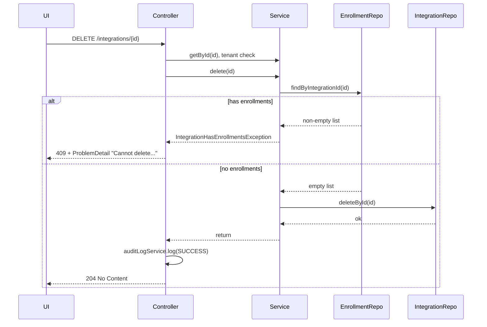

# Fix integration delete constraint violation surfacing to Admin UI

## Problem

1. **Flow today**: User deletes an integration that has enrollments → `IntegrationService.delete(id)` calls `integrationRepository.deleteById(id)` → DB raises FK constraint violation → Spring wraps it in `DataIntegrityViolationException` → [ValidationExceptionHandler](ezkey-admin-api/src/main/java/org/ezkey/exception/ValidationExceptionHandler.java) catches it and returns **400** with message `"Invalid data: constraint violation"` (see lines 374–376; FK violations are not special-cased, only NOT NULL and UNIQUE are).
2. **Why it’s bad**: The error is legitimate, but the message is generic and sounds like “invalid request data” instead of “this operation is not allowed in the current state.” The exception is “remontée” in the sense that a low-level DB exception is what drives the API/UI response.
3. **Audit bug**: In [IntegrationController.delete](ezkey-admin-api/src/main/java/org/ezkey/admin/controller/IntegrationController.java) (lines 454–466), the audit log is written with `EventStatus.SUCCESS` **before** calling `service.delete(id)`. If delete fails (constraint or our new exception), the audit already records success.

## Approach

Enforce the rule in the **service layer** and return a **domain exception** mapped to **409 Conflict** with a clear, user-oriented message. Optionally keep the DB as a safety net; do **not** rely on parsing FK messages in the handler for this case.

## Implementation

### 1. Domain exception (ezkey-core)

- Add a new exception in the same package as [IntegrationCodeAlreadyExistsException](ezkey-core/src/main/java/org/ezkey/integration/exception/IntegrationCodeAlreadyExistsException.java): e.g. `**IntegrationHasEnrollmentsException`** (or `IntegrationCannotBeDeletedException`).
- Message along the lines of: *"Cannot delete integration: it has one or more enrollments. Remove or revoke enrollments first."*
- No need for extra fields unless you want to expose count; the message is enough for UI.

### 2. IntegrationService.delete (ezkey-core)

- Inject [EnrollmentRepository](ezkey-core/src/main/java/org/ezkey/enrollment/domain/repository/EnrollmentRepository.java) into [IntegrationService](ezkey-core/src/main/java/org/ezkey/integration/service/IntegrationService.java) (it already has `findByIntegrationId(integrationId)`).
- In `delete(Integer id)`:
  - **Before** calling `integrationRepository.deleteById(id)`, check if there are enrollments for this integration (e.g. `!enrollmentRepository.findByIntegrationId(id).isEmpty()`).
  - If any exist, throw the new `IntegrationHasEnrollmentsException`.
  - Otherwise call `integrationRepository.deleteById(id)` as today.
- Optional: add `existsByIntegrationId(Integer integrationId)` to `EnrollmentRepository` and use it for a cheaper check instead of `findByIntegrationId(id).isEmpty()`.

### 3. DomainExceptionHandler (ezkey-admin-api)

- In [DomainExceptionHandler](ezkey-admin-api/src/main/java/org/ezkey/exception/DomainExceptionHandler.java), add an `@ExceptionHandler` for the new exception (same pattern as `IntegrationCodeAlreadyExistsException`):
  - HTTP **409 Conflict**
  - RFC 9457 ProblemDetail with a clear `detail` (e.g. the exception message) and a stable `type` URI (e.g. `https://ezkey.io/problems/domain/integration-has-enrollments`).

So the UI will receive 409 with an explicit message instead of 400 with “Invalid data: constraint violation”.

### 4. Audit log order (IntegrationController)

- In [IntegrationController.delete](ezkey-admin-api/src/main/java/org/ezkey/admin/controller/IntegrationController.java), **move the audit log call to after** the successful `service.delete(id)`.
- Order should be: resolve integration and tenant → **call `service.delete(id)`** → **then** `auditLogService.log(..., EventStatus.SUCCESS, ...)` → return 204.
- This way, SUCCESS is only logged when the integration was actually deleted; if the service throws (e.g. `IntegrationHasEnrollmentsException`), no success audit is written.

### 5. Tests

- **Integration / API test**: Add or extend a test that deletes an integration that **has** at least one enrollment; expect **409** and a response body containing the new message (or problem type), and ensure the integration is still present. Prefer existing test layout (e.g. [IntegrationManagementSecurityTest](ezkey-tests/src/test/java/org/ezkey/tests/security/integration/IntegrationManagementSecurityTest.java) or equivalent).
- **Unit test (optional)**: In ezkey-core, a unit test for `IntegrationService.delete()` that mocks `EnrollmentRepository` to return a non-empty list and asserts that the new exception is thrown and `deleteById` is not called.

### 6. Optional (defense in depth)

- In [ValidationExceptionHandler.handleDataIntegrityViolationException](ezkey-admin-api/src/main/java/org/ezkey/exception/ValidationExceptionHandler.java), you can add a branch for FK constraint messages (e.g. message contains `"foreign key"` or `"referenced"`) and return a slightly friendlier generic message than “Invalid data: constraint violation” for cases where the service check was bypassed (e.g. race). This is optional; the main fix is the service-layer check and 409.

## Flow after fix

## Files to touch (summary)

| Area      | File                                                                                | Change                                                                                                |
| --------- | ----------------------------------------------------------------------------------- | ----------------------------------------------------------------------------------------------------- |
| Core      | New: `ezkey-core/.../integration/exception/IntegrationHasEnrollmentsException.java` | New exception class                                                                                   |
| Core      | `ezkey-core/.../integration/service/IntegrationService.java`                        | Inject EnrollmentRepository; in delete(), check enrollments and throw new exception before deleteById |
| Core      | `ezkey-core/.../enrollment/domain/repository/EnrollmentRepository.java`             | Optional: add `existsByIntegrationId(Integer)`                                                        |
| Admin API | `ezkey-admin-api/.../exception/DomainExceptionHandler.java`                         | Handle new exception → 409 ProblemDetail                                                              |
| Admin API | `ezkey-admin-api/.../controller/IntegrationController.java`                         | Move audit log after successful service.delete(id)                                                    |
| Tests     | Existing integration/security test module                                           | Test: delete integration with enrollments → 409 and clear message                                     |

No OpenAPI spec edits: only Java code and annotations; the maintainer runs the update-specs script after a clean run. If the Admin API currently documents only 404/500 for delete, adding 409 for “integration has enrollments” will be reflected when the spec is regenerated (and can be documented in ENDPOINT.md if needed).
