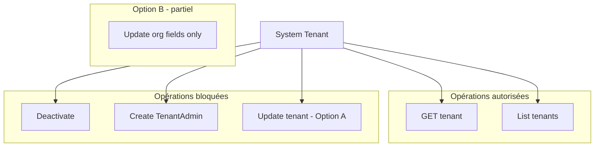

# System Tenant Semantic Rules — Audit and Recommendations

## 1. Confirmation: Un seul tenant IS_SYSTEM_TENANT en base

**Oui, c'est garanti au niveau base de données.**

La migration [V27__add_system_tenant_flag.sql](ezkey-core/src/main/resources/db/migration/V27__add_system_tenant_flag.sql) crée un **index unique partiel** :

```sql
CREATE UNIQUE INDEX idx_tenant_system_tenant_unique
ON ezkey_tenant(is_system_tenant)
WHERE is_system_tenant = TRUE;
```

- Au plus **un** tenant peut avoir `is_system_tenant = TRUE`
- Les autres tenants ont `is_system_tenant = FALSE` (pas de conflit)
- Toute tentative d'insérer ou modifier un second tenant avec `is_system_tenant = TRUE` échoue en base

---

## 2. Nature du System Tenant (PRD + code)

D'après le [PRD](PRD.md) et le code :


| Aspect             | Description                                                         |
| ------------------ | ------------------------------------------------------------------- |
| **Rôle**           | Organisation qui héberge l'instance Ezkey (ex. "Acme Corp")         |
| **Contenu**        | Global Admins, System Integration (MFA admin)                       |
| **Création**       | Migration V3, bootstrap au démarrage                                |
| **Identification** | Flag `is_system_tenant = TRUE` (robuste) ou `tenant_name` (fragile) |


Le tenant système n'est pas un tenant métier : il représente **l'instance Ezkey elle-même**.

---

## 3. Règles actuelles (ce qui est déjà bloqué)


| Opération                | Statut | Implémentation                                                                                                                                               |
| ------------------------ | ------ | ------------------------------------------------------------------------------------------------------------------------------------------------------------ |
| **Désactivation**        | Bloqué | [TenantService.deactivateTenant](ezkey-admin-api/src/main/java/org/ezkey/admin/service/TenantService.java) : `TenantNotAllowedException` si `isSystemTenant` |
| **Création TenantAdmin** | Bloqué | [AdminProvisioningService.createTenantAdmin](ezkey-admin-api/src/main/java/org/ezkey/admin/service/AdminProvisioningService.java) : rejet si System Tenant   |
| **Danger Zone (UI)**     | Masqué | [tenant-detail.tsx](ezkey-admin-ui/src/pages/tenant-detail.tsx) : `{!tenant.isSystemTenant && (...)}` masque Deactivate/Activate                             |


---

## 4. Problème identifié : PUT /tenants/{id} sans restriction

Le [TenantService.updateTenant](ezkey-admin-api/src/main/java/org/ezkey/admin/service/TenantService.java) **ne vérifie pas** si le tenant est le system tenant. Tous les champs sont modifiables :

- `tenantName`
- `tenantDescription`
- `organizationName`, `organizationDomain`, `countryCode`, `timezone`
- `primaryContactName`, `primaryContactEmail`

**Risques :**

1. **tenantName** : [AdminBootstrapService](ezkey-admin-api/src/main/java/org/ezkey/admin/service/AdminBootstrapService.java) utilise `findByTenantName(organizationProperties.getName())` pour retrouver le tenant système. Si le nom est modifié via l’UI, le bootstrap peut échouer au prochain redémarrage.
2. **tenantDescription** : Le tenant système est une entité sémantique fixe ; modifier sa description n’a pas de sens métier.
3. **Champs organisation** : Pour un tenant métier, ils sont pertinents ; pour le tenant système, ils sont redondants avec `OrganizationProperties` et peuvent créer de la confusion.

---

## 5. Recommandations sémantiques

### Option A — Blocage total des mises à jour (recommandé)

**Principe** : Le tenant système est une entité système, pas un tenant métier. Aucune modification via l’API.


| Champ | Raison                                                                                                   |
| ----- | -------------------------------------------------------------------------------------------------------- |
| Tous  | Le tenant système représente l’instance Ezkey ; ses attributs sont définis par la config et le bootstrap |


**Implémentation** : Dans `TenantService.updateTenant`, si `tenant.getIsSystemTenant() == true`, lever `TenantNotAllowedException("Cannot update the system tenant")`.

**UI** : Masquer le bouton "Edit Tenant" pour le tenant système (comme pour la Danger Zone).

---

### Option B — Mise à jour partielle (champs organisation uniquement)

**Principe** : Autoriser uniquement les champs d’identité organisationnelle, pas le nom ni la description.


| Champ                                      | Autorisé | Raison                                 |
| ------------------------------------------ | -------- | -------------------------------------- |
| tenantName                                 | Non      | Utilisé par le bootstrap               |
| tenantDescription                          | Non      | Entité sémantique fixe                 |
| organizationName, organizationDomain, etc. | Oui      | Identité de l’organisation hébergeante |


**Implémentation** : Dans `TenantService.updateTenant`, si system tenant : ignorer `tenantName` et `tenantDescription`, appliquer uniquement les champs organisation.

**UI** : Afficher le formulaire d’édition mais désactiver ou masquer les champs `tenantName` et `tenantDescription` pour le tenant système.

---

### Option C — Rendre le bootstrap robuste + Option A ou B

**Problème** : Le bootstrap utilise `findByTenantName()` au lieu du flag `is_system_tenant`.

**Action** : Ajouter `Optional<Tenant> findByIsSystemTenantTrue()` dans [TenantRepository](ezkey-core/src/main/java/org/ezkey/integration/domain/repository/TenantRepository.java) et faire utiliser cette méthode par `AdminBootstrapService` pour retrouver le tenant système. Cela évite toute dépendance au nom.

Ensuite, appliquer Option A ou B pour les règles de mise à jour.

---

## 6. Synthèse des règles sémantiques proposées




---

## 7. Fichiers à modifier (Option A — recommandée)


| Fichier                                                                                        | Modification                                                                               |
| ---------------------------------------------------------------------------------------------- | ------------------------------------------------------------------------------------------ |
| [TenantService.java](ezkey-admin-api/src/main/java/org/ezkey/admin/service/TenantService.java) | Au début de `updateTenant`, vérifier `isSystemTenant` et lever `TenantNotAllowedException` |
| [tenant-detail.tsx](ezkey-admin-ui/src/pages/tenant-detail.tsx)                                | Masquer le bouton "Edit Tenant" quand `tenant.isSystemTenant`                              |
| [ENDPOINT.md](docs/ENDPOINT.md)                                                                | Documenter que PUT /tenants/{id} retourne 400 pour le system tenant                        |


---

## 8. Tests à ajouter

- `TenantServiceTest` : `updateTenant` sur le tenant système (id=1, `isSystemTenant=true`) doit lever `TenantNotAllowedException`
- Test d’intégration : `PUT /api/v1/tenants/1` avec un GlobalAdmin doit retourner 400 avec un ProblemDetail explicite

---

## Conclusion

- **Unicité** : Garantie par l’index unique partiel en base.
- **Problème actuel** : La modification du tenant système (nom, description, etc.) est possible alors qu’elle n’a pas de sens métier et peut casser le bootstrap.
- **Recommandation** : Option A — bloquer toute mise à jour du tenant système (API + UI) et documenter clairement cette règle.

