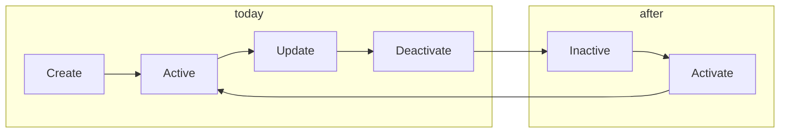

# Tenant lifecycle revision – reflection and enhancement plan

## 1. Current state

**Implemented tenant operations (Admin API):**

| Action     | Endpoint                               | Who                                  | Notes                                                        |
| ---------- | -------------------------------------- | ------------------------------------ | ------------------------------------------------------------ |
| Create     | `POST /api/v1/tenants`                 | GlobalAdmin                          | Full org identity (name, domain, country, timezone, contact) |
| List       | `GET /api/v1/tenants`                  | GlobalAdmin / TenantAdmin (own only) | Returns all or single tenant                                 |
| Get by ID  | `GET /api/v1/tenants/{id}`             | GlobalAdmin / TenantAdmin (own)      |                                                              |
| Update     | `PUT /api/v1/tenants/{id}`             | GlobalAdmin                          | Partial update; blocked if tenant inactive                   |
| Deactivate | `POST /api/v1/tenants/{id}/deactivate` | GlobalAdmin                          | Optional `reason` in body (audit); system tenant protected   |

**Deactivation behaviour (already in place):**

- Sets `active = false`; sets `deactivatedAt`, `deactivatedByAdmin` (audit).
- Revokes all admin tokens for the tenant.
- Login, token validation, and API key validation reject inactive tenants.
- `ensureTenantActive(tenantId)` blocks new integrations, enrollments, API keys.
- No cascade to child entities (integrations/enrollments stay as-is; runtime checks only).

**What is missing:**

- No **reactivate** (or activate) endpoint. The archived plan [plan-tenantDeactivationIntegrity](.github/prompts/archived/plan-tenantDeactivationIntegrity.prompt.md) already recommended: *"The inverse operation (POST /tenants/{id}/activate) should exist for symmetry."*
- Tenant management (create/list/get/update/deactivate) is **not** described in [docs/ENDPOINT.md](docs/ENDPOINT.md); only Postman and code document it.
- Response DTO [TenantResponseDto](ezkey-admin-api/src/main/java/org/ezkey/admin/dto/response/TenantResponseDto.java) exposes `active` and `isSystemTenant` but not `deactivatedAt` (useful for operators and audit).

---

## 2. Real-world scenarios and normative expectations

**Scenarios that require tenant-level actions:**

| Scenario                                            | Need                                   | Today                                          |
| --------------------------------------------------- | -------------------------------------- | ---------------------------------------------- |
| Customer leaves / contract ends                     | Turn off access, keep data for audit   | Deactivate ✅                                   |
| Mistake: wrong tenant deactivated                   | Restore access without data loss       | No reactivate ❌                                |
| Temporary pause (payment, compliance review)        | Suspend then resume                    | Deactivate ✅, resume ❌                         |
| Audit / compliance: "prove access was removed at T" | Immutable deactivation timestamp       | `deactivatedAt` ✅ (in DB); not in API response |
| Hosting multiple orgs (PME / multi-tenant hoster)   | Per-org on/off without touching others | Deactivate ✅                                   |
| Read-only / "view only" tenant                      | Optional future; out of 80/20 scope    | Not in scope                                   |

**Comparable systems (IAM / MFA / SaaS):**

- **Okta (user lifecycle):** States (e.g. STAGED, PROVISIONED, ACTIVE), **suspend** (non-destructive, blocks sign-in, keeps data), and state transitions for reactivation. Tenant-level lifecycle in multi-tenant is analogous: suspend/deactivate + ability to restore.
- **Common pattern:** At least two concepts — "turn off" (suspend/deactivate) and "turn back on" (reactivate/activate). Single "deactivate only" is limiting for operations and error recovery.

**Ezkey positioning (PRD, README):**

- Open-source, free, SME-focused, self-hosted or hoster for multiple organisations.
- 80/20 and "developer/DevOps who doesn’t only do this" — avoid unnecessary states (e.g. multiple statuses) while staying secure and operable.

**Normative (SOC 2, audit):**

- CC6.3 (removal of access): who/when/why for deactivation — already covered by `reason`, `deactivatedAt`, `deactivatedByAdmin`.
- Operability: having **reactivate** is standard and reduces risk of "permanent" mistake; no new normative obligation if we only add reactivate and docs.

---

## 3. Recommended direction (80/20, secure, operable)

**Must-have (minimal and safe):**

1. **Add reactivate (activate)**
  - New endpoint: `POST /api/v1/tenants/{id}/activate` (GlobalAdmin only).
  - Semantics: set `active = true`; clear or leave `deactivatedAt`/`deactivatedByAdmin` for audit history (recommend: leave as-is for traceability).
  - No cascade: integrations/enrollments/API keys are unchanged; they work again as soon as tenant is active.
  - Idempotent if already active.
  - Optional request body: `{ "reason": "..." }` for audit (same pattern as deactivate).
  - Aligns with existing [TenantService](ezkey-admin-api/src/main/java/org/ezkey/admin/service/TenantService.java) and [TenantController](ezkey-admin-api/src/main/java/org/ezkey/admin/controller/TenantController.java) patterns.
2. **Document tenant lifecycle in ENDPOINT.md**
  - Add a "Tenant management" section: create, list, get, update, deactivate, **activate**.
  - Describe lifecycle: Active ↔ Inactive (deactivate / activate); system tenant cannot be deactivated; audit fields and token revocation on deactivate.

**Nice-to-have (low cost):**

1. **Expose deactivation metadata in API**
  - In [TenantResponseDto](ezkey-admin-api/src/main/java/org/ezkey/admin/dto/response/TenantResponseDto.java): add optional `deactivatedAt` (and optionally `deactivatedByAdminId` or similar) so UIs and operators can show "Deactivated on … by …" without extra calls.
  - Requires [TenantMapper](ezkey-admin-api/src/main/java/org/ezkey/admin/mapper/TenantMapper.java) and possibly entity field mapping.

**Explicitly out of scope (keep complexity down):**

- **Multiple states** (e.g. ACTIVE / SUSPENDED / DEACTIVATED): one boolean `active` is enough for SME and hoster use cases; can be revisited later if needed.
- **Soft-delete vs hard-delete:** keep "deactivate = access off, data kept for audit"; no tenant deletion in this plan.
- **Scheduled deactivation / auto-reactivation:** not in 80/20; can be external (cron + API) if ever needed.

---

## 4. High-level implementation outline

**Tasks:**

| #   | Task                             | Scope                                                                                                                                                                                    |
| --- | -------------------------------- | ---------------------------------------------------------------------------------------------------------------------------------------------------------------------------------------- |
| 1   | **Activate endpoint**            | `TenantController`: `POST /api/v1/tenants/{id}/activate` (GlobalAdmin). Request DTO optional (e.g. `TenantActivateRequestDto` with optional `reason`).                                   |
| 2   | **TenantService.activateTenant** | Load tenant, reject system tenant if needed (no-op or 400), if already active return; else set `active = true`, set `updatedAt` / `updatedByAdmin`, save. No token or child changes.     |
| 3   | **Audit**                        | Log `TENANT_ACTIVATED` (or reuse existing event type if present) with reason; reuse same audit helper pattern as deactivate.                                                             |
| 4   | **ENDPOINT.md**                  | New section "Tenant management" documenting create, list, get, update, deactivate, activate, and lifecycle.                                                                              |
| 5   | **Optional: TenantResponseDto**  | Add `deactivatedAt` (and optionally who) for list/get; update TenantMapper.                                                                                                              |
| 6   | **Tests**                        | Unit: TenantService activate (idempotent, already active, system tenant if applicable). Integration: controller activate returns 200/204 and tenant is active; optional audit assertion. |
| 7   | **Postman / CLI / Tenant UI**    | Update Postman collection; CLI/TUI and tenant-ui if they manage tenants (add "Activate" where "Deactivate" exists).                                                                      |

**Files to touch (minimal):**

- [TenantController](ezkey-admin-api/src/main/java/org/ezkey/admin/controller/TenantController.java): add `POST /{id}/activate`.
- [TenantService](ezkey-admin-api/src/main/java/org/ezkey/admin/service/TenantService.java): add `activateTenant(id, principal)`.
- [AdminAuditConstants](ezkey-admin-api/src/main/java/org/ezkey/admin/constants/AdminAuditConstants.java) / [EventType](ezkey-core) (if needed): `TENANT_ACTIVATED`.
- [docs/ENDPOINT.md](docs/ENDPOINT.md): Tenant management section.
- Optional: [TenantResponseDto](ezkey-admin-api/src/main/java/org/ezkey/admin/dto/response/TenantResponseDto.java), [TenantMapper](ezkey-admin-api/src/main/java/org/ezkey/admin/mapper/TenantMapper.java).
- Tests: new or extended in ezkey-admin-api and/or ezkey-tests.

---

## 5. Summary

| Question                                    | Answer                                                                                                                                |
| ------------------------------------------- | ------------------------------------------------------------------------------------------------------------------------------------- |
| Is "deactivate only" too limited?           | Yes: no way to undo a mistaken deactivation or to "resume" after a temporary pause.                                                   |
| What do similar systems do?                 | Suspend/deactivate + reactivate/activate; single reversible lifecycle.                                                                |
| What is desirable (normative + operable)?   | Audit trail (already there) + **reactivate** for safety and operations.                                                               |
| What to implement without overcomplicating? | **Activate** endpoint + **documented lifecycle** in ENDPOINT.md; optionally expose `deactivatedAt` in API; no extra states or delete. |

This keeps the tenant model simple (one boolean `active`), aligns with SOC 2 and real-world usage, and stays maintainable for a small team or a DevOps developer.
