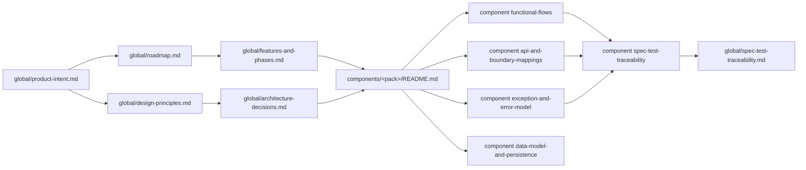

# Documentation Governance

This document formalizes how the `product-docs/` corpus is maintained, how its pieces link together, and how it supports spec-first, test-driven collaboration between humans and AI agents.

It is intentionally short and rule-driven. The operating assumption is that discipline in a small number of rules, applied consistently, produces more value than a large ceremonial process.

## Goals

1. Keep one canonical location per product concept.
2. Keep global truth and component truth connected through explicit links.
3. Keep features, specs, and tests traceable at product and component scope.
4. Make every non-trivial decision recoverable years later.
5. Stay usable by humans and AI agents without a heavy learning curve.

## Corpus Overview

## Core Rules

### 1. One canonical location per concept

- A concept lives in exactly one document. Other documents that need it **link** to it.
- If two documents are drifting toward overlap, they must be reconciled in the same change set: one becomes canonical, the other becomes a link.

### 2. Global ↔ component linking is mandatory

- Every **component feature entry** references its global counterpart in [`global/features-and-phases.md`](global/features-and-phases.md).
- Every **global feature entry** lists the component pack(s) that implement it when a pack exists.
- Every **architecture decision** lists the affected components (by pack link) and the features it touches.

### 3. Spec-test traceability is not optional

- Every feature has at least one entry in a [traceability matrix](global/spec-test-traceability.md) — global or component — with an explicit status.
- Every workflow, mapping, or error rule that defines externally observable behavior is referenced from the matrix.
- Gaps are tracked in the `Open Gaps` section of the relevant matrix; they are not hidden.

### 4. Decisions carry rationale, alternatives, and consequences

- Use the [architecture decision template](templates/architecture-decision.template.md).
- Never silently replace a decision. Supersede with a new ADR and link the prior one.
- Decisions that apply only to one component live in that pack's `design-decisions.md`.

### 5. Templates are starting points, not contracts

- Instantiated documents may remove sections that do not apply rather than leave them empty.
- Instantiated documents must keep the **section order** when reasonable so that readers can compare peers.
- If a template proves too rigid for a recurring need, update the template — do not fork it.

### 6. Documentation updates are part of the change set

- When **behavior, contract, or workflow** changes: update the relevant documents in the **same branch** as the code change.
- When a **feature status** changes: update [`global/features-and-phases.md`](global/features-and-phases.md) and the matching traceability matrices.
- When an **architecture decision** is taken: add the ADR before or at the same time as the code change.

### 7. Generated artifacts are not documentation

- OpenAPI specs under [`../specs/`](../specs/) are generated by the contract refresh script. Never hand-edited.
- Orval-generated clients in [`../ezkey-admin-ui/src/generated/`](../ezkey-admin-ui/src/generated/) and [`../ezkey_mobile/app/services/api/generated/`](../ezkey_mobile/app/services/api/generated/) are regenerated, not hand-edited.
- The documentation corpus references these artifacts; it does not duplicate them.

### 8. Vocabulary is shared through the glossary

- Any term that has a specific product meaning (for example `Enrollment`, `Eligibility chain`, `Proof token`) must be defined in [`glossary.md`](glossary.md).
- When a new term appears in two or more documents, add it to the glossary.

## Content Ownership Map

| Concept | Canonical location |
| ------- | ------------------ |
| Product intent, thesis, audience | [`global/product-intent.md`](global/product-intent.md) |
| Roadmap and milestones | [`global/roadmap.md`](global/roadmap.md) |
| Feature catalog | [`global/features-and-phases.md`](global/features-and-phases.md) |
| Architectural view and patterns | [`global/architecture-overview.md`](global/architecture-overview.md) |
| Global ADRs | [`global/architecture-decisions.md`](global/architecture-decisions.md) |
| Design principles | [`global/design-principles.md`](global/design-principles.md) |
| Entity relationships and lifecycle rules | [`global/lifecycle-model.md`](global/lifecycle-model.md) |
| Global traceability | [`global/spec-test-traceability.md`](global/spec-test-traceability.md) |
| Component architecture | `components/<pack>/stack-and-architecture.md` |
| Component workflows | `components/<pack>/functional-flows.md` |
| Component boundaries and mappings | `components/<pack>/api-and-boundary-mappings.md` |
| Component data and persistence | `components/<pack>/data-model-and-persistence.md` |
| Component errors | `components/<pack>/exception-and-error-model.md` |
| Component ADRs | `components/<pack>/design-decisions.md` |
| Component traceability | `components/<pack>/spec-test-traceability.md` |

## Typical Change Workflows

### Capturing product direction and ideation

1. Record directional notes in `global/vision/` using the vision-note template.
2. Promote actionable candidates to `global/backlog/ideas/` using stable `I-*` identifiers.
3. Maintain status, priority, and review dates according to `global/backlog/statuses-and-lifecycle.md`.
4. Promote `ready` ideas into tracer bullets (`TB-*`) before implementation planning.

### Adding a new feature

1. Pick the right milestone in [`global/roadmap.md`](global/roadmap.md) (or add one through an ADR).
2. Add an entry in [`global/features-and-phases.md`](global/features-and-phases.md) using the short format and link to the affected component pack(s).
3. If the feature creates or changes durable component-local truth, update the relevant component pack in the same change set:
    - Add a workflow entry in `functional-flows.md` via the [functional workflow template](templates/functional-workflow.template.md) when a workflow changes.
    - Add a mapping entry in `api-and-boundary-mappings.md` when a boundary is crossed.
    - Add an error entry in `exception-and-error-model.md` when new failure modes appear.
    - Add an entry in the component `spec-test-traceability.md` when feature evidence changes.
4. Add or update the corresponding row in [`global/spec-test-traceability.md`](global/spec-test-traceability.md) if the feature affects product-level coverage.

### Recording a new decision

1. Scope the decision (`global` vs `component:<pack>`).
2. Copy [`templates/architecture-decision.template.md`](templates/architecture-decision.template.md) into the correct decision log.
3. Assign the next ID (`ADR-XXXX` or `ADR-UI/API/MOB-XXXX`).
4. Cross-reference the decision from the affected feature entries and from related documents.

### Changing a contract

1. Update the Java code and Springdoc/OpenAPI annotations.
2. Run tests. Fix failures.
3. Refresh specs via the authorized script (see [`../AGENTS.md`](../AGENTS.md) and [`../.cursor/rules/openapi-specs.mdc`](../.cursor/rules/openapi-specs.mdc)).
4. Regenerate clients (Admin UI Orval, Mobile Orval) when the change is client-facing.
5. Update the relevant mapping matrix in the component pack and the traceability row.

### Retiring documentation

1. Mark the target section as `deprecated` with a link to the replacement.
2. Update cross-references to point at the replacement.
3. Remove the deprecated document or section only when no link to it remains.

## AI Agent Etiquette

To keep the corpus discoverable and useful for automated agents:

- Follow the reading order declared in each `README.md`.
- Use the feature catalog and the traceability matrices as the primary discovery path.
- Before writing new content, search for the canonical location; create duplicates only as a last resort.
- When a link is ambiguous, prefer linking to the **component pack** and let the pack's `README.md` redirect.
- When a question is not answered here, look up the canonical answer in the legacy [`../docs/`](../docs/) hub or a module-level README; if the answer becomes recurring, promote it into this corpus.

## Enrichment Scope

The initial corpus pass established the skeleton and seeded it with minimal concrete content. The
current enrichment pass extends the corpus through:

- **Stakeholder interviews** that reconstruct missing intent around existing code.
- **Codebase re-discovery** to uncover undocumented decisions, mappings, and workflows.
- **Validation** of reconstructed material with the product owner before marking it as current truth.
- **Expanded traceability** so that every active feature has explicit acceptance criteria and verifying tests.
- **Additional component packs** for Auth API, Integration API, Core, Core Security, SDK, CLI, Docker stack, and the public site when they meet the instantiation threshold in [`components/README.md`](components/README.md).

The enrichment pass keeps the same rules as the initial skeleton pass — the change is in coverage,
not in governance.

## Acceptance of This Governance

This governance is adopted when:

- The eight documents in the global pack exist and are linked from [`README.md`](README.md).
- The three initially seeded component packs (Admin UI, Admin API, Mobile) follow the common skeleton.
- Every initially seeded feature entry is cross-referenced between [`global/features-and-phases.md`](global/features-and-phases.md) and the component pack(s) that implement it.
- Global and component traceability matrices list the seeded features with an explicit status.
- This document is referenced from [`README.md`](README.md).

## Related Documents

- [`README.md`](README.md)
- [`glossary.md`](glossary.md)
- [`templates/README.md`](templates/README.md)
- [`global/README.md`](global/README.md)
- [`components/README.md`](components/README.md)
