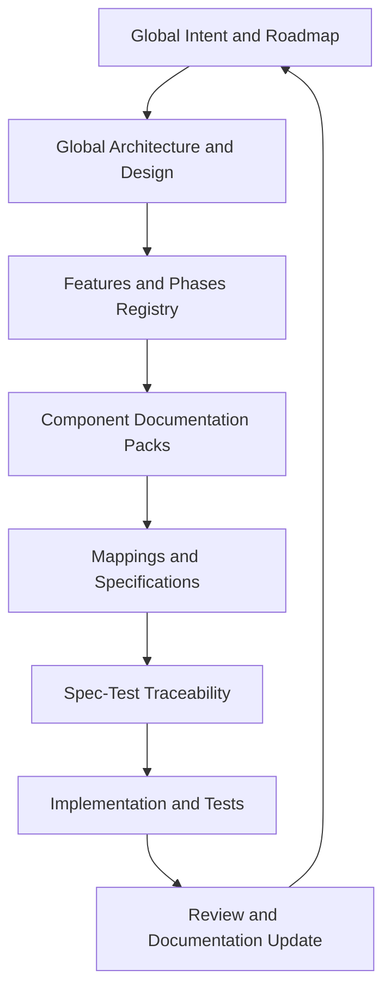

# Product Documentation System

This directory is the home of the Ezkey product documentation system: a unified, spec-first, test-driven documentation corpus designed for healthy collaboration between humans and AI coding agents.

It is intentionally isolated from the legacy `docs/` and module-level documentation so it can be evaluated, iterated, and adopted progressively without disrupting what already exists.

The structure and templates defined here are designed to be **reusable in any monorepo-based product**. Ezkey is the reference instance; the concepts remain general.

## Purpose

The system exists to answer these questions consistently, at any scale of product:

- What is the product? Why does it exist? What are its features and phases?
- What is the architecture? What are the design decisions and their rationale?
- How does each component work internally? Which flows does it support?
- How is data shaped, persisted, and mapped between boundaries?
- How are exceptions and errors handled?
- How does each feature map to a specification and to its verifying tests?

Every answer lives in **one canonical location**, linked from the correct entry point.

## Documentation Model

The system has three layers:

1. **Global layer** — product-wide living truth: intent, roadmap, features, architecture, design principles, lifecycle model, and traceability.
2. **Component layer** — per-entrypoint documentation packs (Admin UI, Admin API, Mobile, etc.) with their own architecture, flows, data model, mappings, errors, decisions, and traceability.
3. **Template layer** — a small, opinionated palette of markdown templates that enforces expressiveness, consistency, and spec-first structure.



## Folder Structure

```text
product-docs/
  README.md                     Entry point (this file).
  GOVERNANCE.md                 Governance rules and change workflows.
  glossary.md                   Canonical vocabulary and naming conventions.
  global/                       Product-wide living truth.
    README.md                   Global reading order and document map.
    product-intent.md           Product intent, positioning, success criteria.
    roadmap.md                  Major product steps and sequencing.
    features-and-phases.md      Feature catalog linked to phases.
    architecture-overview.md    Patterns, principles, boundaries.
    architecture-decisions.md   Global architecture decision log.
    design-principles.md        Cross-product design principles.
    lifecycle-model.md          Entity relationships and lifecycle rules.
    spec-test-traceability.md   Global traceability matrix.
  components/                   Per-entrypoint documentation packs.
    README.md                   Component pack index.
    admin-ui/                   Admin UI pack.
    admin-api/                  Admin API pack.
    mobile/                     Mobile app pack.
  templates/                    Reusable markdown templates.
    README.md                   Template index and usage.
    product-intent.template.md
    roadmap.template.md
    feature-brief.template.md
    architecture-decision.template.md
    functional-workflow.template.md
    mapping-matrix.template.md
    error-and-exception.template.md
    persistence-and-lifecycle.template.md
    screens-and-wireflow.template.md
    spec-test-traceability.template.md
```

Each component pack has the same skeleton:

```text
<component>/
  README.md                     Scope, boundaries, links to global registry.
  stack-and-architecture.md     Stack, libraries, architectural patterns.
  functional-flows.md           Nominal and exception workflows.
  data-model-and-persistence.md Internal data model and persistence rules.
  screens-and-wireflow.md       Screens and navigation (UI-bearing only).
  api-and-boundary-mappings.md  Mappings with external and internal boundaries.
  exception-and-error-model.md  Exception categories and error handling rules.
  design-decisions.md           Component-local design decisions.
  spec-test-traceability.md     Component-local traceability matrix.
```

## Reading Order

A first-time reader should follow this path:

1. [`global/product-intent.md`](global/product-intent.md)
2. [`global/roadmap.md`](global/roadmap.md)
3. [`global/features-and-phases.md`](global/features-and-phases.md)
4. [`global/architecture-overview.md`](global/architecture-overview.md)
5. [`global/design-principles.md`](global/design-principles.md)
6. [`global/lifecycle-model.md`](global/lifecycle-model.md)
7. [`components/README.md`](components/README.md) and the relevant component pack.
8. [`global/spec-test-traceability.md`](global/spec-test-traceability.md)

## Living vs Finality Documents

The system distinguishes two kinds of documents:

- **Finality documents** — express the **current truth and long-term direction** of the product. Examples: product intent, roadmap, architecture overview, design principles. They evolve, but they always represent the latest intended state.
- **Living documents** — express the **current reality on a given branch**, especially phase, feature state, and traceability. Examples: features-and-phases, spec-test-traceability, component design decisions.

Both kinds are markdown, versioned in git, and kept under the same folder structure. The distinction is editorial, not structural.

## Governance Rules

The authoritative governance rules live in [`GOVERNANCE.md`](GOVERNANCE.md). Summary:

- **One canonical place per concept.** If something lives here, it should not also live elsewhere. Cross-link instead of duplicating.
- **Templates are minimal on purpose.** Every section must earn its place. Do not pad.
- **Every feature entry links to:** intent, phase, mappings, exceptions, acceptance criteria, and tests.
- **Every architecture or design decision has:** rationale, alternatives considered, and consequences.
- **Documentation updates are required when behavior, contracts, or workflows change.** Specs, prose, and tests stay aligned.
- **Keep language pragmatic.** Express intent and constraints clearly; avoid ceremony that does not change outcomes.

See [`GOVERNANCE.md`](GOVERNANCE.md) for the full rule set, typical change workflows, content ownership map, and AI agent etiquette.

## How to Contribute

- To add a new feature: create an entry in [`global/features-and-phases.md`](global/features-and-phases.md), then a feature brief from [`templates/feature-brief.template.md`](templates/feature-brief.template.md), and link it back from the relevant component pack.
- To add a new architecture decision: copy [`templates/architecture-decision.template.md`](templates/architecture-decision.template.md) into [`global/architecture-decisions.md`](global/architecture-decisions.md) or the component's `design-decisions.md`.
- To describe a new workflow: copy [`templates/functional-workflow.template.md`](templates/functional-workflow.template.md) into the relevant `functional-flows.md`.
- To describe a new mapping (DTO ↔ API ↔ internal model): copy [`templates/mapping-matrix.template.md`](templates/mapping-matrix.template.md) into `api-and-boundary-mappings.md`.

## Relationship with Existing Documentation

- The legacy [`../docs/`](../docs/) hub and module-level READMEs remain authoritative for operational, configuration, and protocol details during the transition.
- This `product-docs/` corpus is the **target home** for intent, architecture, design, flows, mappings, exceptions, lifecycle, and traceability.
- Progressively, content will be migrated or linked in; duplicates will be resolved in favor of this structure.
