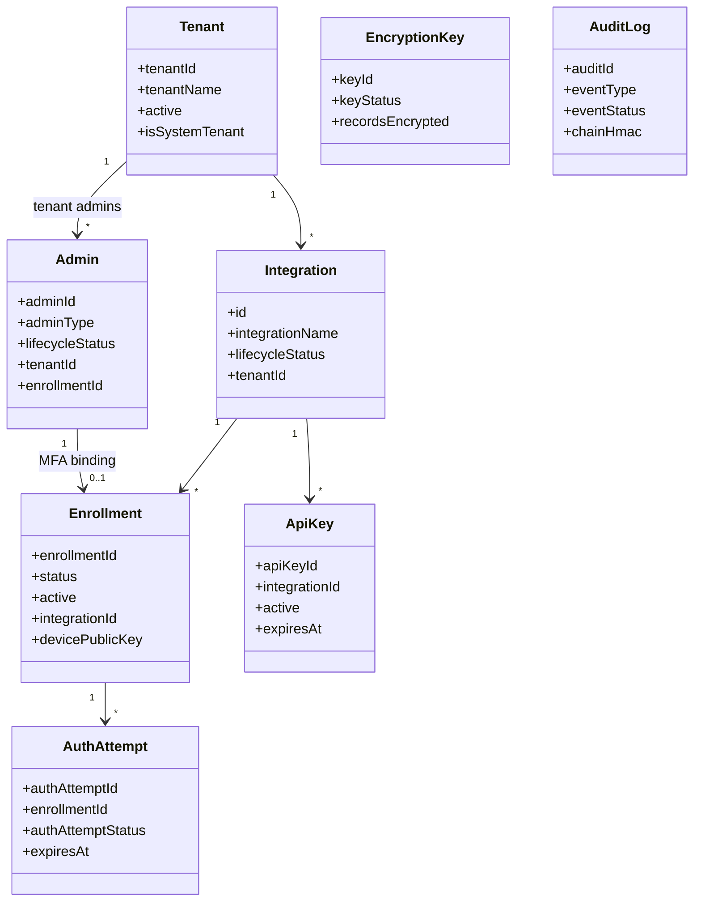

# Admin API — Data Model and Persistence

## Intent

This document describes the Admin API's data ownership: the entities it owns (directly or through the shared core module), their persistence characteristics, and their lifecycle rules. The detailed global lifecycle narrative lives in [`../../../docs/LIFECYCLE_GOVERNANCE.md`](../../../docs/LIFECYCLE_GOVERNANCE.md) and is summarized in [`../../global/lifecycle-model.md`](../../global/lifecycle-model.md). This document focuses on the Admin API's local perspective: what it reads, writes, and enforces.

## Ownership and Boundaries

- **Owned through `ezkey-core`.** Tenants, integrations, enrollments, admins, API keys, auth attempts, audit logs, encryption keys, re-encryption batches, recovery codes.
- **Shared with `ezkey-auth-api`.** Auth attempts and enrollments in the cryptographic flows: the Auth API writes `pending` / `respond` state; the Admin API reads and mutates lifecycle state.
- **Referenced only.** Device-side material (private keys) never leaves the device; the Admin API sees device public keys.

## Conceptual View

## Entity Reference (Admin API Perspective)

### Tenant

- **Purpose.** Organizational boundary.
- **Source of truth.** Database.
- **Key attributes.** `tenantId`, `tenantName`, `active`, `isSystemTenant`.
- **Lifecycle.** Active/inactive; system tenant protected. Details: [`../../global/lifecycle-model.md`](../../global/lifecycle-model.md).

### Integration

- **Purpose.** Application or service protected by Ezkey.
- **Key attributes.** `id`, `integrationName`, `integrationDescription`, `lifecycleStatus` (`ACTIVE`, `RETIRED`), `tenantId`, `isSystemIntegration`.
- **Lifecycle.** Active → Retired → (Delete when preconditions met). Details: global lifecycle model.

### Enrollment

- **Purpose.** Cryptographic binding between a user (or admin) and an integration.
- **Key attributes.** `enrollmentId`, `status` (PENDING, VERIFIED, REVOKED), `active`, `integrationId`, `devicePublicKey`, `devicePrivateKeyStorageTier` (client-reported), timestamps, audit fields.
- **Lifecycle.** PENDING → VERIFIED (Active/Inactive) → REVOKED. Details: global lifecycle model.

### API Key

- **Purpose.** Machine credential for an integration.
- **Key attributes.** `apiKeyId`, `integrationId`, `integrationKey`, `active`, `expiresAt`, `lastUsedAt`, `ipWhitelist`.
- **Lifecycle.** Create → Revoke or Expire. No reactivation, no delete.

### Admin

- **Purpose.** Operator identity.
- **Key attributes.** `adminId`, `adminType` (`GLOBAL_ADMIN`, `TENANT_ADMIN`), `lifecycleStatus` (`PENDING_ACTIVATION`, `ACTIVE`, `DEACTIVATED`), `tenantId`, `enrollmentId`, `lastLoginAt`.
- **Lifecycle.** Pending Activation → Active → Deactivated. Identity and MFA enrollment are independent concerns.

### Auth Attempt

- **Purpose.** Transient authentication event.
- **Key attributes.** `authAttemptId`, `enrollmentId`, `authAttemptStatus` (`PENDING`, `READ`, `ACCEPTED`, `REJECTED`, `INVALID`, `EXPIRED`), `expiresAt`, `authAttemptProofToken`, context fields.
- **Lifecycle.** Event-driven. Expiry is handled by a scheduled job and by explicit cancel.

### Encryption Key

- **Purpose.** Protects data at rest.
- **Key attributes.** `keyId`, `keyStatus` (`PENDING`, `ENABLED`, `PRIMARY`, `DISABLED`), counters, lifecycle timestamps.
- **Lifecycle.** Two-layer model: cryptographic role + operator lifecycle.

### Audit Log

- **Purpose.** Integrity-linked trail of significant operations.
- **Key attributes.** `auditId`, `eventType`, `eventStatus`, `chainHmac`, `prevChainHmac`, actor, target, `eventDetails`.
- **Lifecycle.** Append-only. Chain checkpoints summarize windows of entries.

## Lifecycle Rules Enforced by the Admin API

These rules run server-side and must never depend solely on client-side validation:

- **No persistent cascade on parent state change.** Deactivating a tenant blocks operations at runtime through the eligibility chain; it does not mutate child state. See [ADR-0004](../../global/architecture-decisions.md#adr-0004-lifecycle-without-persistent-cascade).
- **System tenant protection.** The system tenant (id 1) cannot be deactivated, updated (except in controlled paths), or deleted.
- **System integration protection.** The system integration cannot be retired or deleted.
- **Minimum-admin rule.** At least one active Global Admin must exist at all times; self-deactivation is forbidden.
- **Admin-MFA guard.** When an enrollment is an admin's MFA enrollment, bind/verify/use is guarded by the admin's lifecycle status.
- **Reason policy enforcement.** Actions that require a reason (revoke, retire, delete) reject calls that fail validation (min length, max length). See [`../../global/lifecycle-model.md`](../../global/lifecycle-model.md).

## Persistence Rules

- **Storage.** PostgreSQL as the primary store; Tink handles encryption at rest for encrypted fields.
- **Migrations.** Flyway; source in `ezkey-core/src/main/resources/db/migration/`. Initial global admin and system tenant are created by `V1__core_domain_and_multi_tenant.sql`.
- **Encryption at rest.** Rotatable keys via the encryption key lifecycle. Field-level encryption for device public keys and other sensitive material.
- **Retention.** Audit entries are append-only; archival follows the audit chain lifecycle documented in [`../../../docs/AUDIT_LOG_LIFECYCLE_REFRAMING.md`](../../../docs/AUDIT_LOG_LIFECYCLE_REFRAMING.md).
- **Consistency.** Transactional boundaries are defined on service entry points; concurrent mutations use optimistic locking (`version`) where applicable.

## Cross-Boundary Effects

- **Admin API ↔ Auth API state sharing.** Auth attempts and enrollments transition through both surfaces; the Auth API writes `pending` and `respond` outcomes, the Admin API manages lifecycle (cancel, expire, retire, revoke) and audit.
- **Admin API → clients.** Changes are propagated via pull: clients re-fetch through `usePaginatedQuery` or Orval hooks after mutations. There is no server-side push.
- **Admin API → audit chain.** Writes are embedded in the same transaction as the business change when possible, ensuring an audit entry exists for every material change.

## Related Documents

- [`stack-and-architecture.md`](stack-and-architecture.md).
- [`functional-flows.md`](functional-flows.md).
- [`api-and-boundary-mappings.md`](api-and-boundary-mappings.md).
- [`../../global/lifecycle-model.md`](../../global/lifecycle-model.md).
- Legacy: [`../../../docs/LIFECYCLE_GOVERNANCE.md`](../../../docs/LIFECYCLE_GOVERNANCE.md), [`../../../docs/ENDPOINT.md`](../../../docs/ENDPOINT.md).
