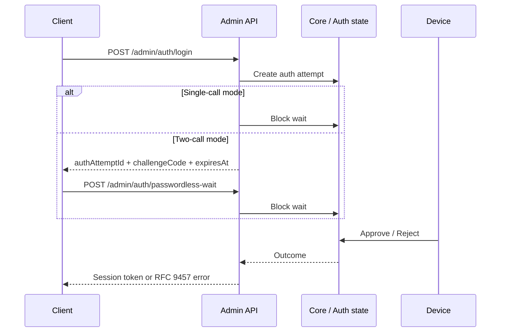
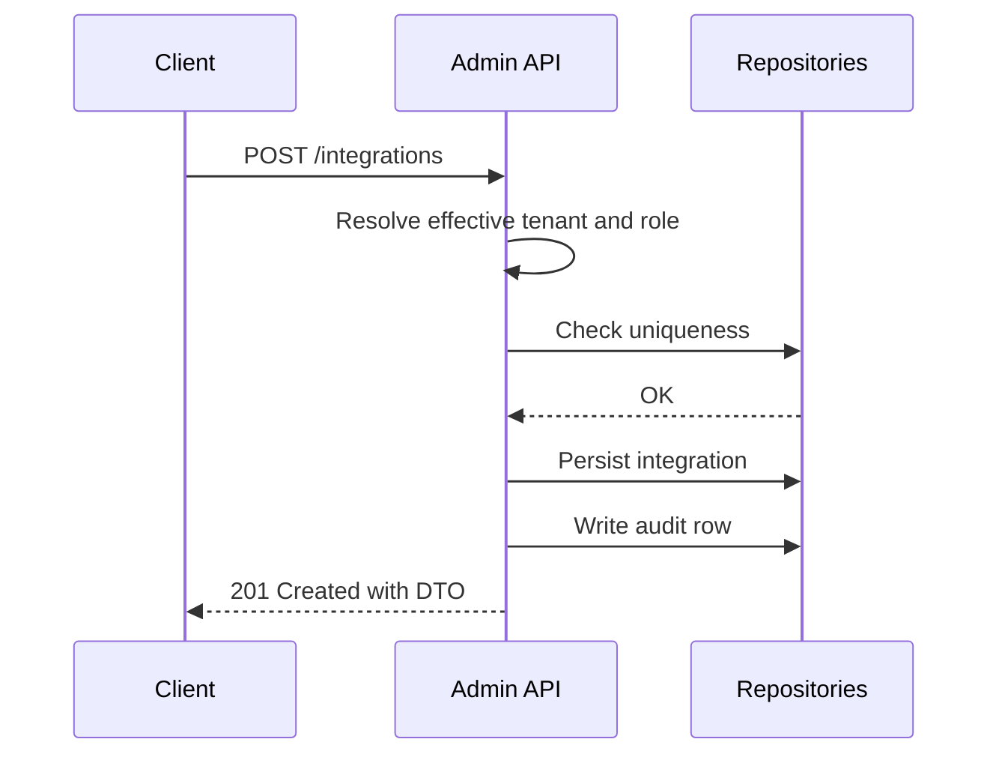
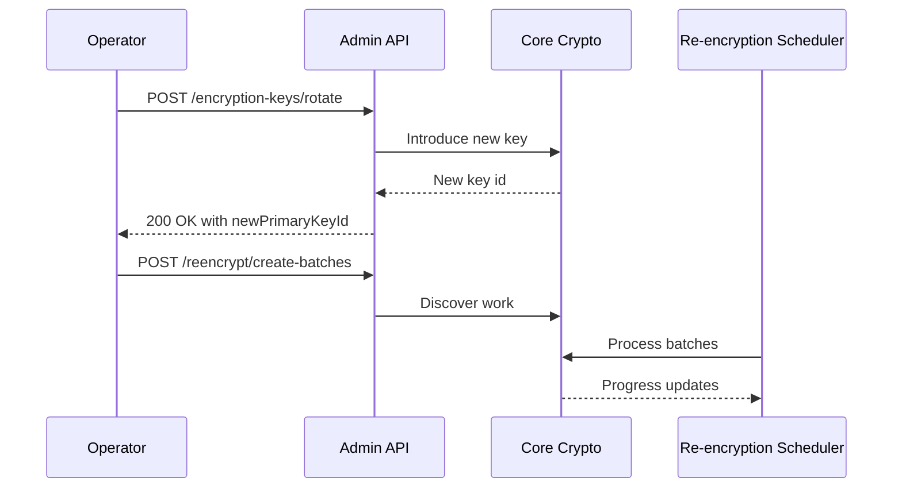

# Admin API — Functional Flows

## Intent

This document catalogs the representative backend workflows that the Admin API orchestrates. Each workflow describes the nominal path, decision points, exception paths, and boundaries crossed. Exhaustive endpoint-by-endpoint behavior remains in [`../../../docs/ENDPOINT.md`](../../../docs/ENDPOINT.md); this document focuses on **flows**, not **endpoints**.

Phase 1 seeds three representative flows. Additional flows will be added using the [functional workflow template](../../templates/functional-workflow.template.md).

## Workflow Index

| ID | Workflow | Status | Related feature |
|----|----------|--------|-----------------|
| `W-api-admin-login-passwordless` | Admin passwordless login (single-call and two-call) | `implemented` | [`F-admin-lifecycle`](../../global/features-and-phases.md#f-admin-lifecycle), [`F-admin-api-core`](../../global/features-and-phases.md#f-admin-api-core) |
| `W-api-integration-create` | Create an integration under a tenant | `implemented` | [`F-admin-api-core`](../../global/features-and-phases.md#f-admin-api-core), [`F-tenant-lifecycle`](../../global/features-and-phases.md#f-tenant-lifecycle) |
| `W-api-encryption-key-rotation` | Rotate encryption key and run re-encryption batches | `in-progress` | [`F-encryption-key-rotation`](../../global/features-and-phases.md#f-encryption-key-rotation) |

---

## `W-api-admin-login-passwordless` — Admin Passwordless Login

### Intent

Authenticate an administrator using Ezkey passwordless authentication and issue a session token. Two modes coexist:

- **Single-call mode.** `/login` blocks until the device approves.
- **Two-call mode.** `/login` returns a challenge code immediately; the client then calls `/passwordless-wait`.

### Actors

- **Client** — Admin UI or API caller.
- **Admin API** — `/api/v1/admin/auth/*`.
- **Core services** — auth attempt state, enrollment state.
- **Auth API** (internal state sharing) — pending auth attempt lifecycle.
- **Device** — mobile app approving the request.

### Preconditions

- Administrator exists and is `ACTIVE`.
- Administrator has a bound and `VERIFIED` MFA enrollment.
- Rate limits are not breached for the client IP.

### Postconditions

- On success: session token stored; `lastLoginAt` updated; `ADMIN_LOGIN` audit row with success status.
- On failure: appropriate audit row (`login_mfa_rejected`, `login_mfa_expired`, etc.).

### Nominal Flow

1. Client calls `POST /login` with `username` and `challengeRequested`.
2. Admin API creates an auth attempt against the admin's enrollment.
3. In **single-call mode**, the API blocks waiting for device approval and returns the session token.
4. In **two-call mode**, the API returns `authAttemptId`, `challengeCode`, and `expiresAt`; the client then calls `POST /passwordless-wait` which blocks until the device responds or the attempt expires.
5. Admin API writes the appropriate `ADMIN_LOGIN` audit row.

### Decision Points

| Decision | Condition | Branch |
|----------|-----------|--------|
| `challengeRequested` | `true` | Two-call mode with challenge display. |
| Device approval or rejection | Outcome on device | Map to success token or RFC 9457 `authentication.*` problem type. |
| Attempt expires | `expiresAt` passes before approval | Return `auth-timeout` problem type; audit `login_mfa_expired`. |

### Exception Paths

#### `EX-login-rate-limited`

- **Trigger.** Request exceeds rate limit.
- **Outcome.** HTTP 429 with `Retry-After`.
- **Reference.** [`exception-and-error-model.md`](exception-and-error-model.md).

#### `EX-login-no-enrollment`

- **Trigger.** Admin has no bound enrollment.
- **Outcome.** HTTP 400 with `authentication.*` problem type.
- **Reference.** [`exception-and-error-model.md`](exception-and-error-model.md).

### Boundaries Crossed

- Admin API ↔ core services for auth attempts.
- Admin API ↔ Auth API internal state for pending/respond lifecycle coordination.
- Admin API ↔ Admin UI or CLI ([`api-and-boundary-mappings.md#m-api-admin-auth`](api-and-boundary-mappings.md#m-api-admin-auth)).

### Persistence Interactions

- Writes `AuthAttempt` rows.
- Writes `AuditLog` rows (`ADMIN_LOGIN` family).
- Updates `Admin.lastLoginAt` on success.

### Acceptance Criteria

- `expiresAt` matches the stored attempt TTL.
- Challenge code is a 2-digit integer; client-side zero-padding is expected.
- Audit rows follow the `ADMIN_LOGIN` taxonomy documented in [`../../../docs/AUDIT_ADMIN_LOGIN_ACTIONS.md`](../../../docs/AUDIT_ADMIN_LOGIN_ACTIONS.md) (when present).
- Rate limiting returns `429` with `Retry-After`.

### Related Documents

- [`../admin-ui/functional-flows.md#w-ui-login-passwordless`](../admin-ui/functional-flows.md#w-ui-login-passwordless).
- [`../../../docs/ENDPOINT.md`](../../../docs/ENDPOINT.md) — Admin Authentication section.

---

## `W-api-integration-create` — Create Integration

### Intent

Create a new integration under a tenant, applying role-scoped authorization and default state rules.

### Actors

- **Client** — Admin UI or API caller.
- **Admin API** — `/api/v1/integrations`.
- **Core services** — integration repository, tenant repository.

### Preconditions

- Caller is authenticated as `GLOBAL_ADMIN` or `TENANT_ADMIN`.
- Target tenant is active and not the system tenant when disallowed.

### Postconditions

- Integration exists with `lifecycleStatus = ACTIVE` and is attached to the correct tenant.
- Audit row written.

### Nominal Flow

1. Client submits payload with `integrationName`, optional description, and optional tenant id.
2. Admin API resolves the effective tenant: caller's tenant for Tenant Admin; explicit tenant id or caller scope for Global Admin.
3. Validates uniqueness and basic input rules.
4. Persists the integration.
5. Writes audit entry.

### Decision Points

| Decision | Condition | Branch |
|----------|-----------|--------|
| Global Admin with tenant id | `adminType = GLOBAL_ADMIN` and `tenantId` present | Use that tenant. |
| Tenant Admin | `adminType = TENANT_ADMIN` | Ignore any `tenantId`; use caller's tenant. |
| Tenant is system tenant | `tenantId = 1` | Disallow creating an integration that would violate system-tenant rules. |

### Exception Paths

- **Validation error (`400`).** Name conflict, invalid format. RFC 9457 with `admin.invalid-argument` family.
- **Forbidden (`403`).** Tenant Admin targeting another tenant, or inactive tenant.
- **Tenant not found (`400`).** When referenced tenant does not exist.

### Boundaries Crossed

- Admin API ↔ Admin UI: [`../admin-ui/api-and-boundary-mappings.md#m-integrations`](../admin-ui/api-and-boundary-mappings.md#m-integrations).
- Admin API ↔ database via core repositories.

### Persistence Interactions

- Writes `Integration` row.
- Writes `AuditLog` row.

### Acceptance Criteria

- Global Admin can scope creation via `tenantId`.
- Tenant Admin creation is always scoped to their tenant.
- Duplicate names surface as RFC 9457 `400` responses.

---

## `W-api-encryption-key-rotation` — Encryption Key Rotation

### Intent

Rotate the primary encryption key used for encryption at rest, without downtime, and prepare the re-encryption work.

### Actors

- **Operator** (Global Admin) via Admin UI.
- **Admin API** — `/api/v1/encryption-keys/*`.
- **Core cryptography services**.
- **Scheduled re-encryption job**.

### Preconditions

- Operator is `GLOBAL_ADMIN`.
- Instance is not in the middle of an invalid state (for example another pending key conflicting with rotation).

### Postconditions

- A new key exists in `PENDING` or `PRIMARY` status according to the rotation policy.
- Re-encryption batches are discoverable for old keys.

### Nominal Flow

1. Operator triggers `POST /api/v1/encryption-keys/rotate` with an optional reason.
2. Admin API invokes the core cryptography service.
3. Service introduces a new key (often `PENDING`), scheduling promotion according to the policy window.
4. Operator (or scheduled job) runs `POST /api/v1/encryption-keys/reencrypt/create-batches` to discover re-encryption work.
5. Batches are processed by the scheduled job or by `POST /api/v1/encryption-keys/reencrypt/trigger`.

### Decision Points

| Decision | Condition | Branch |
|----------|-----------|--------|
| Pending key already exists | Current state has a pending key | Return RFC 9457 `409 Conflict`. |
| Batch discovery yields no work | No old-key ciphertext found | `noOp` response; no error. |

### Exception Paths

- **Conflict (`409`).** Another pending key present.
- **Internal failure (`500`).** Bubble to RFC 9457 for consistency; the operator re-tries or inspects logs.

### Boundaries Crossed

- Admin API ↔ core cryptography services.
- Admin API ↔ database (key state, batch state, audit rows).

### Persistence Interactions

- Writes and updates `EncryptionKey` rows.
- Writes `ReencryptionBatch` rows.
- Writes `AuditLog` entries in the `ENCRYPTION_KEY` and `REENCRYPTION` families.

### Acceptance Criteria

- Rotation is safe: no data loss, no inconsistent snapshot.
- Re-encryption batches are idempotent and resumable.
- Drained verification protects decommissioning of old keys.

### Related Documents

- Runbook: [`../../../docs/REENCRYPTION_OPERATIONS.md`](../../../docs/REENCRYPTION_OPERATIONS.md).
- Global feature: [`F-encryption-key-rotation`](../../global/features-and-phases.md#f-encryption-key-rotation).
