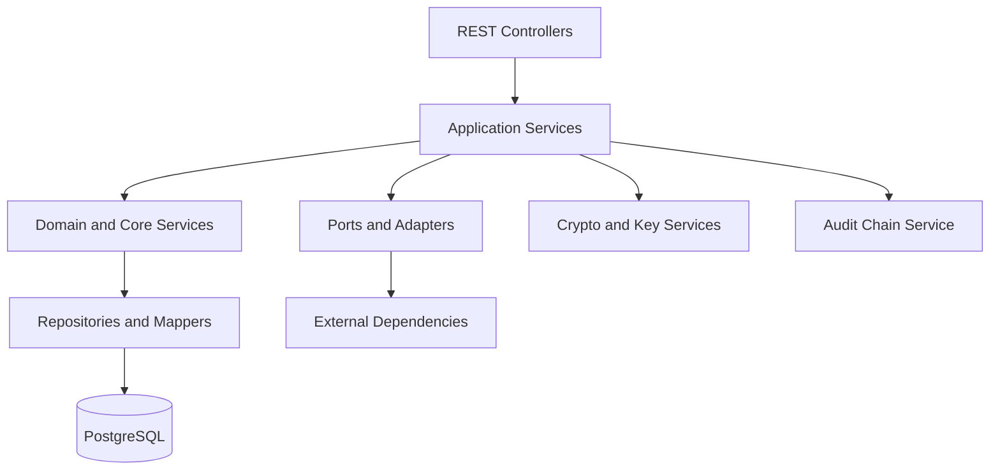

# Admin API — Stack and Architecture

## Intent

This document describes the technical structure of the Admin API backend: the stack, the layered architecture, and the cross-cutting patterns that apply across endpoints. Endpoint-level semantics remain in [`../../../docs/ENDPOINT.md`](../../../docs/ENDPOINT.md); this document captures **what a reader must understand before modifying or extending the Admin API**.

## Stack

- **Java 21+**, **Spring Boot 3.x** — backend framework.
- **Spring Web MVC** — REST endpoints.
- **Spring Data JPA + MyBatis** — persistence (mixed as documented in repo rules).
- **Flyway** — database migrations under [`../../../ezkey-core/src/main/resources/db/migration/`](../../../ezkey-core/src/main/resources/db/migration/).
- **MapStruct** — DTO ↔ domain mapping. Explicit default methods are used for enum-to-string conversions (see [`../../../.cursor/rules/mapstruct.mdc`](../../../.cursor/rules/mapstruct.mdc)).
- **Springdoc OpenAPI** — spec generation; the resulting artifacts under [`../../../specs/`](../../../specs/) are **generated** and never hand-edited.
- **Tink** — cryptographic primitives for encryption at rest and key rotation.
- **SLF4J + Logback** — logging.
- **Maven** — build. The reactor is Checkstyle-sensitive; see [`../../../.cursor/rules/maven-build.mdc`](../../../.cursor/rules/maven-build.mdc).

## Runtime Shape

The Admin API is a Spring Boot application that listens on port **9080** locally. It is fronted by Caddy (in Docker) for QA/production-like paths. In a local clean-start stack, it runs alongside the Auth API, Crypto API, Demo Device, and UI surfaces.

Bootstrap responsibilities include:

- Applying Flyway migrations (placeholder global admin row).
- Running `InitialGlobalAdminService` to align the real global admin identity with configured properties.
- Running `AdminBootstrapService` to create the system integration, the initial admin enrollment, and recovery codes.

Logging and secret handling rules:

- **Never log** enrollment proof tokens, challenge codes, plaintext recovery codes, recovery tokens, bearer tokens, or raw cryptographic signatures.
- Log only non-secret identifiers (for example `enrollmentId`, `username`).

## Layered Architecture

- **Controllers** define REST endpoints, DTO contracts, and Problem Details responses. No business logic.
- **Services** hold orchestration and invariants. Transactions are declared here.
- **Domain and core services** live mostly in `ezkey-core`. Admin API composes them.
- **Repositories and mappers** persist and load entities.
- **Audit chain service** writes integrity-protected audit entries for actions that matter.

## Cross-Cutting Patterns

### Constructor injection only

No `@Autowired`. Every Spring bean receives its dependencies through the constructor. This keeps tests and wiring predictable.

### Transactional boundaries

Transactions are declared at the service entry point of a user-visible operation. Helper methods that are not invoked through the Spring proxy must not rely on their own `@Transactional`. This matters for flows that delegate to `LockingTaskExecutor`; see [ADR-API-0003](design-decisions.md#adr-api-0003-transactional-boundary-on-service-entry-points).

### Scan base packages discipline

Each boot module declares explicit `scanBasePackages`. Adding a new top-level package under `org.ezkey.*` used by an Admin API bean requires updating `AdminApplication` to include it. Failing to do so produces a startup failure that unit tests do not catch.

### Generated API artifacts

OpenAPI specs under [`../../../specs/admin-api/`](../../../specs/admin-api/) are **generated** by `scripts/update-specs.sh` after a clean-start stack. Agents never hand-edit these files. Postman collections under [`../../../postman/collections/`](../../../postman/collections/) are updated in the same change set when relevant.

### Role-aware endpoints and tenant scoping

Authorization combines three things:

- **Authentication mode** — Bearer token (admin session) or API key (integration).
- **Role** — `GLOBAL_ADMIN` or `TENANT_ADMIN`.
- **Tenant scope** — the current admin's tenant (implicit for Tenant Admin) or an explicit filter (Global Admin).

Controllers reject cross-tenant access; they do not leak existence across tenant boundaries.

### Rate limiting

Selected endpoints enforce rate limiting (login, `/admin/auth/recover`, `respond`, auth attempt creation, cancellation, wait). Exceeded limits return HTTP 429 with a `Retry-After` header. Details: [`../../../ezkey-admin-api/README_RATE_LIMITING.md`](../../../ezkey-admin-api/README_RATE_LIMITING.md) and [`../../../ezkey-admin-api/API_KEY_RATE_LIMIT_NOTE.md`](../../../ezkey-admin-api/API_KEY_RATE_LIMIT_NOTE.md).

### Audit chain integrity

Significant state transitions write audit rows with cryptographic chain linkage. Chain checkpoints and lifecycle observability endpoints are documented in [`../../../docs/ENDPOINT.md`](../../../docs/ENDPOINT.md) and [`../../../docs/AUDIT_LOG_INTEGRITY.md`](../../../docs/AUDIT_LOG_INTEGRITY.md).

### Encryption at rest

Tink-backed encryption with rotatable keys. Operator-facing lifecycle is documented in [`functional-flows.md`](functional-flows.md) and in the re-encryption operations runbook [`../../../docs/REENCRYPTION_OPERATIONS.md`](../../../docs/REENCRYPTION_OPERATIONS.md).

## Validation and Build Baseline

Before running targeted Maven commands, use the reactor-safe baseline from the repository root:

1. `mvn spotless:apply`
2. `mvn checkstyle:check`
3. `mvn clean`
4. `mvn install -DskipTests`

Then use targeted commands (for example `mvn test -pl 'ezkey-admin-api,!ezkey-tests'`). Reference: [`../../../.cursor/rules/maven-build.mdc`](../../../.cursor/rules/maven-build.mdc).

## Related Documents

- [`functional-flows.md`](functional-flows.md).
- [`data-model-and-persistence.md`](data-model-and-persistence.md).
- [`api-and-boundary-mappings.md`](api-and-boundary-mappings.md).
- [`exception-and-error-model.md`](exception-and-error-model.md).
- Module: [`../../../ezkey-admin-api/README.md`](../../../ezkey-admin-api/README.md).
