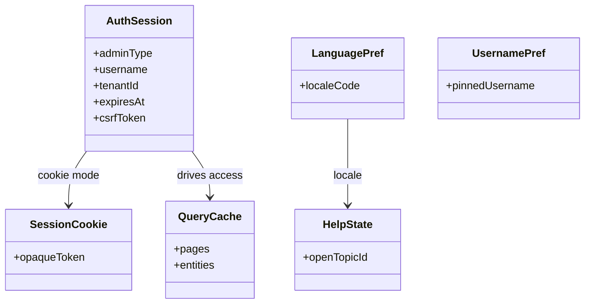
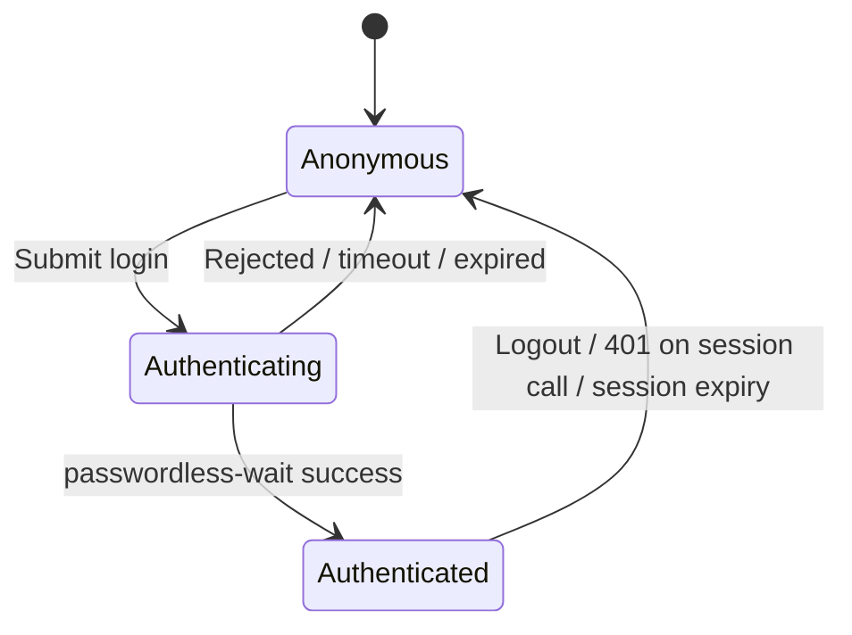

# Admin UI — Data Model and Persistence

## Intent

This document describes the Admin UI's local data model: the types it manipulates, the client-side caching strategy, and the small persistence surface it owns. The Admin UI is **not a source of truth** — the Admin API is. The UI's "data model" is shaped around consuming Admin API responses and holding them efficiently between interactions.

## Ownership and Boundaries

- **Owned state.** Session material, language preference, optional username pin, help UI state, toast queue, session-level demo toggle (development builds only).
- **Referenced state.** All business entities (integrations, enrollments, admins, API keys, tenants, audit logs) are owned by the Admin API and described in [`../admin-api/data-model-and-persistence.md`](../admin-api/data-model-and-persistence.md). The UI reads them and renders them.

## Conceptual View

## Types That Matter

- **`AuthSession`** — the current logged-in session view (not the secret itself). Exposed by `useAuth()`.
- **`PageResponse<T>`** — wire format for paginated lists. Metadata is nested under `page` (Spring Data Pattern B).
- **`ProblemDetail`** — RFC 9457 envelope used across error paths. Wrapped by `ApiError` on the client.
- **Domain models** — `Integration`, `Enrollment`, `AuthAttempt`, `Admin`, `ApiKey`, `AuditLog` (see `src/types/models.ts`). Field names match backend DTOs exactly.

## Persistence Surface

| Concern | Storage | Scope | Notes |
|---------|---------|-------|-------|
| Session (token mode) | `sessionStorage` | Tab | Cleared on logout, 401 on session call, or tab close. |
| Session (cookie mode) | HTTP cookie | Browser | Managed by backend; `csrfToken` is exposed through `/me`. |
| Language preference | `localStorage` | Origin | Key `ezkey-admin-ui-lang`. |
| Username pin | `localStorage` | Origin | Key `ezkey_admin_username_pref`. Non-secret username only. |
| Session-level demo toggle | In-memory | Tab | Active only when `VITE_DEMO_MODE` is true. |
| Query cache | In-memory (TanStack Query) | App | Cleared on logout. |

### Rules

- **Never store the bearer token in `localStorage`** — the rule is non-negotiable.
- **Never persist secrets in the UI** beyond what the session model requires.
- **Clear the query cache on logout** (`queryClient.clear()`) to prevent the next operator from seeing cached data.
- **Derive role gating from the session** (`session.adminType`); never cache a flipped role copy elsewhere.

## Caching Strategy

- Default TanStack Query settings: `staleTime: 30s`, 1 retry, `refetchOnWindowFocus: false`.
- Paginated list queries use `usePaginatedQuery` (custom) or `usePaginatedFromOrval` (generated). Both respect Pattern B pagination metadata.
- List invalidation after mutations uses the **same query key** as the list query. Orval generators expose factory functions (for example `getListTenantsQueryKey()`); custom hooks use prefixes (for example `['integrations']`).

## Lifecycle of a Session

- Session creation requires a successful `passwordless-wait` response.
- Session termination happens on explicit logout, a 401 on a session-authenticated request, or expiry.

## Cross-Boundary Effects

- **Mutations → list refetch.** Covered in [`stack-and-architecture.md`](stack-and-architecture.md).
- **Mutations → detail refetch.** Detail pages invalidate using the matching detail query key (including Orval path-based tuples).
- **Logout → backend revocation.** `POST /api/v1/admin/auth/logout` is invoked before clearing client state so that the token is invalidated server-side.

## Related Documents

- [`stack-and-architecture.md`](stack-and-architecture.md).
- [`api-and-boundary-mappings.md`](api-and-boundary-mappings.md).
- [`../admin-api/data-model-and-persistence.md`](../admin-api/data-model-and-persistence.md).
- Module note: [`../../../ezkey-admin-ui/docs/LIST_DATA_LOADING_DESIGN.md`](../../../ezkey-admin-ui/docs/LIST_DATA_LOADING_DESIGN.md).
