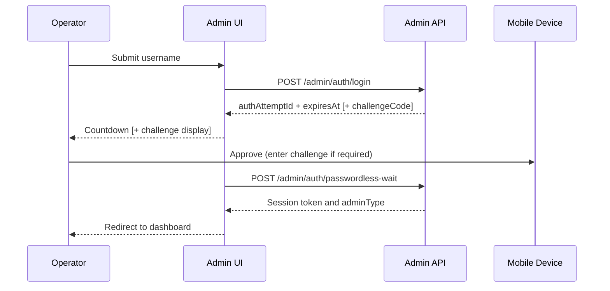
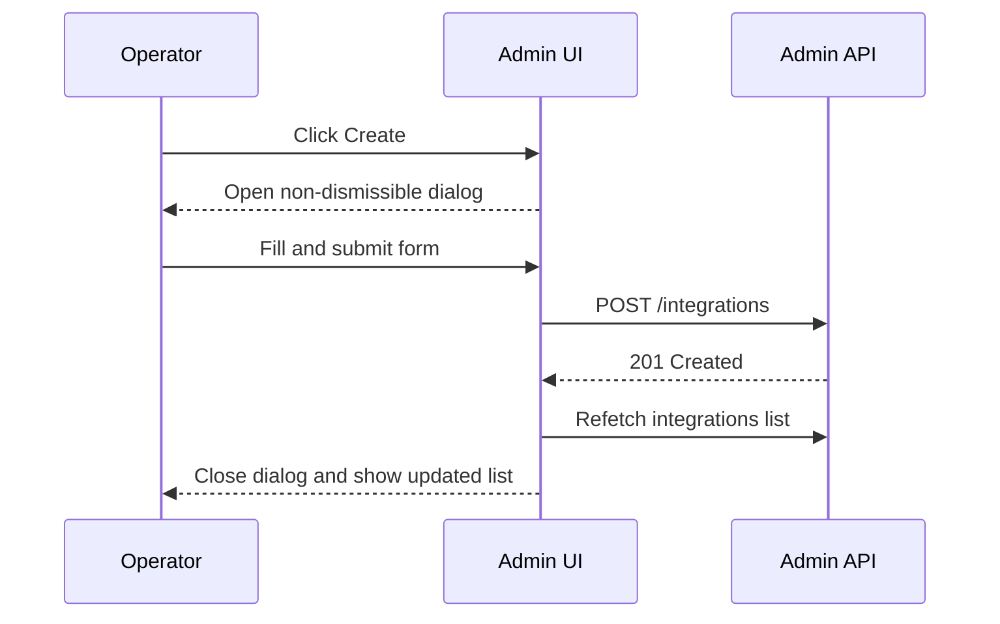

# Admin UI — Functional Flows

## Intent

This document catalogs the primary user-facing workflows in the Admin UI. Each workflow describes the nominal path, decision points, exception paths, and boundaries crossed. Detailed Admin API semantics live in [`../admin-api/functional-flows.md`](../admin-api/functional-flows.md); this document is about what the operator sees and does.

Phase 1 seeds two representative workflows. Additional workflows will be added using the [functional workflow template](../../templates/functional-workflow.template.md).

## Workflow Index

| ID | Workflow | Status | Related feature |
|----|----------|--------|-----------------|
| `W-ui-login-passwordless` | Passwordless login with optional challenge | `implemented` | [`F-admin-ui-shell`](../../global/features-and-phases.md#f-admin-ui-shell) |
| `W-ui-integration-create` | Create an integration | `implemented` | [`F-admin-ui-workflows`](../../global/features-and-phases.md#f-admin-ui-workflows) |

---

## `W-ui-login-passwordless` — Passwordless Login

### Intent

Authenticate an operator into the Admin UI using Ezkey passwordless authentication. This is the single entry point for Global Admins and Tenant Admins; there are no other authentication methods.

### Actors

- **Operator** — Global Admin or Tenant Admin.
- **Admin UI** — React SPA.
- **Admin API** — `/api/v1/admin/auth/*`.
- **Mobile Device** — Ezkey mobile app (or Demo Device for test environments).

### Preconditions

- Operator has a bound Ezkey enrollment.
- Operator has the mobile device available.

### Postconditions

- Session established (bearer token in `sessionStorage` or session cookie set).
- Operator redirected to the dashboard with their role-appropriate navigation.

### Nominal Flow

1. Operator opens `/login`, enters username, optionally toggles "challenge required", submits.
2. Admin UI calls `POST /api/v1/admin/auth/login` with `nonBlocking: true`.
3. Admin API returns `authAttemptId`, `expiresAt`, and optionally a `challengeCode`.
4. Admin UI renders a countdown driven by `expiresAt` and, when present, displays the challenge code zero-padded (for example `"07"`).
5. Operator approves the request on the mobile device (matching the challenge code if requested).
6. Admin UI calls `POST /api/v1/admin/auth/passwordless-wait` (long-running) with `AbortController`-guarded race handling.
7. On success, Admin UI persists the session and redirects to the dashboard.

### Decision Points

| Decision | Condition | Branch |
|----------|-----------|--------|
| Challenge requested? | `challengeRequested = true` | Display challenge code and require device-side entry. |
| Pin username? | User toggles "remember" | Persist `ezkey_admin_username_pref` in `localStorage`. |

### Exception Paths

#### `EX-login-rejected`

- **Trigger.** Device explicitly rejects the authentication request.
- **Outcome.** UI displays the translated error (`authentication.auth-rejected`).
- **Recovery.** Operator may retry from the login page.
- **Reference.** [`exception-and-error-model.md#auth-rejected`](exception-and-error-model.md#auth-rejected).

#### `EX-login-timeout`

- **Trigger.** Authentication attempt expires before device approves.
- **Outcome.** UI resets the form and surfaces the `authentication.auth-timeout` error.
- **Recovery.** Operator may retry from the login page.
- **Reference.** [`exception-and-error-model.md#auth-timeout`](exception-and-error-model.md#auth-timeout).

#### `EX-login-rate-limited`

- **Trigger.** Admin API returns `429 Too Many Requests`.
- **Outcome.** UI displays a rate-limited message with the server-provided `Retry-After` hint when available.
- **Recovery.** Operator waits and retries.

### Boundaries Crossed

- Admin UI ↔ Admin API passwordless endpoints — see [`api-and-boundary-mappings.md#admin-auth`](api-and-boundary-mappings.md#admin-auth).

### Persistence Interactions

- Writes session material to `sessionStorage` (plain token) or relies on session cookie (browser cookie mode).
- Optionally writes `ezkey_admin_username_pref` to `localStorage`.

### Acceptance Criteria

- Login form sends `nonBlocking: true` on the initial call.
- Challenge code, when present, is zero-padded to 2 digits via `formatChallengeCode`.
- Abort handling prevents race conditions on success after expiry.
- Session is populated exactly once; a duplicate login never overrides an existing active session without explicit logout.

### Related Documents

- [`screens-and-wireflow.md#login`](screens-and-wireflow.md#login).
- [`../admin-api/functional-flows.md#admin-login-passwordless`](../admin-api/functional-flows.md#admin-login-passwordless).

---

## `W-ui-integration-create` — Create an Integration

### Intent

Create a new integration within the current tenant scope, through the Admin UI "Integrations" list toolbar.

### Actors

- **Operator** — Global Admin (any tenant) or Tenant Admin (own tenant).
- **Admin UI**.
- **Admin API** — `POST /api/v1/integrations`.

### Preconditions

- Operator is authenticated.
- The target tenant is active (for Tenant Admins, the operator's own tenant).

### Postconditions

- Integration is created in the target tenant.
- Integrations list refreshes to include the new record.

### Nominal Flow

1. Operator navigates to the Integrations list.
2. Operator clicks **Create** (primary action, right-aligned on the toolbar).
3. Dialog opens (`dismissible={false}` because it contains a form).
4. Operator fills the form (name, description, optional demo-mode "Fill demo" in test builds).
5. On submit, UI calls `POST /api/v1/integrations`.
6. On success, UI invalidates the integrations list query key so the list refetches before the dialog closes.

### Decision Points

| Decision | Condition | Branch |
|----------|-----------|--------|
| GlobalAdmin with tenant context | `adminType = GLOBAL_ADMIN` and tenant filter set | Creates in the filtered tenant. |
| TenantAdmin | `adminType = TENANT_ADMIN` | Creates in own tenant only. |

### Exception Paths

#### `EX-integration-validation`

- **Trigger.** Server returns 400 with RFC 9457 Problem Details (for example, duplicate name).
- **Outcome.** Inline alert inside the dialog with translated or server-provided message.
- **Recovery.** Operator edits the form and resubmits.

#### `EX-integration-forbidden`

- **Trigger.** Server returns 403 (tenant scope mismatch, inactive tenant).
- **Outcome.** Global error alert; dialog stays open to preserve input.
- **Recovery.** Operator exits the dialog or escalates.

### Boundaries Crossed

- Admin UI ↔ Admin API integration endpoints — see [`api-and-boundary-mappings.md#integrations`](api-and-boundary-mappings.md#integrations).

### Persistence Interactions

- None client-side beyond query cache.

### Acceptance Criteria

- Primary action is right-aligned on the toolbar.
- Dialog is non-dismissible while the form is active.
- List invalidation uses the matching query key so the new integration appears without a manual refresh.
- Error display uses `getTranslatedApiError`.

### Related Documents

- [`../admin-api/functional-flows.md#integration-create`](../admin-api/functional-flows.md#integration-create).
- [`api-and-boundary-mappings.md#integrations`](api-and-boundary-mappings.md#integrations).
