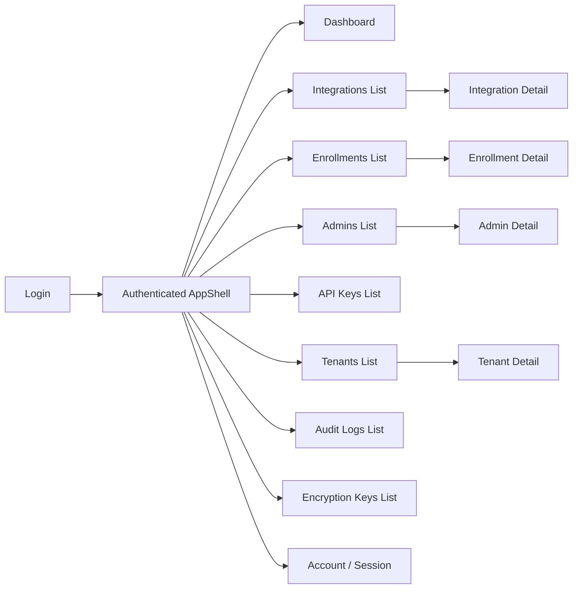

# Admin UI — Screens and Wireflow

## Intent

This document describes the primary screens of the Admin UI, how they connect, and what each screen is responsible for. It is a **map**, not a specification of every pixel. Visual identity and theme tokens live in [`stack-and-architecture.md`](stack-and-architecture.md).

## Navigation Model

The UI is organized around:

- An **authentication shell** (`/login`, recovery pages).
- An **authenticated shell** (`AppShell`) that wraps every protected page with a sidebar, header, and body.
- **Role-aware navigation** — the sidebar adapts based on `adminType`; Global Admin sees platform-wide entries, Tenant Admin sees tenant-scoped entries.

## Screen Inventory

### Login

- **Route.** `/login`.
- **Primary actor.** Anonymous operator.
- **Purpose.** Authenticate via Ezkey passwordless flow.
- **Primary actions.** Submit username, optionally request challenge, optionally pin username.
- **Displayed data.** Countdown driven by `expiresAt`; challenge code when challenge is requested.
- **Visibility.** Public (only page available before login).
- **Related workflow.** [`functional-flows.md#w-ui-login-passwordless`](functional-flows.md#w-ui-login-passwordless).

### Dashboard

- **Route.** `/`.
- **Primary actor.** Authenticated operator (both roles).
- **Purpose.** Entry landing: session context, quick links, recent activity (to the extent exposed).
- **Visibility.** Authenticated.
- **Widget signal model.** Badge colors, operator questions, and drilldown targets for stat cards and conditional panels are documented in [`dashboard-widget-signal-model.md`](dashboard-widget-signal-model.md) (enrollment **invalid** vs **revoked** split; red reserved for investigate-now states).

### Integrations List

- **Route.** `/integrations`.
- **Primary actor.** Both roles (Global Admin sees all tenants; Tenant Admin sees own tenant only).
- **Purpose.** Search, filter, paginate integrations; create a new integration.
- **Primary actions.** Create, Refresh, filter by name / lifecycle status.
- **Displayed data.** Integration name, lifecycle status, created timestamp.
- **Related workflow.** [`functional-flows.md#w-ui-integration-create`](functional-flows.md#w-ui-integration-create).

### Integration Detail

- **Route.** `/integrations/:id`.
- **Primary actor.** Both roles.
- **Purpose.** View integration details and related enrollments and API keys; run operator actions (retire, delete when applicable).
- **Primary actions.** Retire (reason required), Delete (guarded), navigate to enrollments.
- **Gating.** Retire and Delete hidden when conditions are not met.

### Enrollments List and Detail

- **Routes.** `/enrollments`, `/enrollments/:id`.
- **Primary actor.** Both roles (scope applies).
- **Purpose.** Manage enrollment lifecycle (deactivate, reactivate, revoke, delete when conditions are met).
- **Create dialog.** Operators may set an optional pending-phase invitation expiry (`expiresAt`) or rely on the instance default (`ezkey.enrollment.pending-expiration-days`, default 7 days).
- **Detail page features.** Trigger a **Test Authentication** attempt and poll until a final status. Cancel outstanding attempt on exit.

### Admins List and Detail

- **Routes.** `/admins` (list). There is **no** `/admins/:id` — detail opens on `/admins?adminId=` via `adminListDetailHref`.
- **Primary actor.** Both roles (Global Admin for Global Admins; Tenant Admin limited to own tenant).
- **Purpose.** Provision and manage admin identities; regenerate recovery codes; retrieve onboarding credentials (and QR) when applicable.

### API Keys

- **Routes.** `/api-keys` (list), `/api-keys/:id` (detail), and `/integrations/:id/api-keys`.
- **Primary actor.** Both roles (scope applies).
- **Purpose.** Create new API keys (secret shown once), list, filter, revoke; on detail, copy the
  full key, edit description and IP whitelist (`PATCH`), revoke with reason.

### Tenants List and Detail

- **Routes.** `/tenants`, `/tenants/:id`.
- **Primary actor.** Global Admin (Tenant Admin sees own tenant in read-only mode).
- **Purpose.** Create tenants, activate/deactivate, manage tenant metadata.

### Audit Logs

- **Route.** `/audit-logs`.
- **Primary actor.** Both roles.
- **Purpose.** Search audit entries with date-range presets (`DateRangeFilter`); inspect chain
  checkpoints and lifecycle observability (Global Admin). Enrollment, integration, and auth-attempt
  detail pages open this screen via **View related audits** (entity filter + rolling window).
  **Expand context** is a bounded 24h → 48h zoom-out, not a general investigation console.
- **Reading model.** `eventType` answers what happened; `eventStatus` answers how that audited step
    ended (`SUCCESS`, `FAILURE`, `ERROR`); `eventAction` is the stable filter/export key for
    automation and SIEM.
- **Role rule.** Global Admin and Tenant Admin use the same column semantics; role only changes row
    visibility scope, not interpretation.

(Source: R-2026-07-25-audit-vs-auth-expiry)

### Encryption Keys

- **Route.** `/encryption-keys`.
- **Primary actor.** Global Admin.
- **Purpose.** Observe encryption key status (PRIMARY row emphasis); rotate; per-key re-encrypt;
  create batches vs trigger full re-encryption; inspect/resume batches (row detail). Ops contract:
  [`docs/REENCRYPTION_OPERATIONS.md`](../../../docs/REENCRYPTION_OPERATIONS.md).

### Account / Session

- **Route.** `/account`.
- **Primary actor.** Authenticated operator.
- **Purpose.** Display session metadata, language preference, logout.

## Wireflow Patterns

- **List + detail.** Every collection (integrations, enrollments, admins, API keys, tenants, audit logs) follows the same list-then-detail navigation.
- **Create dialog.** Primary action is right-aligned on the toolbar; dialog is non-dismissible; success invalidates the list query key.
- **Confirmation dialog.** Irreversible actions require a reason (min 10 characters) and show a summary of what will change. Hints come from `reason-preset-groups.ts` when applicable.
- **Secret-shown-once dialog.** Used for API key creation and similar flows; `dismissible={false}`, close only via explicit action.
- **Countdown and pending.** Used by login and Test Authentication; driven by `expiresAt` with a single `setInterval`.

## Accessibility and Internationalization

- All strings go through `useTranslation()`; locales `en` and `fr` are mandatory for every key.
- The help drawer responds to the `?` key when focus is not in an input, textarea, select, or contenteditable.
- Focus traps are implemented in `Dialog`; non-dismissible dialogs keep focus inside until explicit close.
- Shadows, borders, and sizing aim at WCAG AA contrast on the standard theme.

## Visual Identity

See [`stack-and-architecture.md#visual-identity`](stack-and-architecture.md#visual-identity) for token-level detail. The model is subtle neo-brutalism: solid borders, flat shadows, no gradients, `rounded-sm` max on inputs.

## Related Documents

- [`functional-flows.md`](functional-flows.md).
- [`api-and-boundary-mappings.md`](api-and-boundary-mappings.md).
- [`exception-and-error-model.md`](exception-and-error-model.md).
- [`../../global/lifecycle-model.md`](../../global/lifecycle-model.md).
