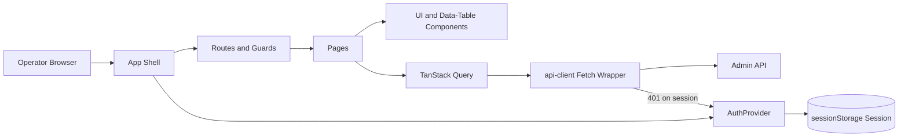

# Admin UI — Stack and Architecture

## Intent

This document describes the technical structure of the Admin UI, the libraries it relies on, and the architectural patterns that apply across pages and features. Implementation specifics remain in the module itself; this document captures **what a reader must understand before modifying UI code** and **why** the pieces are assembled this way.

## Stack

- **Vite 7** — build tooling and dev server (HMR via `npm run dev`).
- **React 19 + TypeScript** (strict mode, `verbatimModuleSyntax`).
- **React Router v7** — `createBrowserRouter`, lazy-loaded pages, `ProtectedRoute` guard.
- **Tailwind CSS v4** — theme tokens declared in `src/index.css` (`@theme {}`); no `tailwind.config.ts`.
- **TanStack Query v5** — data fetching, caching, pagination.
- **React Hook Form + Zod** — forms and validation.
- **Fetch API** — no axios; always use `api.*` from `@/lib/api-client`.
- **i18next** — locale-aware translation (EN and FR).
- **Playwright** — browser-level tests against a real backend with the pre-seeded Demo Device.

## Runtime Shape

The Admin UI is a single-page application served statically and proxied to the Admin API (`/api/*`). Deployment paths:

- **Local dev** (`npm run dev`) — Vite HMR, API proxy configured in `vite.config.ts`.
- **Docker / QA** (`./start.sh`) — Built assets served by Caddy on port 3090; Caddy enforces CSP and other headers; reverse-proxies `/api/*` to the Admin API.
- **Cloudflare Pages** (`npm run build:cloudflare`) — Static build with an embedded API base URL for a split UI/API topology.

Details on header surfaces and deployment variations live in [`../../../docs/admin-ui-security.md`](../../../docs/admin-ui-security.md) and [`../../../docs/cloudflare/admin-ui-pages.md`](../../../docs/cloudflare/admin-ui-pages.md).

## Module Layout

The relevant top-level structure inside `src/`:

```text
src/
  lib/                 Runtime utilities: api-client, auth session, query-client,
                       query-keys, utils, api-error-i18n, demo-mode, preset groups.
  types/               DTO and domain model types (api.ts, models.ts).
  context/             React providers (auth, demo mode, toast).
  hooks/               Reusable hooks (use-paginated-query, use-debounce, use-integrations).
  components/
    ui/                Primitive components (Button, Input, Card, Alert, Dialog, ...).
    layout/            AppShell, Sidebar, Header.
    data-table/        DataTable<T>, Pagination.
    feature/           Feature-specific components (status badges, reason pickers, demo badges).
  pages/               One file per route.
  routes.tsx           Centralized route definitions with lazy imports and ProtectedRoute.
  App.tsx              Root composition of providers and router.
  locales/en|fr/*.json Translation namespaces (including `errors` for RFC 9457 mapping).
  generated/           Orval-generated Admin API clients (read-only; regenerated from specs).
```

The path alias `@/` maps to `src/` and is used for cross-directory imports.

## Architectural View



## Cross-Cutting Patterns

### Session and authentication

The UI uses Ezkey passwordless authentication. Bearer tokens or session cookies are managed by `AuthProvider`; plain tokens are stored in `sessionStorage` only. A 401 on a session-authenticated request automatically clears the session and redirects to login.

The login flow uses `nonBlocking: true` on the initial call and a long-running `passwordless-wait` call resolved on device approval. Challenge codes are always zero-padded via `formatChallengeCode`.

### Data loading and caching

- **Paginated lists** use `usePaginatedQuery` (custom) or `usePaginatedFromOrval` (generated Admin API clients).
- Spring Data pagination is **Pattern B**: metadata is nested inside a `page` sub-object. The UI never accesses `data.totalElements` directly.
- Lists support **server-side sorting** only — never client-side sort of the visible page.
- Mutations invalidate matching query keys in `onSuccess`. Orval-generated keys use path-based tuples (for example `['/api/v1/tenants']`); custom hooks use prefixes (for example `['integrations']`). See [`../../../ezkey-admin-ui/docs/LIST_DATA_LOADING_DESIGN.md`](../../../ezkey-admin-ui/docs/LIST_DATA_LOADING_DESIGN.md).

### Error handling

External errors from the Admin API use RFC 9457 Problem Details. The UI wraps them in an `ApiError` type; components render them through `getTranslatedApiError` (preferred) or `getApiErrorMessage` (raw fallback). Locale mapping for `type` URIs lives under the `errors` i18n namespace.

### Internationalization

- Languages supported: English and French.
- Language preference is stored in `localStorage` under `ezkey-admin-ui-lang`.
- Every user-visible string must go through `t('namespace:key')`.

### Role-based gating

`useAuth()` exposes the current session (`adminType`, `tenantId`, `expiresAt`). Role-dependent UI is guarded by inline checks like `session?.adminType === 'GLOBAL_ADMIN'`.

### Contextual help

`HelpProvider` wraps the routes; the `?` key opens a right-hand drawer with topic content resolved via `resolveHelpTopicId()` and rendered from the `help` namespace. FR/EN parity is mandatory for every help key.

### Demo mode

- Enabled at build time via `VITE_DEMO_MODE`. Production builds strip all demo branches through compile-time constant replacement in `vite.config.ts`.
- Demo presets live in `src/lib/demo-mode.ts` and per-locale `demo.json`.
- Production verification is automated through `scripts/assert-no-demo-in-build.sh`.

## Visual Identity

Sober neo-brutalist design: solid borders (`border-2 border-fg`), flat shadows (`shadow-brutal`), minimal border radius, no gradients, no decorative animations. Theme tokens live in `src/index.css`. The brand is driven from the root `logo.svg`; UI variants are generated by `scripts/prepare-admin-ui-brand-assets.py`.

## Relationship with Backend

The Admin UI is a **client** of the Admin API. It does not implement business rules; it renders state, applies optimistic updates carefully, and defers all decisions to the backend. Role-based visibility in the UI is convenience; authorization is always enforced server-side.

## Related Documents

- [`functional-flows.md`](functional-flows.md) — primary workflows.
- [`api-and-boundary-mappings.md`](api-and-boundary-mappings.md) — Admin API boundary.
- [`exception-and-error-model.md`](exception-and-error-model.md) — error taxonomy.
- [`screens-and-wireflow.md`](screens-and-wireflow.md) — screen composition.
- [`design-decisions.md`](design-decisions.md) — local decisions.
- Module: [`../../../ezkey-admin-ui/README.md`](../../../ezkey-admin-ui/README.md), [`../../../ezkey-admin-ui/AGENTS.md`](../../../ezkey-admin-ui/AGENTS.md).
