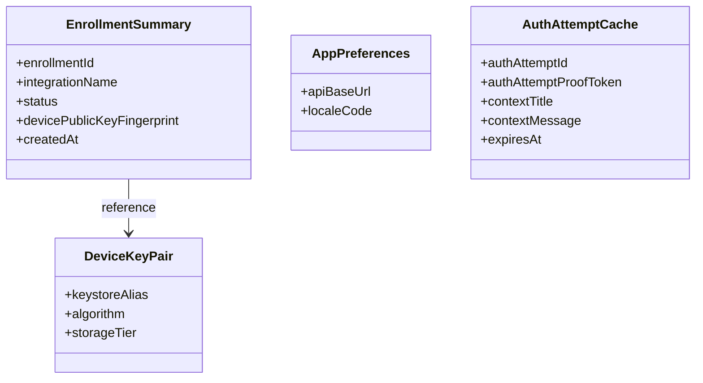

# Mobile — Data Model and Persistence

## Intent

This document describes the mobile app's local data model and persistence rules. The canonical internal reference is [`../../../ezkey_mobile/docs/MOBILE_DATA_MODEL.md`](../../../ezkey_mobile/docs/MOBILE_DATA_MODEL.md); this document summarizes the model for the product-wide system and highlights boundaries and invariants.

## Ownership and Boundaries

- **Owned locally.** Enrollment summaries, app preferences, session context (non-secret).
- **Owned by the native keystore.** Device EC P-256 private keys. Application code has no access.
- **Protected through secure storage.** Long-lived local application secrets such as `enrollmentProofToken` and `integrationPublicKey`, using Android Keystore-backed sealed-secret envelopes on Android and secure-storage fallback elsewhere.
- **Owned by the backend.** Enrollment lifecycle state, authentication attempts, integration metadata. The app reads these through the Auth API and stores minimum copies only for UX purposes.

## Conceptual View

## Types That Matter

- **`EnrollmentSummary`** — local metadata describing a bound enrollment. Never stores the private key.
- **`DeviceKeyPair` (logical)** — a reference to the keystore alias; actual key material stays native.
- **`StoredEnrollment` (runtime)** — local metadata rehydrated with `enrollmentProofToken` and `integrationPublicKey` from the secure secret delegate when the app needs to execute authenticated flows.
- **Generated Auth API DTOs** — live under `app/services/api/generated/auth-api/model/`; never hand-edited.
- **`AuthAttemptCache`** — optional short-lived in-memory cache for the currently displayed attempt.

## Persistence Surface

| Concern | Storage | Scope | Notes |
|---------|---------|-------|-------|
| Device EC P-256 private key | Android Keystore / iOS Keychain | Device | Non-extractable; `StrongBox` requested when available. |
| Enrollment metadata | AsyncStorage-backed local metadata storage | App | Installation metadata, labels, timestamps, and non-secret routing/display fields. |
| Enrollment proof token and integration verification key | Android: sealed-secret envelopes in AsyncStorage protected by an app-level Keystore AES key. Other platforms: secure storage abstraction | App | Persisted outside the AsyncStorage enrollment collection and rehydrated when needed. |
| App preferences | App storage | App | Base URL, locale, minor toggles. |
| Current auth attempt cache | In-memory only | Screen session | Cleared when the screen unmounts or a final result is received. |
| One-time proof tokens (`deviceProofToken`, `authAttemptProofToken`) | In-memory only | Flow step | Never persisted as durable local state. |

### Rules

- **Never persist one-time proof material or long-lived verification material in ordinary app storage.** The current mobile app persists `enrollmentProofToken` and `integrationPublicKey` via the secure-storage delegate rather than in the AsyncStorage enrollment collection.
- **Never log private keys or signatures.** Identifiers (for example `enrollmentId`) are acceptable.
- **Do not maintain a second hand-edited copy of Auth API contracts** in `app/services/api/types.ts`; that file keeps local mobile domain types and UI-friendly wrapper shapes only.

Important clarification: the current app does **not** use the per-enrollment private key as a universal decryption key
for every other local secret. `Android Keystore` / `StrongBox when available` protect the signing key. On Android, a
separate app-level Keystore AES key protects sealed-secret envelopes for `enrollmentProofToken` and
`integrationPublicKey`; other platforms continue to use their secure-storage abstraction.

## Lifecycle (Local Perspective)

- **Enrollment.** Created after a successful verify; considered `verified` locally when the backend confirms.
- **Key pair.** Created once per enrollment; rotated only when the enrollment is re-bound.
- **Auth attempt cache.** Tied to the screen; never outlives the flow step.

## Cross-Boundary Effects

- **App → Native keystore.** Signing requests cross into native code; private key bytes never reach JavaScript.
- **App ↔ Auth API.** Only endpoint interactions. No side-channels.
- **Backend revocation.** If the backend invalidates an enrollment, the app discovers it on the next successful pending check or respond; the app does not eagerly sync.

## Related Documents

- Canonical: [`../../../ezkey_mobile/docs/MOBILE_DATA_MODEL.md`](../../../ezkey_mobile/docs/MOBILE_DATA_MODEL.md).
- Native modules: [`../../../ezkey_mobile/docs/NATIVE_MODULES.md`](../../../ezkey_mobile/docs/NATIVE_MODULES.md).
- [`stack-and-architecture.md`](stack-and-architecture.md).
- [`api-and-boundary-mappings.md`](api-and-boundary-mappings.md).
