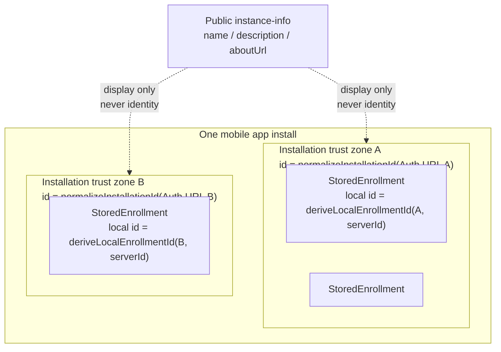
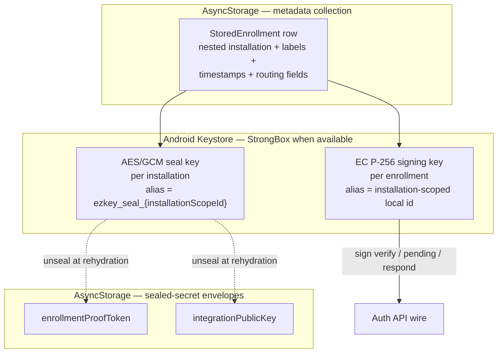

# Mobile — Data Model and Persistence

## Intent

This document is the product-docs entry point for the mobile local model: **installation as trust zone**, enrollments
as members of that zone, and the Keystore / StrongBox relationship to sealed secrets.

Deep field tables, rehydration outcomes, and source-of-truth matrices live in the module canon
[`../../../ezkey_mobile/docs/MOBILE_DATA_MODEL.md`](../../../ezkey_mobile/docs/MOBILE_DATA_MODEL.md)
(start at **Cornerstone: Installation Trust Zone and Key Material**).

## Ownership and Boundaries

- **Owned by the installation trust zone (conceptually).** Every enrollment belongs to exactly one installation;
  identity is the normalized Auth API URL.
- **Owned locally (persisted packaging).** Enrollment metadata rows nest an `installation` object (storage convenience,
  not conceptual subordination).
- **Owned by the native keystore.** Device EC P-256 private signing keys (StrongBox when available). Application code
  never sees private key bytes.
- **Protected through sealed secrets (Android).** `enrollmentProofToken` and `integrationPublicKey` live in
  AsyncStorage envelopes sealed by a **per-installation** Keystore AES key (`ezkey_seal_{installationScopeId}`,
  ADR-MOB-0006). Other platforms use their secure-storage abstraction.
- **Owned by the backend.** Enrollment lifecycle, auth attempts, integration metadata. The app stores minimum UX copies
  only.

## Cornerstone Conceptual View

**Invariants**

- Two enrollments with equivalent normalized Auth URLs share one trust zone; distinct URLs are independent zones.
- Signing key aliases, local enrollment ids, and seal keys are all installation-scoped (MOB-011, ADR-MOB-0006).
- The EC P-256 signing key does **not** decrypt other local secrets; seal keys and signing keys are complementary.
- Clear-all removes signing keys, sealed envelopes, and every `ezkey_seal_*` alias.

## Types That Matter

- **`Installation`** — first-class local trust zone; `id` = normalized Auth URL; branding from `instance-info` is
  display-only.
- **`EnrollmentSummary`** — local metadata for a bound enrollment that belongs to one installation. Never stores the
  private key.
- **`StoredEnrollment` (runtime)** — metadata plus rehydrated `enrollmentProofToken` and `integrationPublicKey`.
- **`DeviceKeyPair` (logical)** — Keystore alias reference; key material stays native.
- **Generated Auth API DTOs** — under `app/services/api/generated/auth-api/model/`; never hand-edited.
- **`AuthAttemptCache`** — optional short-lived in-memory cache for the currently displayed attempt.

## Persistence Surface

| Concern | Storage | Scope | Notes |
|---------|---------|-------|-------|
| Device EC P-256 private key | Android Keystore / iOS Keychain | Per enrollment (installation-scoped alias) | Non-extractable; StrongBox requested when available. |
| Per-installation AES seal key | Android Keystore | Per installation trust zone | Alias `ezkey_seal_{installationScopeId}` (ADR-MOB-0006). |
| Enrollment metadata | AsyncStorage metadata collection | App | Nested `installation`, labels, timestamps, non-secret routing/display fields. |
| Enrollment proof token and integration verification key | Android: sealed envelopes in AsyncStorage; other platforms: secure-storage abstraction | Per enrollment, sealed under installation seal key | Rehydrated into `StoredEnrollment` at runtime; not cleartext in the metadata collection. |
| App preferences | App storage | App | Base URL, locale, minor toggles. |
| Current auth attempt cache | In-memory only | Screen session | Cleared when the screen unmounts or a final result is received. |
| One-time proof tokens (`deviceProofToken`, `authAttemptProofToken`) | In-memory only | Flow step | Never persisted as durable local state. |

### Rules

- **Never persist one-time proof material or long-lived verification material in ordinary cleartext app storage.**
- **Never log private keys or signatures.** Identifiers (for example local enrollment id) are acceptable.
- **Do not maintain a second hand-edited copy of Auth API contracts** in `app/services/api/types.ts`.

## Lifecycle (Local Perspective)

- **Installation.** Materialized when the first enrollment for that Auth URL is verified (and refreshed for branding).
- **Enrollment.** Persisted after a successful verify; considered verified locally when the backend confirms.
- **Signing key pair.** Created once per enrollment; wiped on delete / clear-all (best-effort).
- **Seal key.** Provisioned per installation on first seal need; all `ezkey_seal_*` aliases swept on clear-all.
- **Auth attempt cache.** Tied to the screen; never outlives the flow step.

## Cross-Boundary Effects

- **App → Native keystore.** Signing and seal/unseal cross into native code; private key bytes never reach JavaScript.
- **App ↔ Auth API.** Only endpoint interactions. No side-channels.
- **Backend revocation.** Discovered on the next successful pending check or respond; the app does not eagerly sync.

## Related Documents

- Module canon (cornerstone + tables): [`../../../ezkey_mobile/docs/MOBILE_DATA_MODEL.md`](../../../ezkey_mobile/docs/MOBILE_DATA_MODEL.md).
- Design decisions: [`design-decisions.md`](design-decisions.md) (ADR-MOB-0002, ADR-MOB-0004, ADR-MOB-0006).
- Native modules: [`../../../ezkey_mobile/docs/NATIVE_MODULES.md`](../../../ezkey_mobile/docs/NATIVE_MODULES.md).
- [`stack-and-architecture.md`](stack-and-architecture.md).
- [`api-and-boundary-mappings.md`](api-and-boundary-mappings.md).
