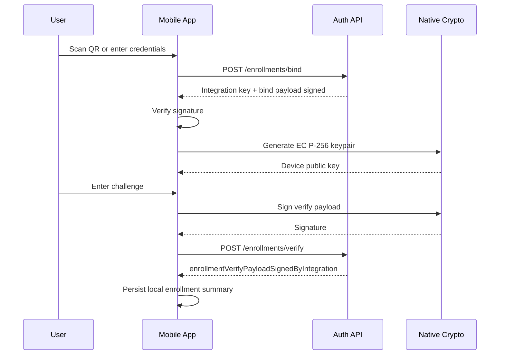

# Mobile — Functional Flows

## Intent

This document catalogs the mobile app's primary workflows: enrollment wizard, retrieving pending authentication attempts, and responding to them. Detailed narrative lives in [`../../../ezkey_mobile/docs/MOBILE_FUNCTIONAL_FLOWS.md`](../../../ezkey_mobile/docs/MOBILE_FUNCTIONAL_FLOWS.md); this document frames the flows inside the product-wide system.

Phase 1 seeds three representative flows. Additional flows can be added using the [functional workflow template](../../templates/functional-workflow.template.md).

## Workflow Index

| ID | Workflow | Status | Related feature |
|----|----------|--------|-----------------|
| `W-mob-enrollment-wizard` | Bind and verify an enrollment via QR-first wizard | `implemented` | [`F-enrollment-bind-verify`](../../global/features-and-phases.md#f-enrollment-bind-verify) |
| `W-mob-pending-check` | User-initiated pending authentication check | `implemented` | [`F-auth-pending-respond`](../../global/features-and-phases.md#f-auth-pending-respond) |
| `W-mob-respond` | Approve or deny a pending authentication attempt | `implemented` | [`F-auth-pending-respond`](../../global/features-and-phases.md#f-auth-pending-respond) |

---

## `W-mob-enrollment-wizard` — Bind and Verify

### Intent

Establish a cryptographic binding between a mobile device and an Ezkey integration, driven by a QR code that carries the enrollment handle and optionally the Auth API URL.

### Actors

- **End user** — holder of the device.
- **Mobile app**.
- **Auth API** — `/api/v1/enrollments/bind` and `/api/v1/enrollments/verify`.
- **Native crypto module** — generates and stores the EC P-256 key on the keystore.

### Preconditions

- The user has an enrollment invitation (a QR payload, or `enrollmentId` + `enrollmentProofToken`).
- The device has a functioning secure storage/keystore.

### Postconditions

- A verified enrollment exists on the backend.
- The device holds an EC P-256 key pair on the native keystore with no application-code access to the private key.
- The app has a local `EnrollmentSummary` entry referencing the backend enrollment.

### Nominal Flow

1. User opens the Enrollment Wizard and scans the QR or enters credentials manually.
2. App calls `POST /api/v1/enrollments/bind` to retrieve integration public key and bind payload signature.
3. App verifies the bind payload signature against the integration public key (fail-closed on algorithm mismatch).
4. App generates an EC P-256 key pair via the native crypto module.
5. User enters the verification challenge on the device UI.
6. App signs the verify canonical payload and calls `POST /api/v1/enrollments/verify`.
7. App stores a local enrollment summary and routes the user to Home.

### Decision Points

| Decision | Condition | Branch |
|----------|-----------|--------|
| `integrationKeyAlgorithm = ed25519` | matches expected value | proceed |
| `integrationKeyAlgorithm` mismatch | any other value | fail-closed; abort enrollment |

### Exception Paths

#### `EX-enroll-challenge-wrong`

- **Trigger.** User enters an incorrect challenge response.
- **Outcome.** Auth API returns 400 (and may mark the enrollment invalid on repeat attempts).
- **Recovery.** User starts a new enrollment invitation.

#### `EX-enroll-algorithm-mismatch`

- **Trigger.** `integrationKeyAlgorithm` is not `ed25519`.
- **Outcome.** App fails closed: aborts enrollment and surfaces a user-readable explanation.
- **Recovery.** Backend coordination; not user-recoverable.

### Boundaries Crossed

- Mobile ↔ Auth API: [`api-and-boundary-mappings.md#m-mob-enrollment`](api-and-boundary-mappings.md#m-mob-enrollment).
- Mobile ↔ Native crypto module.

### Persistence Interactions

- Writes private key to native keystore.
- Writes `EnrollmentSummary` to local secure/metadata storage.

### Acceptance Criteria

- Bind payload signature is verified before any further action.
- Device private key is generated on the native keystore; `StrongBox` is requested when available.
- Canonical verify payload follows [`../../../docs/ENROLLMENT_SIGNATURE_PAYLOAD.md`](../../../docs/ENROLLMENT_SIGNATURE_PAYLOAD.md).

### Related Documents

- Canonical mobile doc: [`../../../ezkey_mobile/docs/MOBILE_FUNCTIONAL_FLOWS.md`](../../../ezkey_mobile/docs/MOBILE_FUNCTIONAL_FLOWS.md).
- Screen description: [`screens-and-wireflow.md#enrollment-wizard`](screens-and-wireflow.md#enrollment-wizard).

---

## `W-mob-pending-check` — User-Initiated Pending Check

### Intent

Allow the user to explicitly check whether the backend has a pending authentication attempt for one of their enrollments.

### Actors

- **End user**.
- **Mobile app**.
- **Auth API** — `/api/v1/auth-attempts/pending`.

### Preconditions

- At least one local VERIFIED enrollment.
- The user explicitly triggers the check (no background polling).

### Postconditions

- If a pending attempt exists, it is displayed on the Pending Auth screen with context.
- If not, a friendly "no pending" state is shown.

### Nominal Flow

1. User taps "Check pending" on Home.
2. App builds the signed request body using the enrollment's device private key (via native crypto module) and a proof token generated by `generateProofToken`.
3. App calls `POST /api/v1/auth-attempts/pending`.
4. On `200 OK`, app verifies the integration-signed `authAttemptProofToken` before displaying context.
5. On `204 No Content`, app shows the "no pending" state.

### Decision Points

| Decision | Condition | Branch |
|----------|-----------|--------|
| HTTP status | `200` | Display pending card. |
| HTTP status | `204` | Display no-pending state. |
| HTTP status | `503 (heartbeat degraded)` | Display `Retry-After` guidance. |

### Exception Paths

#### `EX-pending-rate-limited`

- **Trigger.** Auth API returns 429.
- **Outcome.** App displays a polite rate-limit message with the `Retry-After` hint.

#### `EX-pending-signature-invalid`

- **Trigger.** Integration-signed token signature fails verification.
- **Outcome.** App refuses to display the attempt; logs a non-secret identifier only.

### Boundaries Crossed

- Mobile ↔ Auth API pending endpoint.

### Acceptance Criteria

- No background polling.
- The request body is always signed by the device with a fresh signature.
- Integration-signed `authAttemptProofToken` is verified before showing the attempt.

### Related Documents

- Canonical mobile flows: [`../../../ezkey_mobile/docs/MOBILE_FUNCTIONAL_FLOWS.md`](../../../ezkey_mobile/docs/MOBILE_FUNCTIONAL_FLOWS.md).

---

## `W-mob-respond` — Respond to a Pending Attempt

### Intent

Allow the user to approve or deny a pending authentication attempt, producing a device-signed proof that the backend verifies.

### Actors

- **End user**.
- **Mobile app**.
- **Auth API** — `/api/v1/auth-attempts/respond`.

### Preconditions

- A pending attempt is displayed (from `W-mob-pending-check`).
- The device's enrollment private key is present on the keystore.

### Postconditions

- Backend records the user's decision.
- App shows the outcome to the user, verifying the integration-signed response.

### Nominal Flow

1. User taps Approve or Deny.
2. If the attempt requires a challenge, user enters the challenge response.
3. App signs the canonical `authAttemptProofToken|accepted` payload with the device private key.
4. App calls `POST /api/v1/auth-attempts/respond` with the signature and challenge response.
5. On `200 OK`, app verifies `authAttemptProofTokenResultSignedByIntegration` and displays the integration-signed result.

### Decision Points

| Decision | Condition | Branch |
|----------|-----------|--------|
| Challenge required | `authAttemptChallengeRequired = true` | Prompt user for challenge. |
| Result value | `ACCEPTED`, `FAILED`, `REJECTED` | Display appropriate UI state. |

### Exception Paths

#### `EX-respond-invalid`

- **Trigger.** Backend returns 200 with `authAttemptResult = FAILED` or RFC 9457 error.
- **Outcome.** App shows the failure explanation; the user must start a new flow from the integrating application.

#### `EX-respond-invalid-signature`

- **Trigger.** Integration-signed response fails verification on the device.
- **Outcome.** App refuses to display a positive outcome, even if the backend claims success. Fail-closed UI.

### Boundaries Crossed

- Mobile ↔ Auth API respond endpoint.

### Acceptance Criteria

- Canonical signed payload follows [`../../../docs/AUTH_ATTEMPT_SIGNATURE_PAYLOAD.md`](../../../docs/AUTH_ATTEMPT_SIGNATURE_PAYLOAD.md).
- No retry on first failed validation; a new flow must start from the integrating application.
- UI clearly distinguishes integration-signed positive outcome from a locally assumed success.

### Related Documents

- [`../admin-api/functional-flows.md`](../admin-api/functional-flows.md) — Admin-side perspective on auth attempts.
- Canonical mobile flows: [`../../../ezkey_mobile/docs/MOBILE_FUNCTIONAL_FLOWS.md`](../../../ezkey_mobile/docs/MOBILE_FUNCTIONAL_FLOWS.md).
