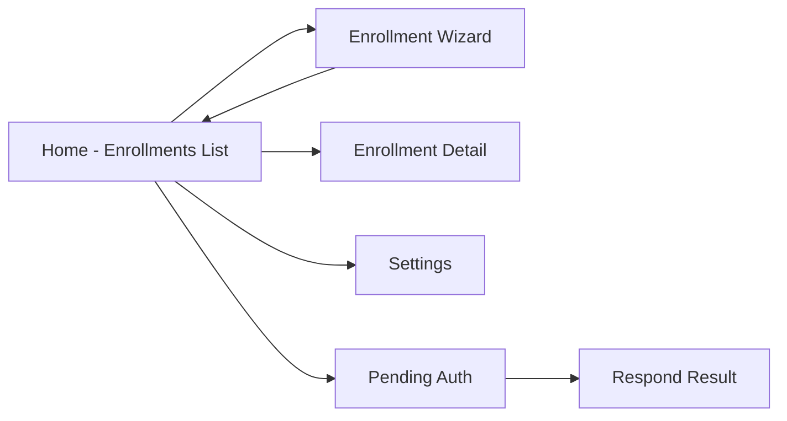

# Mobile — Screens and Wireflow

## Intent

This document describes the primary screens of the mobile app, how they connect, and what each screen is responsible for. The canonical internal reference is [`../../../ezkey_mobile/docs/MOBILE_SCREENS_AND_WIREFLOWS.md`](../../../ezkey_mobile/docs/MOBILE_SCREENS_AND_WIREFLOWS.md); this document keeps the product-wide map aligned with that truth.

## Navigation Model

The app uses a stack navigator. Navigation happens on explicit user actions; no deep push-based routing from external notifications.

## Screen Inventory

### Home (Enrollments List)

- **Primary actor.** End user.
- **Purpose.** Display the list of local enrollments; entry point to start a new enrollment or to check for pending authentication attempts.
- **Primary actions.** Start enrollment (opens the wizard), Check pending (triggers `W-mob-pending-check`), open enrollment detail.
- **Displayed data.** Enrollment name, integration name, status.
- **Related workflow.** [`functional-flows.md#w-mob-pending-check`](functional-flows.md#w-mob-pending-check).

### Enrollment Wizard

- **Primary actor.** End user.
- **Purpose.** Bind and verify an enrollment through a QR-first flow with manual fallback.
- **Primary actions.** Scan QR, manually enter credentials, enter challenge, confirm bind.
- **Displayed data.** Integration name and description from the bind response, challenge prompt.
- **Related workflow.** [`functional-flows.md#w-mob-enrollment-wizard`](functional-flows.md#w-mob-enrollment-wizard).

### Enrollment Detail

- **Primary actor.** End user.
- **Purpose.** Inspect a local enrollment, see the integration metadata, and access a direct pending check shortcut.
- **Primary actions.** Check pending for this enrollment, remove enrollment locally.
- **Displayed data.** Enrollment metadata from local storage; sensitive fields are never shown.

### Pending Auth

- **Primary actor.** End user.
- **Purpose.** Display a pending authentication attempt and allow the user to approve or deny it.
- **Primary actions.** Approve, Deny, enter challenge if required.
- **Displayed data.** Integration-signed `contextTitle` and `contextMessage` (nullable), countdown to expiry.
- **Related workflow.** [`functional-flows.md#w-mob-respond`](functional-flows.md#w-mob-respond).

### Respond Result

- **Primary actor.** End user.
- **Purpose.** Present the integration-signed outcome returned by the Auth API, with explicit fail-closed behavior on signature mismatch.
- **Primary actions.** Return to Home.
- **Displayed data.** Integration-signed result string; no speculative success.

### Settings

- **Primary actor.** End user.
- **Purpose.** Configure app-level preferences (API base URL override, locale) and access documentation.
- **Primary actions.** Edit preferences, view about page.

## Wireflow Patterns

- **QR-first with manual fallback.** Enrollment always offers a scan affordance; manual entry is reachable from the same flow.
- **Explicit pending check.** The user must tap to check; no automatic surface of authentication requests.
- **Integration-signed outcome.** The Respond Result screen never claims success without a verified integration signature.
- **Challenge input when required.** UI exposes a zero-padded challenge input consistent with the Admin UI's display.

## Accessibility and Internationalization

- User-facing content supports **English and French** (English default; manual Settings → Language).
  Locale changes apply immediately via i18next (`changeAppLanguage`); preference is also persisted for cold start.
- Primary actions are reachable with standard system gestures; focus handling follows platform conventions.

## Visual Identity

Minimal, functional, security-first. No decorative clutter; no integration logos. See [`../../../ezkey_mobile/AGENTS.md`](../../../ezkey_mobile/AGENTS.md) for directives.

## Related Documents

- Canonical: [`../../../ezkey_mobile/docs/MOBILE_SCREENS_AND_WIREFLOWS.md`](../../../ezkey_mobile/docs/MOBILE_SCREENS_AND_WIREFLOWS.md).
- [`functional-flows.md`](functional-flows.md).
- [`api-and-boundary-mappings.md`](api-and-boundary-mappings.md).
- [`exception-and-error-model.md`](exception-and-error-model.md).
