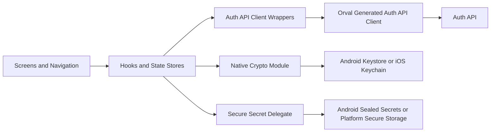

# Mobile — Stack and Architecture

## Intent

This document describes the mobile app's technical structure at a level sufficient to reason about changes and spec updates without re-reading the codebase. The authoritative internal reference remains [`../../../ezkey_mobile/docs/MOBILE_STACK_AND_ARCHITECTURE.md`](../../../ezkey_mobile/docs/MOBILE_STACK_AND_ARCHITECTURE.md); this document frames the mobile app inside the product-wide system.

## Stack

- **React Native 0.86.2**, **React 19.2.7**, **TypeScript**.
- **Yarn 4 (Berry)** — package manager.
- **Axios** — HTTP client wrapped by a shared service.
- **Zustand** — lightweight state stores.
- **React Navigation** — stack-based navigation.
- **React Query** — data fetching and caching where applicable.
- **Orval** — Auth API client generation from [`openapi-spec.json`](../../../ezkey_mobile/openapi-spec.json).
- **Native modules** — Android (Kotlin) and iOS (Swift/Objective-C++) bridges for crypto and QR processing.

## Runtime Shape

- **Platforms.** Android (primary for current release work) and iOS (alignment in progress).
- **Default API targets.** `EZKEY_API_BASE_URL` in `.env` for local work; QR-embedded `authUrl` when enrollment is QR-first.
- **Installation branding.** After enrollment, the app calls signed `POST /api/v1/enrollments/instance-info` on the enrollment `authUrl` (not the Admin API). Unsigned Auth `GET /api/v1/public/instance-info` is not a mobile display path.

## Module Layout

High-level shape inside `ezkey_mobile/app/`:

```text
app/
  components/         Reusable UI (e.g., QR modal).
  hooks/              React Query + storage orchestration.
  navigation/         Stack navigator and route types.
  providers/          App-wide context providers.
  screens/            Feature screens (Home, Enrollment Wizard, Pending Auth, Settings).
  services/
    api/              Generated Auth API client, wrappers, problem mapping, DTOs.
    crypto/           Native crypto integration layer.
    storage/          Secure and metadata storage abstractions.
  state/              Zustand stores.
```

The `app/services/api/generated/auth-api/model/` directory is the **source of truth for Auth API DTOs** and is regenerated through Orval from the local `openapi-spec.json`. Never hand-edit generated files. The spec is refreshed only via the root `scripts/update-specs.sh` after a clean Docker stack run.

## Architectural View



## Cross-Cutting Patterns

### Pull-based protocol

The app polls the Auth API only when the user explicitly asks to check for pending authentication attempts. No background polling. This is a product-wide decision: [ADR-0002](../../global/architecture-decisions.md#adr-0002-user-initiated-mobile-polling).

### One-shot proof tokens

Proof tokens produced by the app are scoped to the current flow step. They are generated only via `app/utils/generateProofToken.ts` and never logged.

### Secure key handling

Device private keys are EC P-256 and live on the native keystore. In the current Android implementation the app uses `Android Keystore` and requests `StrongBox` when available. Application code never sees private key bytes; signing operations happen on the native side through `EzkeyCryptoModule`.

The current app uses a second protection layer for small application secrets:

- the per-enrollment private signing key stays on the keystore path
- the long-lived `enrollmentProofToken` and `integrationPublicKey` use the secure secret abstraction

This is intentionally documented as a split model. The current implementation does **not** use the enrollment private
key itself as a master wrapping key that decrypts all other mobile secrets on demand.

### QR-first enrollment

The enrollment QR payload contains `enrollmentId`, `enrollmentProofToken`, and optionally `authUrl`. Scanning uses Vision Camera 5 plus `react-native-vision-camera-barcode-scanner` (ML Kit) via `useBarcodeScannerOutput`. When `authUrl` is absent, the app falls back to the configured base URL.

### Problem Details awareness

HTTP errors from the Auth API are parsed into RFC 9457 Problem Details and mapped to user-facing messages. The mapping lives in the API services layer alongside the generated client.

### No background polling, no push fatigue

Combined with ADR-0002, this means the app never surfaces authentication requests opportunistically. Users pull to check, and the UI reflects explicit user intent.

## Relationship With Backend

- **Auth API** is the only backend the mobile app talks to directly.
- **Admin API** is not called from the mobile app.
- **Contract-first.** Spec changes go through `scripts/update-specs.sh` and then `yarn generate:api`; see [`../../../ezkey_mobile/AGENTS.md`](../../../ezkey_mobile/AGENTS.md).

## Related Documents

- Canonical mobile architecture: [`../../../ezkey_mobile/docs/MOBILE_STACK_AND_ARCHITECTURE.md`](../../../ezkey_mobile/docs/MOBILE_STACK_AND_ARCHITECTURE.md).
- Native modules: [`../../../ezkey_mobile/docs/NATIVE_MODULES.md`](../../../ezkey_mobile/docs/NATIVE_MODULES.md).
- Crypto reference: [`../../../ezkey_mobile/docs/MOBILE_CRYPTO_REFERENCE.md`](../../../ezkey_mobile/docs/MOBILE_CRYPTO_REFERENCE.md).
- Shared protocol: [`../../../docs/CRYPTO.md`](../../../docs/CRYPTO.md), [`../../../docs/MOBILE_DEVELOPER_GUIDE.md`](../../../docs/MOBILE_DEVELOPER_GUIDE.md).
