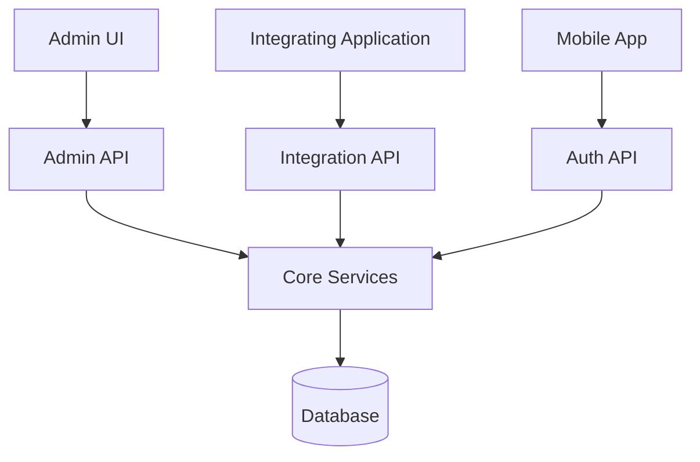
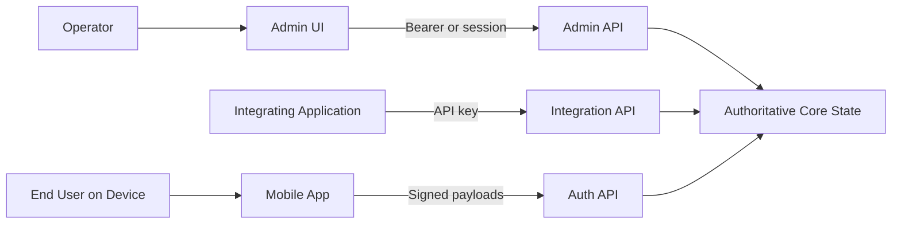

# Architecture Overview

## Purpose

This document describes Ezkey's system architecture at the product level: the main components, how they relate, where trust is placed, and the key patterns that recur across the stack. Implementation-level details belong in the [component packs](../components/README.md).

Ezkey is a **backend-first cryptographic MFA platform**. Its architecture should be understood as a distinct server-to-mobile trust model rather than as a browser-centric authentication stack.

## System View

Ezkey is organized around a small set of explicit responsibilities:

- a web-based Admin UI for human administration,
- a backend that owns durable state and verification,
- a mobile client that holds device credentials and participates in signed flows,
- integrating applications that create and consume authentication decisions through APIs.

## Main Components

| Component | Role |
|-----------|------|
| `ezkey-admin-ui` | Primary web surface for human administration (Global Admin and Tenant Admin). Details in [`components/admin-ui`](../components/admin-ui/README.md). |
| `ezkey-admin-api` | Administrative surface for integrations, enrollments, authentication management, and operator workflows. Details in [`components/admin-api`](../components/admin-api/README.md). |
| `ezkey-auth-api` | Mobile-facing surface for enrollment and authentication. |
| `ezkey-integration-api` | Machine-to-machine surface for integrated backends. |
| `ezkey-core` | Shared business logic, persistence, and security-sensitive state handling. |
| `ezkey-core-security` | Cryptographic primitives and shared security utilities. |
| `ezkey-migration` | Database migration component (Flyway). |
| `ezkey_mobile` | React Native mobile application. Details in [`components/mobile`](../components/mobile/README.md). |

## Trust Boundaries

Ezkey's architecture is organized around explicit trust boundaries:

- The **backend is authoritative** for verification and state transitions.
- The **mobile device** is trusted to hold device credentials and produce cryptographic proofs.
- **Integrating applications** interact with Ezkey through explicit API calls rather than hidden browser flows.
- The **Admin UI** is the primary operator surface for platform-wide and tenant-scoped administration; it is an integration surface, not the root of trust.

## Cryptographic Architecture

Ezkey's security model is based on **cryptographic continuity** across lifecycle steps, not on single isolated proofs.

- During enrollment, `bind` and `verify` are cryptographically linked.
- During authentication, `pending` and `respond` are cryptographically linked.
- One-time proof material and signatures protect against replay and tampering.
- Backend verification remains central even when secure device storage is used on mobile.

Shared cryptographic formats and payload rules are defined in [`../../docs/CRYPTO.md`](../../docs/CRYPTO.md), [`../../docs/AUTH_ATTEMPT_SIGNATURE_PAYLOAD.md`](../../docs/AUTH_ATTEMPT_SIGNATURE_PAYLOAD.md), and [`../../docs/ENROLLMENT_SIGNATURE_PAYLOAD.md`](../../docs/ENROLLMENT_SIGNATURE_PAYLOAD.md).

## Data and State Ownership

The database is part of the security model, not a passive storage layer. It preserves:

- enrollment state,
- authentication attempt state,
- proof-token lifecycle,
- administrative and operational records,
- audit chain entries and checkpoints.

This backend ownership of state is one of the reasons Ezkey remains understandable and operable for backend teams. Encryption at rest uses rotatable keys managed through the Admin API.

## Patterns That Recur Across the Stack

These patterns appear in multiple components. Component packs show concrete instances and trade-offs.

### Backend-authoritative state transitions

All state transitions that matter for security or auditability are decided on the backend. Clients observe and request; they do not mutate state on their own.

### Pull-based mobile protocol

The mobile application polls the backend on **user-initiated actions**. There is no automatic background polling. This protects users from push fatigue and keeps the protocol simpler.

### Signed payloads with canonical serialization

Every cryptographically meaningful exchange is signed with an explicit canonical payload. Clients verify signatures before trusting responses. See the signature payload documents linked above.

### One-time proof tokens

Proof tokens are scoped to a flow step and used once. Replay is prevented by token invalidation and by signature binding.

### Problem Details error model (RFC 9457)

External error contracts follow RFC 9457 Problem Details, with stable `type` URIs and optional `parameters` extension for client-side localization. Details: [`exception-and-error-model`](../components/admin-api/exception-and-error-model.md) per component.

### Lifecycle with reversible and irreversible actions

Operator-facing actions are categorized into reversible (deactivate, reactivate) and irreversible (revoke, retire, delete). The rationale and matrix live in [`lifecycle-model.md`](lifecycle-model.md).

## Deployment and Operations Posture

- Local and self-hosted deployment is first-class; a clean-start script bootstraps the full stack.
- Operational behavior is inspectable through structured logs and stable APIs.
- Security-sensitive behavior does not depend on opaque third-party platform services.

Runbooks and operational details remain in [`../../docs/OPERATIONAL.md`](../../docs/OPERATIONAL.md) and [`../../docs/DEVELOPMENT.md`](../../docs/DEVELOPMENT.md).

## Design Principles

See [`design-principles.md`](design-principles.md) for the principles that shape architectural trade-offs.

## Related Documents

- [`product-intent.md`](product-intent.md)
- [`design-principles.md`](design-principles.md)
- [`lifecycle-model.md`](lifecycle-model.md)
- [`architecture-decisions.md`](architecture-decisions.md)
- Legacy: [`../../docs/ARCHITECTURE.md`](../../docs/ARCHITECTURE.md), [`../../docs/CRYPTO.md`](../../docs/CRYPTO.md), [`../../docs/ENDPOINT.md`](../../docs/ENDPOINT.md).
