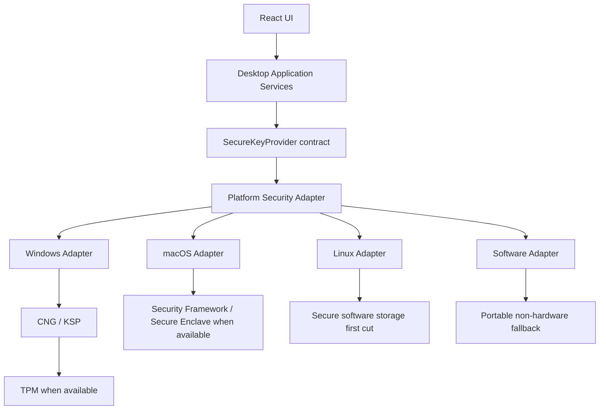
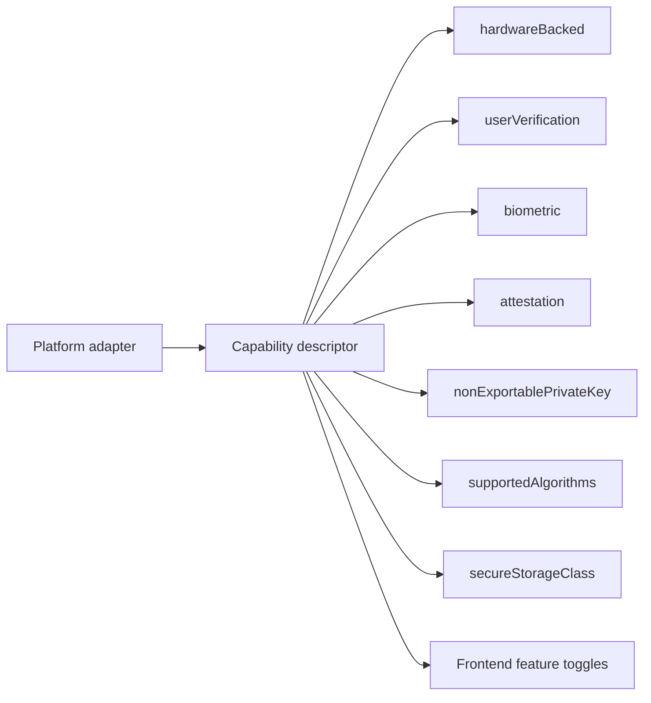

# Architecture synthesis — 2026-07-18 (Desktop authenticator contract-first model)

## Session control

| Field | Value |
| ----- | ----- |
| **Backlog** | `I-2026-07-17-desktop-authenticator-reference-app` |
| **Lane** | `A` (new idea refinement) |
| **Status** | `complete` |
| **Date** | `2026-07-18` |
| **Captured by** | Copilot + Marc summary |
| **Source** | External discussion summary provided by operator |

## Purpose

Capture high-signal architecture guidance from an external design discussion and map it to the
current desktop-authenticator backlog idea, so future detailed design can run a deliberate
counter-check instead of restarting from memory.

## High-signal conclusions

1. Keep a stable business-facing cryptographic contract (`SecureKeyProvider`) independent from
   OS security technologies.
2. Enforce strict layering: React UI -> application services -> contract -> platform adapter ->
   native security APIs.
3. Keep platform details fully encapsulated in adapters (Windows CNG/KSP, macOS Security
   Framework, Linux first-cut software secure store).
4. Expose dynamic capabilities so UI behavior can adapt without platform-specific branching in
   frontend code.
5. Preserve non-exportability semantics for private keys as a contract-level invariant.

## Architecture sketch (remembering aid)

## Capability-discovery model (first-cut shape)

## Contract-shape candidates for detailed design

- `GenerateCredential(request)`
- `SignChallenge(request)`
- `DeleteCredential(credentialId)`
- `GetCapabilities()`
- Future extension points:
  - `AttestCredential(...)`
  - `VerifyUserPresence(...)`

## Design guardrails to preserve

1. No frontend direct access to private key material.
2. No frontend awareness of TPM, Secure Enclave, or platform crypto APIs.
3. No business-service branching on platform internals; branching belongs in adapter selection.
4. Keep capability semantics typed and explicit rather than free-text booleans spread in UI.

## Counter-check list for TB preparation

1. Validate that every MVP flow (bind, verify, one approval response) can run through only the
   contract operations above.
2. Produce a capability matrix per platform (Windows/macOS/Linux/software fallback) for first-cut
   behavior and UX implications.
3. Define error taxonomy mapping (contract error -> user-facing message) without leaking
   platform-native jargon.
4. Confirm Linux posture language stays explicit on trust level differences versus hardware-backed
   options.

## Key risks introduced by this direction

- Under-specified contract can cause leakage of platform semantics into upper layers.
- Capability drift across adapters can create inconsistent UX decisions.
- Tauri/Rust host can become too broad if command surface is not constrained from day one.

## Product strategy posture (confirmed)

1. Favor progressive hardening over absolute day-one guarantees when trade-offs would block MVP.
2. Keep promise levels explicit by platform and runtime capability state.
3. Avoid over-claiming security equivalence with mobile hardware-backed posture.
4. Preserve informed operator choice: desktop may be acceptable for many contexts, while mobile
   remains the stronger-security fallback path when needed.

## Relationship with current stack recommendation

This synthesis reinforces the 2026-07-17 stack mini-comparison direction:

- Tauri remains a strong fit because Rust host boundaries map naturally to adapter-based command
  mediation.
- Electron remains fallback if delivery speed dominates, but only with equivalent strict contract
  and bridge boundaries.

## Links

- Backlog idea: `../ideas/I-2026-07-17-desktop-authenticator-reference-app.md`
- Grill session: `2026-07-17-desktop-authenticator-reference-app-grill-me.md`
- Stack comparison: `2026-07-17-desktop-authenticator-stack-mini-comparison.md`
- Capability matrix v0: `2026-07-18-desktop-authenticator-capability-matrix-v0.md`
