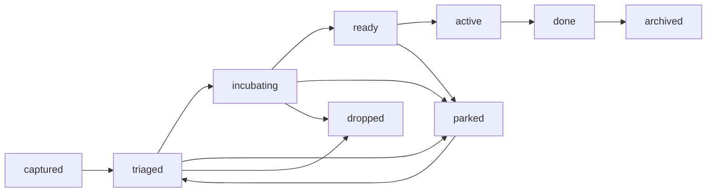

# Backlog Statuses and Lifecycle

## Purpose

This document defines the standard status lifecycle for markdown backlog ideas.

## Status definitions

- `captured` — idea recorded with minimal context.
- `triaged` — value, scope, and tags clarified.
- `incubating` — analysis/design exploration in progress.
- `ready` — suitable for tracer-bullet promotion.
- `active` — implementation work has started.
- `done` — delivered and documented.
- `parked` — deliberately paused.
- `archived` — no longer active; retained **in place** for historical reference (not a physical
  move — see note below).
- `dropped` — intentionally not pursued.

**No physical archive folder.** Changing status to `archived` does not move the file. The idea file
stays where it is (`ideas/`); `index.md` is the discoverability layer. This corrects an earlier
`archived/<year>/` folder convention that was never actually exercised in practice — see
[`../../methodology/decisions/2026-07-28-backlog-retention-in-place-not-relocation.md`](../../methodology/decisions/2026-07-28-backlog-retention-in-place-not-relocation.md).

## Recommended transitions

## Review cadence

- `captured`, `triaged`, `incubating`: review at least every 30 days.
- `ready`, `active`: review weekly.
- `parked`: review on scheduled date.

## Metadata minimum

Each idea file should include:

- ID and title,
- status,
- priority,
- creation and update dates,
- last reviewed date,
- component and phase tags.

## Tracer bullet placement

`TB-*` files live at `backlog/` root, not under `ideas/`. `ideas/` is reserved for `I-*` files.
This was previously inconsistent (roughly a third of `TB-*` files had accumulated under `ideas/`
with no written rule); see
[`../../methodology/decisions/2026-07-28-backlog-retention-in-place-not-relocation.md`](../../methodology/decisions/2026-07-28-backlog-retention-in-place-not-relocation.md)
for the cleanup record.

Sub-artifacts of an idea or tracer bullet (a grill session, a test-plan slice) are **not** named
with their parent's ID prefix and do not live in `ideas/` either — they use their own kind's prefix
and folder: a grill session is `grill-sessions/YYYY-MM-DD-<slug>-grill-me.md`; a test-plan slice is
`test-plans/TSP-YYYY-MM-DD-<slug>.md`. Cross-link from the parent instead of borrowing its ID.
