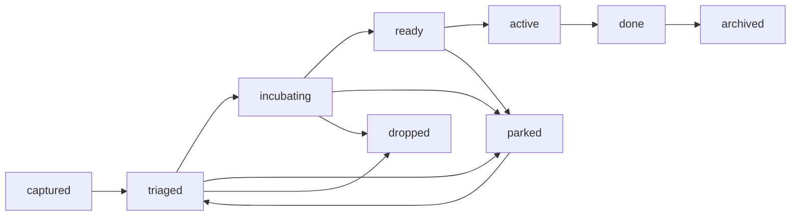

# Backlog Statuses and Lifecycle

## Purpose

This document defines the standard status lifecycle for markdown backlog ideas.

## Status definitions

- `captured` — idea recorded with minimal context.
- `triaged` — value, scope, and tags clarified.
- `incubating` — analysis/design exploration in progress.
- `ready` — suitable for tracer-bullet promotion.
- `active` — implementation work has started.
- `done` — delivered and documented.
- `parked` — deliberately paused.
- `archived` — moved to history.
- `dropped` — intentionally not pursued.

## Recommended transitions

## Review cadence

- `captured`, `triaged`, `incubating`: review at least every 30 days.
- `ready`, `active`: review weekly.
- `parked`: review on scheduled date.

## Metadata minimum

Each idea file should include:

- ID and title,
- status,
- priority,
- creation and update dates,
- last reviewed date,
- component and phase tags.
