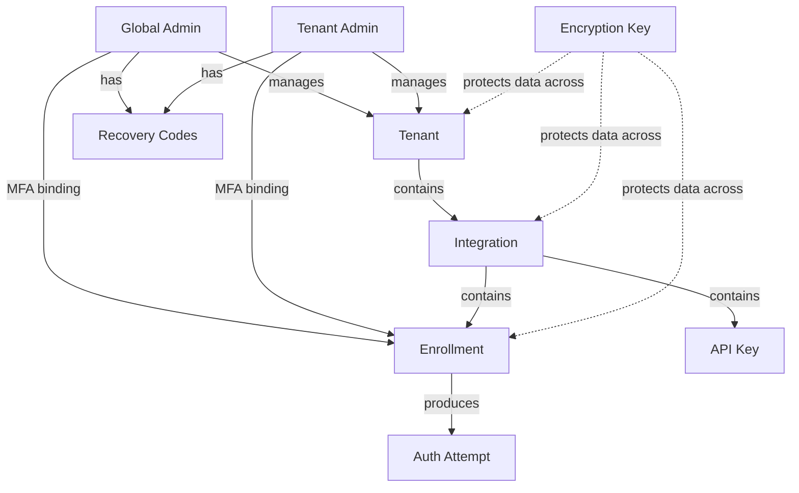
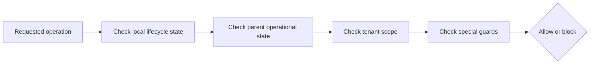

# Lifecycle Model

## Purpose

This document describes the global lifecycle model for Ezkey entities: how they relate to each other, how operational status propagates through the hierarchy, and which rules govern reversible and irreversible actions.

It is the **global companion** to component-level `data-model-and-persistence.md` documents. Detailed per-entity rules, action matrices, and operational scenarios live in the legacy [`../../docs/LIFECYCLE_GOVERNANCE.md`](../../docs/LIFECYCLE_GOVERNANCE.md); this document summarizes the model and links into it.

## Entity Hierarchy

## Eligibility Chain

Every entity has a local state and an **operational status** evaluated at runtime. The operational status depends on the entire parent chain, not only the entity itself.

1. **Local state.** Is the entity itself in a usable state (active, verified, not revoked, not expired)?
2. **Parent state.** Is the immediate parent operational?
3. **Tenant scope.** Is the tenant active?
4. **Special guards.** System-tenant protection, minimum-admin rules, admin-MFA enrollment guards.

If any check fails, the operation is blocked. See [ADR-0004](architecture-decisions.md#adr-0004-lifecycle-without-persistent-cascade) for the rationale behind keeping local state and effective operational state separate.

## Reversible vs Irreversible Actions

| Action | Reversibility | Typical use |
|--------|---------------|-------------|
| Deactivate | Reversible | Temporary hold, investigation, operational pause. |
| Reactivate / Activate | Reversible | Undo a reversible hold. |
| Revoke | Irreversible | Confirmed compromise or permanent credential withdrawal. |
| Retire | Irreversible | Decommissioning an integration. |
| Delete | Irreversible | Housekeeping after explicit preconditions. |

**Default operating principle.** When in doubt, deactivate first. Revocation is permanent; deactivation is not.

## Reason Policy

| Action type | Reason policy |
|-------------|---------------|
| Irreversible credential invalidation (revoke) | **Required** |
| Physical deletion | **Required** |
| Integration retirement | **Required** |
| Reversible toggles (deactivate, reactivate, activate) | Optional — encouraged |
| Automatic expiration | Not required (policy-driven) |

Reasons are recorded in the audit log so that a future operator can reconstruct why an action was taken.

## Entity Summary

This table summarizes lifecycle shapes at a glance. For full per-entity rules, actions, and scenarios, read [`../../docs/LIFECYCLE_GOVERNANCE.md`](../../docs/LIFECYCLE_GOVERNANCE.md) and the corresponding component `data-model-and-persistence.md`.

| Entity | States | Reversible | Irreversible | Notes |
|--------|--------|------------|--------------|-------|
| Tenant | Active, Inactive | Deactivate / Reactivate | — | System tenant protected. No delete. |
| Integration | Active, Retired | — | Retire, Delete (conditional) | No intermediate "Inactive". |
| Enrollment | Pending, Verified (Active/Inactive), Revoked | Deactivate / Reactivate (Verified only) | Revoke, Delete (conditional) | Dual model: status + active flag. |
| API Key | Active, Revoked, Expired | — | Revoke | No reactivation, no delete. |
| Admin | Pending Activation, Active, Deactivated | Deactivate / Activate | — | Identity and MFA are separate concerns. No delete. |
| Auth Attempt | Pending, Read, Accepted, Rejected, Invalid, Expired | — | — | Event-driven; not operator-managed. |
| Encryption Key | Pending, Enabled, Primary, Disabled | Promote / Demote via rotation | Decommission | Two-layer lifecycle (cryptographic role + operator lifecycle). |
| Recovery Codes | Issued, Consumed, Regenerated | Regenerate (invalidates previous set) | — | Generate-and-replace model. |

## Cross-Component Coupling

- Admin identity lifecycle and admin MFA enrollment lifecycle are **independent**. Deactivating an admin does not revoke their enrollment; revoking their enrollment does not delete their admin identity.
- Tenant deactivation blocks all child operations through the eligibility chain without modifying child storage.
- Retirement of an integration triggers a bulk revocation of revocable enrollments, then marks the integration as retired. Details: legacy doc and component pack.

## Related Documents

- [`architecture-overview.md`](architecture-overview.md)
- [`architecture-decisions.md`](architecture-decisions.md)
- [`features-and-phases.md`](features-and-phases.md)
- Legacy: [`../../docs/LIFECYCLE_GOVERNANCE.md`](../../docs/LIFECYCLE_GOVERNANCE.md), [`../../docs/ENDPOINT.md`](../../docs/ENDPOINT.md).
