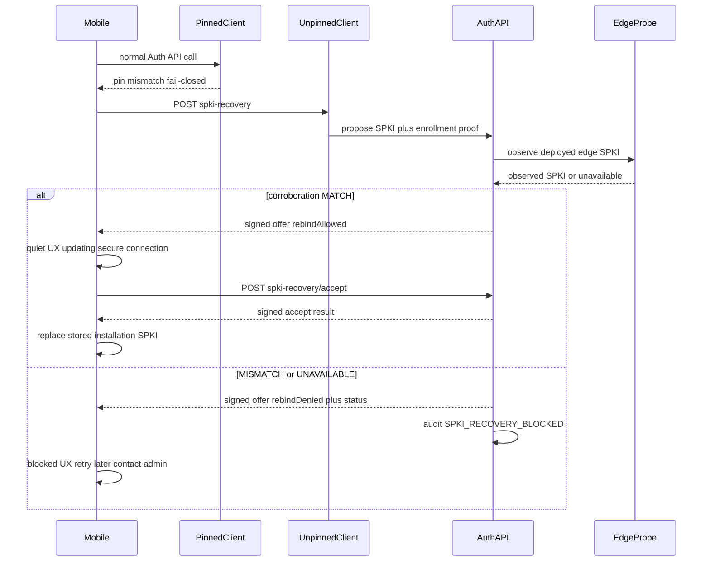

# Mobile certificate pinning — Design Pack (Ezkey middle path)

## Purpose

Canonical design for Ezkey-style **SPKI pinning** on mobile Auth API traffic: trust-zone scoped
TOFU, fail-closed steady state, MATCH-only quiet rebind via edge corroboration, blocked/retry when
corroboration fails, trust-zone policy to support or not support pinning, Global Admin audit
signals, and honest non-claims.

**Vision:** [`vision/V-2026-0006-mobile-certificate-pinning.md`](vision/V-2026-0006-mobile-certificate-pinning.md)

**Backlog:** [`backlog/ideas/I-2026-07-25-mobile-certificate-pinning-middle-path.md`](backlog/ideas/I-2026-07-25-mobile-certificate-pinning-middle-path.md)

**Retrofit:** [`legacy-retrofit/R-2026-0001-mobile-certificate-pinning-spki.md`](legacy-retrofit/R-2026-0001-mobile-certificate-pinning-spki.md)

**Grill (historical):** [`backlog/grill-sessions/blitz-2026-05-08-2-D2-D11-retrofit-grill-me.md`](backlog/grill-sessions/blitz-2026-05-08-2-D2-D11-retrofit-grill-me.md)

**Payload canon:** [`../../docs/SPKI_RECOVERY_SIGNATURE_PAYLOAD.md`](../../docs/SPKI_RECOVERY_SIGNATURE_PAYLOAD.md)

**Adjacent (orthogonal):** signed enrolled instance-info / branding integrity (tracked separately;
complementary to transport pinning, not a substitute).

**Supersession note:** Earlier 2026-08-09 wording that required **end-user confirmation** before pin
replacement is **superseded**. The end user must never authenticate certificates. Rebind requires
edge corroboration `MATCH` only.

## Design principles

| Principle | Application |
|-----------|-------------|
| Backend-first integrity (#3) | Edge probe + integration-signed offers authorize rebind; mobile verifies and applies. |
| Explicit trust boundaries (#4) | Steady-state pin vs unpinned recovery path vs policy `DISABLED` are named. |
| Fail-open / fail-closed (#17) | Steady state fail-closed on mismatch; rebind fail-closed until `MATCH`; never user override. |
| End-user non-responsibility | MFA user is not a PKI operator; no “confirm new certificate” UX. |
| Cry-wolf avoidance | Legitimate rotations rebind quietly on `MATCH`; no scary rubber-stamp ceremony. |
| Ezkey twist (signal) | Recovery attempts and blocks are operator-visible trust-pattern signals. |
| Honest middle path | Stronger than TLS-only; below FIDO/passkey ceremony; no overclaim. |
| One app, many trust zones | Per-installation pinning metadata; zones never couple. |

## Terminology

| Term | Meaning |
|------|---------|
| **Trust zone** | One Auth API base URL / Ezkey Auth API instance identity as known to the mobile app (normalized Auth URL). Independent adopting orgs = independent zones. |
| **Installation** | Mobile durable record for one trust zone on one phone (one Ezkey Mobile app may hold many). |
| **SPKI pin** | `sha256` of DER-encoded `SubjectPublicKeyInfo` of the Auth API edge certificate the phone trusts for that zone. |
| **Enrollment** | Crypto identity inside a zone (proof token, device key). Used to authenticate recovery; **not** the pinning policy or pin owner. |

## Honesty boundaries

1. **Transport ≠ tenant isolation.** Pinning binds the phone to the Auth API **edge** identity for
   that trust zone. Multi-tenant / multi-integration behind one hostname share the same pin fate.
2. **TOFU enrollment residual.** A hostile or wrong Auth URL at enrollment still receives a pin
   for that wrong zone (trust-on-issuer). Pinning does not fix enrollment phishing (align with
   MOB-010 / mobile security assessments). Mitigations remain host-visible UX and complementary
   signed instance-info — not this feature.
3. **Unsigned public GET is not authority.** `spkiPinningMode` on public `GET .../instance-info`
   is a discovery / compat hint (MITMable). After enrollment, the **integration-signed**
   instance-info response is authoritative; mobile must verify the response signature before
   applying mode (Auth API sensitive-exchange norm: never TLS-only trust).
4. **Mobile version skew.** Old apps that lack pinning code do not enforce pins even if the
   server advertises `ENFORCED`. Do not claim “the fleet is pinned.”
5. **Recovery is not MITM-proof.** `MATCH` means mobile and backend agree on observed edge SPKI;
   it does not claim FIDO-grade transport attestation.

## Trust-zone pinning support policy

Pinning is **not** globally mandatory.

| Dimension | Posture |
|-----------|---------|
| End user | No opt-in/out. |
| Mobile debug / non-release build | Enforcement **off** (platform TLS only). |
| Trust zone | May **not support** pinning (`DISABLED`) or run full middle path (`ENFORCED`). |
| Finer than trust zone | Out of product shape (no per-enrollment toggle). |

**Recommended positioning (open for longer reflection on durable adopter framing):**

- Allowing a zone to not support pinning is an explicit honest posture (labs, early probe
  rollout, self-hosted deployability).
- `ENFORCED` is the aspirational default for production-oriented profiles once the Auth API can
  outbound-probe its public URL.
- Clean-start / local Docker / lab profiles: prefer `DISABLED` by default.
- No half-mode (“pin but never block”).

**Working field:** `spkiPinningMode` = `ENFORCED` | `DISABLED`

**Discovery:**

| Channel | Role |
|---------|------|
| `GET /api/v1/public/instance-info` | Expose `spkiPinningMode` (hint only). |
| `POST /api/v1/enrollments/instance-info` (signed) | Same field inside integration-signed payload; authoritative after enrollment. |

**Policy flip `DISABLED` → `ENFORCED` (R1 algorithm):** capture SPKI **on next successful TLS
handshake** to that zone after the phone learns `ENFORCED` via verified signed instance-info (or
at next enrollment verify). Prefer capture-on-next-success over mass re-enrollment. Exact property
storage remains TB implementation detail.

**Open (non-blocking for protocol shape):** config surface (`ezkey.*` vs Admin UI vs both);
whether long-lived `DISABLED` is framed as lab-only vs durable adopter choice.

## Per-installation mobile metadata

Each installation (trust zone on device) must own pinning-related data, including at least:

| Field (conceptual) | Purpose |
|--------------------|---------|
| `spkiPinningMode` (last verified) | Whether the zone supports/enforces pinning |
| `pinnedSpkiSha256` (nullable) | Current pin when TOFU completed under `ENFORCED` |
| Blocked / last recovery status | UX for retry; optional diagnostics |

Enrollments under that installation are not the metadata owner.

## Actors and preconditions

| Actor | Role |
|-------|------|
| End user | Uses MFA; sees quiet update or sober blocked/retry only. |
| Ezkey Mobile | TOFU, enforce pin, run recovery, verify signatures, store per-installation metadata. |
| Auth API | Policy, edge probe, signed offer/accept, audit events. |
| Global Admin | Sees pinning blocked / recovery audit signals (IT / infrastructure). |
| Tenant Admin | No pinning-signal empowerment in R1 (enrollments/integrations day-to-day). |

**Preconditions for `ENFORCED`:** release mobile build with pinning; zone mode `ENFORCED`; Auth
API can probe its public Auth URL; at least one verified enrollment for recovery authentication.

## Protocol (MATCH-only rebind)

### Sequence

When `spkiPinningMode=DISABLED` or debug build: no fail-closed pin path; recovery idle.

### Endpoints (Auth API)

Paths are normative intent; DTO names may refine in TB.

| Method | Path | Role |
|--------|------|------|
| `POST` | `/api/v1/trust/spki-recovery` | Propose newly observed SPKI; integration-signed offer |
| `POST` | `/api/v1/trust/spki-recovery/accept` | Device-signed accept; only if offer was `MATCH` |

Proof-in-body (POST), same family as bind / enrolled instance-info / pending.

### Offer (conceptual response)

| Field | Notes |
|-------|-------|
| `recoveryId` | Opaque handle for accept |
| `proposedSpkiSha256` | Hex or Base64URL — lock encoding in TB; must match payload canon |
| `corroborationStatus` | `MATCH` \| `MISMATCH` \| `UNAVAILABLE` |
| `rebindAllowed` | `true` iff `MATCH` |
| `expiresAt` | Short TTL (default **5 minutes**) |
| Integration signature | Over canonical offer string; `integrationKeyAlgorithm` fail-closed |

### Accept rules

- Device signs canonical accept string (see payload doc).
- Server rejects unless offer unexpired, was `MATCH`, and proposed SPKI still corroborates
  `MATCH` (fresh probe or cache within TTL).
- Mobile replaces stored pin only after successful accept **and** verification of the
  integration-signed accept acknowledgment.
- `MISMATCH` / `UNAVAILABLE`: **no** accept path that commits a pin; blocked + retry.

### Identity

Any **verified** enrollment on that trust zone may authenticate recovery (`enrollmentId` +
`enrollmentProofToken`). Audit binds enrollmentId **and** trust-zone identity (normalized Auth
URL or equivalent).

## Edge corroboration

| Rule | Default |
|------|---------|
| Mechanism | Outbound TLS connect from Auth API to public Auth API base URL (`authApiPublicBaseUrl` / same host mobile uses); extract leaf SPKI hash |
| Cache | In-memory **60s** |
| Probe timeout | **5s** (TB may tune) |
| Probe failure / timeout | `UNAVAILABLE` → blocked |
| Proposal ≠ probed SPKI | `MISMATCH` → blocked |
| Multi-pin / multi-edge | **Out of R1**; temporary skew → retry later |

**Deployability:** `ENFORCED` requires Auth API reachability to its own public URL. Labs that
cannot probe should stay `DISABLED`.

## Canonical signatures

Sensitive Auth API exchanges for this feature follow the platform norm: enrollment/device proof on
the request where applicable, and **integration-signed responses** the mobile verifies — never
TLS-only trust.

Full strings: [`docs/SPKI_RECOVERY_SIGNATURE_PAYLOAD.md`](../../docs/SPKI_RECOVERY_SIGNATURE_PAYLOAD.md).

Instance-info mode field must be included in the enrolled instance-info signed payload when the
pinning feature lands (extend `INSTANCE_INFO` canonical string — see payload doc and TB).

## Mobile UX

| State | When | Tone / actions |
|-------|------|----------------|
| Checking connection | Mismatch → propose in flight | Calm, brief |
| Quiet update | `rebindAllowed=true` | Non-alarming progress → resume MFA flow |
| Temporarily unavailable | `MISMATCH` / `UNAVAILABLE` | Sober blocked: **Retry**; secondary contact administrator; **no** cert jargon; **no** confirm-certificate button |
| Failure / expiry | Network, sig fail, expired offer | Retry; stay fail-closed on pinned traffic |

**Plug points:** dual HTTP client (pinned + unpinned recovery) in
`ezkey_mobile/app/services/api/httpClient.ts`; installation metadata; TOFU in enrollment wizard
after verify when mode is `ENFORCED`.

Android-first native enforcement; iOS deferred after Android validation.

## Audit and Admin UI

### Event types (R1)

| EventType | When |
|-----------|------|
| `SPKI_RECOVERY_PROPOSED` | Propose accepted for processing |
| `SPKI_RECOVERY_ACCEPTED` | Accept committed; pin may change on device |
| `SPKI_RECOVERY_BLOCKED` | `MISMATCH` or `UNAVAILABLE` (detail includes status) |

Detail should include corroboration status, proposed SPKI hash, enrollmentId, and trust-zone
identity.

### Admin UI R1

- Audit log filters for Global Admin; enrollment + trust-zone deep links as available.
- **Global Admin only** for pinning recovery/blocked signals (not Tenant Admin).
- No manual “force trust this SPKI” in R1.
- Dedicated `AlertType` deferred unless audit-only proves insufficient.

## Fail-open vs fail-closed summary

| Boundary | Posture |
|----------|---------|
| Steady-state pinned HTTP | Fail-closed on mismatch |
| Recovery path reachability | Narrow unpinned exception + enrollment crypto |
| Pin replacement | Fail-closed until edge `MATCH` + signed accept |
| Probe unavailable | Fail-closed (blocked); never auto-rebind |
| Mode `DISABLED` / debug build | Feature off (platform TLS) — honest, not half-pinning |

## Phased delivery

| Phase | Scope |
|-------|-------|
| **TB1 (first train)** | TOFU + native Android pin + recovery protocol + edge corroboration + quiet MATCH / blocked UX + mode policy fields + audit events + Global Admin audit visibility + payload/docs |
| Later | iOS; pattern heuristics / alerts; nightly compliance batch; optional manual ops override (rare, explicit); multi-pin sets; durable `DISABLED` product framing |

## Defaults and residual risks

| Parameter | R1 default |
|-----------|------------|
| Offer TTL | 5 minutes |
| Probe cache | 60 seconds |
| Probe timeout | 5 seconds |
| Lab / clean-start mode | `DISABLED` |
| Prod-oriented mode | `ENFORCED` when probe deployable |

**Residual risks (accepted):** same-cert attacker on hostname; probe trustworthiness; temporary
edge skew → user retry; TOFU wrong-host at enrollment; old mobile builds without enforcement.

## Non-goals and non-claims

- Not passkey/FIDO2/WebAuthn compatibility or attestation-chain equivalence.
- Not server-proven StrongBox.
- Not absolute classical hard pinning with operator-preloaded pin sets as the default story.
- Not MITM-proof recovery.
- Not end-user certificate authentication.
- Not a substitute for signed instance-info branding integrity.
- Not Tenant Admin pinning operations in R1.
- Not iOS in TB1.

## Promotion

Design pack is ready for tracer-bullet scoping under
`I-2026-07-25-mobile-certificate-pinning-middle-path`. Create a dated `TB-*` when implementation
starts; keep this pack as the design source of truth until an ADR is warranted for the recovery
boundary.
