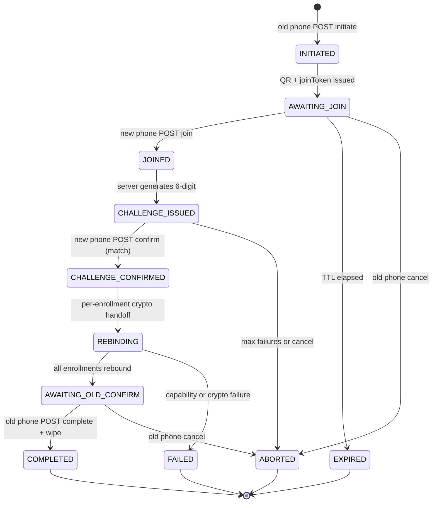
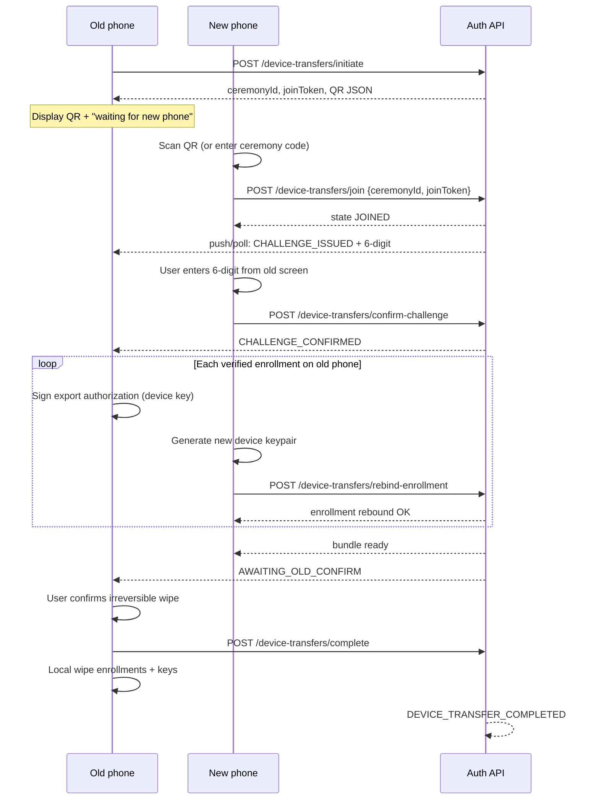

# Phone Transfer Ceremony — Design Pack

## Purpose

Canonical design for the **phone-to-phone enrollment transfer** ceremony (`I-2026-0010`): QR-primary pairing, 6-digit human challenge, Auth API orchestration, full-bundle re-bind, dedicated audit events, and old-device wipe after explicit confirmation.

**Grilled:** Blitz 2026-05-08-2 D3 ([`backlog/grill-sessions/blitz-2026-05-08-2-D3-phone-transfer-grill-me.md`](backlog/grill-sessions/blitz-2026-05-08-2-D3-phone-transfer-grill-me.md)).

**Backlog:** [`I-2026-0010`](backlog/ideas/I-2026-0010-phone-to-phone-enrollment-transfer.md).

**Contrast:** Enrollment **invite** QR (`enrollmentId` + `enrollmentProofToken`) binds a **new** enrollment from an operator invitation. Transfer QR carries only a **short-lived ceremony handle** — no enrollment secrets, no device keys.

## Design principles

| Principle | Application |
|-----------|-------------|
| QR as handle, not secret | QR may be photographed; payload is a public join handle validated server-side. |
| QR-primary | Scan is the default path; manual ceremony code is a fallback only. |
| Same-human proof | 6-digit challenge displayed on **old phone**, entered on **new phone**. |
| Auth API sole interlocutor | Ceremony endpoints live on Auth API; Admin API is audit read + operator filters R1. |
| Full bundle R1 | All verified enrollments on the old installation move together; no partial selection. |
| Fail-closed capability | If the new device cannot satisfy enrollment capabilities (`V-2026-0001`), block with explicit message — no silent downgrade. |
| Expiring ceremony | TTL-bound session; no orphan partial state after expiry or abort. |
| Self-service autonomy | No helpdesk / operator-assisted migration R1 (`D3-11`). |

## Actors and preconditions

| Actor | Role |
|-------|------|
| **Old phone** | Initiates ceremony; displays QR + 6-digit challenge; signs per-enrollment export authorizations; confirms final wipe. |
| **New phone** | Joins via QR (or manual code); enters 6-digit challenge; generates new device keys; receives re-bound enrollments. |
| **Auth API** | Creates ceremony, issues handles, validates challenge, orchestrates re-bind, emits audit events. |
| **Admin API** | Read-only audit visibility for operators R1 (no ceremony control surface). |

**Preconditions:**

- Old phone has at least one **verified** enrollment for the target Auth API installation.
- New phone has Ezkey installed (may be empty or may already hold enrollments for **other** installations — out of scope if cross-installation).
- Both phones can reach the same Auth API base URL (`authUrl`).

## QR payload schema (decision)

Transfer QR uses a **distinct JSON kind** so mobile parsers never route it to the enrollment wizard.

### Primary format (JSON)

```json
{
  "kind": "ezkey-device-transfer",
  "version": 1,
  "ceremonyId": "550e8400-e29b-41d4-a716-446655440000",
  "joinToken": "jt_7Kx9mN2pQ4rS8vW1yZ3",
  "authUrl": "https://auth.example.ezkey.org"
}
```

| Field | Required | Notes |
|-------|----------|-------|
| `kind` | yes | Constant `ezkey-device-transfer`. Parser gate — reject unknown kinds. |
| `version` | yes | Integer protocol version for this ceremony QR (`1` for R1). |
| `ceremonyId` | yes | Opaque ceremony identifier (UUID string). Correlates audit events. |
| `joinToken` | yes | Single-use public join handle; validated server-side; **not** a secret key. |
| `authUrl` | recommended | Same semantics as enrollment invite QR (`ezkey.qr.auth-base-url`). HTTPS enforced in production parsers. |

**Explicitly excluded from QR:** `enrollmentId`, `enrollmentProofToken`, device public keys, export signatures, 6-digit challenge.

### Manual fallback

When scan is impractical, the old phone may display a **human ceremony code** derived from `ceremonyId` (for example 8 alphanumeric characters, grouped `XXXX-XXXX`). The new phone enters code + `authUrl` instead of scanning. Same server join path as QR scan.

### Parser rule (mobile)

- If `kind === "ezkey-device-transfer"` → route to **Transfer Import** flow.
- If JSON lacks `kind` but has `enrollmentId` + `enrollmentProofToken` → existing enrollment wizard path (unchanged).
- Never accept ambiguous payloads.

## Ceremony state machine



### State definitions

| State | Meaning |
|-------|---------|
| `INITIATED` | Ceremony row created; audit `DEVICE_TRANSFER_INITIATED`. |
| `AWAITING_JOIN` | Old phone shows QR (+ optional manual code). |
| `JOINED` | New phone bound to ceremony session; audit `DEVICE_TRANSFER_JOINED`. |
| `CHALLENGE_ISSUED` | 6-digit displayed on old phone; audit `DEVICE_TRANSFER_CHALLENGE_ISSUED`. |
| `CHALLENGE_CONFIRMED` | Same-human proof OK; audit `DEVICE_TRANSFER_CHALLENGE_CONFIRMED`. |
| `REBINDING` | Per-enrollment old-device signature + new device pubkey applied. |
| `AWAITING_OLD_CONFIRM` | New phone has bundle; old phone prompts irreversible wipe confirm. |
| `COMPLETED` | Ceremony closed; old device keys invalidated server-side; audit `DEVICE_TRANSFER_COMPLETED`. |
| `EXPIRED` | TTL elapsed without completion; audit `DEVICE_TRANSFER_EXPIRED`. |
| `ABORTED` | User or policy cancel; audit `DEVICE_TRANSFER_ABORTED`. |
| `FAILED` | Capability mismatch or crypto validation failure; audit `DEVICE_TRANSFER_FAILED`. |

### Timing and limits (R1 defaults)

| Parameter | Default | Notes |
|-----------|---------|-------|
| Ceremony TTL | 15 minutes | Property under `ezkey.enrollment.*` or new `ezkey.device-transfer.*` prefix — finalize in TB. |
| Challenge length | 6 digits | Numeric; mismatch aborts attempt (`D3-2`). |
| Challenge attempts | 3 | Then `ABORTED` with audit `DEVICE_TRANSFER_CHALLENGE_FAILED`. |
| Join token | single-use | Invalid after successful join or ceremony terminal state. |

## Nominal sequence



**Note:** Endpoint paths are illustrative (`/api/v1/device-transfers/...`). Final paths and DTO names are TB scope; shape follows this sequence.

### Old-phone initiation (`D3-1`)

- Entry: Settings → **Transfer to new phone** (copy TBD in mobile wireflow).
- Requires local auth if enabled globally (future: per-enrollment policy from `V-2026-0001`).
- Auth API returns QR payload + polling handle for ceremony progress.

### New-phone join

- Entry: Settings → **Import from another phone** (empty or additional flow on fresh install).
- Scan transfer QR **or** enter ceremony code + confirm `authUrl`.
- On join success, UI prompts for 6-digit challenge.

### Challenge (`D3-2`)

- Server generates cryptographically random 6-digit code.
- Display **only** on old phone (large, copy-friendly optional).
- New phone submits code; constant-time compare server-side; mismatch increments attempt counter.

### Re-bind crypto model (TB validation gate)

For each enrollment in the bundle:

1. **Capability pre-check** — compare required capabilities (local-auth policy, storage tier, protocol generation) against new device attestation **before** starting re-bind loop. On mismatch → `FAILED` + user-readable Problem Details (`D3-8`).
2. **Old device authorization** — old phone signs canonical payload (sketch):

   `device-transfer|v1|{ceremonyId}|{enrollmentId}|{newDevicePublicKey}|{nonce}`

   Signature verified against enrollment's stored device public key.
3. **New device key** — new phone generates EC P-256 keypair (same rules as enrollment verify — ADR-MOB-0002).
4. **Server re-bind** — Auth API atomically updates device public key (and storage tier if reported), invalidates old device key for auth attempts, preserves `enrollmentProofToken` server-side semantics for pending/respond unless rotation is required by policy.
5. **Integration-signed acknowledgment** — optional signed payload returned to new phone mirroring enrollment verify posture (fail-closed UI).

**TB gate (`D3-10`):** Before tracer bullet, run a **crypto spike** documenting:

- exact canonical signing string(s),
- whether `enrollmentProofToken` rotates on transfer,
- idempotency if re-bind POST retries mid-ceremony,
- concurrency if old phone loses connectivity during loop.

Record spike outcome in component docs (`auth-api` boundary mapping + mobile crypto reference) or a short ADR if the re-bind boundary is novel.

## Auth API surface (R1 sketch)

| Step | Method | Purpose |
|------|--------|---------|
| Initiate | `POST /api/v1/device-transfers/initiate` | Old phone starts ceremony; returns QR fields. |
| Join | `POST /api/v1/device-transfers/join` | New phone consumes `joinToken`. |
| Confirm challenge | `POST /api/v1/device-transfers/confirm-challenge` | New phone submits 6-digit code. |
| Rebind enrollment | `POST /api/v1/device-transfers/rebind-enrollment` | Per-enrollment handoff (may batch later — R1 loop acceptable). |
| Complete | `POST /api/v1/device-transfers/complete` | Old phone finalizes; server closes ceremony. |
| Abort | `POST /api/v1/device-transfers/abort` | Either phone cancels while non-terminal. |
| Status (optional) | `GET /api/v1/device-transfers/{ceremonyId}` | Poll ceremony state for UX (both phones). |

All mutating calls authenticated via existing device/enrollment crypto where applicable; join uses `joinToken` + ceremony id only until challenge confirms possession.

Rate limits: apply Auth API enrollment-family limits or dedicated transfer limits (TB).

## Audit event catalog (proposed)

Add to `EventType` enum (names follow existing enrollment/auth conventions):

| Event type | When | `event_details` (JSON) sketch |
|------------|------|-------------------------------|
| `DEVICE_TRANSFER_INITIATED` | Old phone initiate | `{ "ceremonyId", "enrollmentCount", "authUrlHost" }` |
| `DEVICE_TRANSFER_JOINED` | New phone join | `{ "ceremonyId", "newDeviceInstallHint" }` — no PII |
| `DEVICE_TRANSFER_CHALLENGE_ISSUED` | 6-digit generated | `{ "ceremonyId", "attemptBudget" }` — **never** log the code |
| `DEVICE_TRANSFER_CHALLENGE_FAILED` | Wrong code | `{ "ceremonyId", "attemptsRemaining" }` |
| `DEVICE_TRANSFER_CHALLENGE_CONFIRMED` | Code OK | `{ "ceremonyId" }` |
| `DEVICE_TRANSFER_ENROLLMENT_REBOUND` | Each re-bind | `{ "ceremonyId", "enrollmentId", "integrationId" }` |
| `DEVICE_TRANSFER_COMPLETED` | Ceremony success | `{ "ceremonyId", "enrollmentCount" }` |
| `DEVICE_TRANSFER_ABORTED` | User cancel | `{ "ceremonyId", "reason" }` |
| `DEVICE_TRANSFER_EXPIRED` | TTL | `{ "ceremonyId" }` |
| `DEVICE_TRANSFER_FAILED` | Capability/crypto | `{ "ceremonyId", "reasonCode", "enrollmentId?" }` |

**Admin API R1 (`D3-9`):** filter audit logs by `ceremonyId` in `event_details`; no dedicated Admin UI screen required R1.

## Operator observability (R1)

- Audit log entries only — Global Admin / Tenant Admin read paths per existing audit RBAC.
- Optional future: paginated **transfer ceremonies** list (`I-2026-0013` matrix tier) — not R1.

## Error model (sketch)

Use RFC 9457 Problem Details with stable `type` URIs under `https://ezkey.io/problems/device-transfer/`:

| Reason | HTTP | User-facing gist |
|--------|------|------------------|
| `ceremony-expired` | 410 | Start again from old phone. |
| `join-token-invalid` | 400 | QR expired or already used. |
| `challenge-mismatch` | 400 | Wrong code; N attempts left. |
| `capability-unsupported` | 409 | New phone cannot support required enrollment policy. |
| `rebind-crypto-invalid` | 400 | Signature or key validation failed. |
| `ceremony-not-ready` | 409 | Wrong step ordering. |

## Out of scope (R1)

- Partial enrollment selection.
- Cross-installation migration (different `authUrl`).
- Operator-assisted or helpdesk-driven transfer.
- Automatic background transfer without both phones active.
- QR containing secrets or long-lived credentials.

## TB promotion checklist

Before opening `TB-*`:

- [ ] Crypto spike closed (`D3-10`) — canonical payloads + proof-token rotation decision documented.
- [ ] Auth API DTO/controller design aligned with this pack.
- [ ] Mobile parser + two-screen wireflow (`W-mob-device-transfer`) scoped in component docs.
- [ ] `EventType` additions + migration-safe enum rollout plan.
- [ ] Rate limit + CONFIGURATION.md property entries drafted.
- [ ] Postman collection updated when endpoints exist (same change set as controller).

## Related artifacts

- [`I-2026-0010`](backlog/ideas/I-2026-0010-phone-to-phone-enrollment-transfer.md)
- [`V-2026-0001`](vision/V-2026-0001-mobile-local-auth-per-enrollment.md) — capability divergence handling
- [`V-2026-0008`](vision/V-2026-0008-auth-api-protocol-versioning.md) — protocol generation in capability matrix
- [`components/mobile/functional-flows.md`](../components/mobile/functional-flows.md) — workflow index (planned entry)
- Enrollment invite QR reference: [`docs/ENDPOINT.md`](../../docs/ENDPOINT.md) (enrollment QR JSON)
