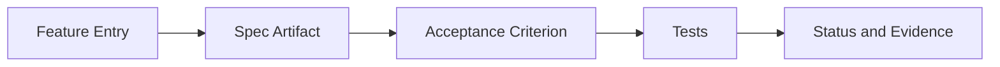

# Spec-Test Traceability — Global

## Purpose

This document is the global traceability matrix. It connects product features to the specifications that define their expected behavior and to the tests that verify that behavior.

This is a **living document**. When a feature is added, modified, or retired, this matrix is updated in the same change set. Component-specific matrices live in each component pack and feed into this global view.

## Traceability Model

Traceability links four artifacts:

1. **Feature** — an entry in [`features-and-phases.md`](features-and-phases.md).
2. **Spec** — the artifact defining expected behavior:
   - OpenAPI operation (under [`../../specs/`](../../specs/)),
   - Component documentation section (workflow, mapping, error model),
   - Canonical signed payload document.
3. **Acceptance criterion** — observable criterion derived from the feature brief or workflow.
4. **Tests** — the suite(s) that verify the acceptance criterion.

## Traceability Matrix

The matrix uses short entries per feature. Detailed acceptance criteria live in each feature brief; detailed test inventories live in each component's traceability document.

| Feature | Primary spec | Acceptance criterion | Test suite | Status |
|---------|--------------|----------------------|------------|--------|
| [`F-enrollment-bind-verify`](features-and-phases.md#f-enrollment-bind-verify) | [Auth API bind/verify](../../docs/ENDPOINT.md), [enrollment payload](../../docs/ENROLLMENT_SIGNATURE_PAYLOAD.md) | Bind and verify are cryptographically linked; verify fails on wrong challenge. | Admin API integration tests; mobile client tests. | `implemented` |
| [`F-auth-pending-respond`](features-and-phases.md#f-auth-pending-respond) | [Auth API pending/respond](../../docs/ENDPOINT.md), [auth attempt payload](../../docs/AUTH_ATTEMPT_SIGNATURE_PAYLOAD.md) | Signed pending response; one-time token; respond verified. | Admin API + Auth API tests; mobile client tests. | `implemented` |
| [`F-mobile-reference-app`](features-and-phases.md#f-mobile-reference-app) | [Mobile pack](../components/mobile/README.md) | User-initiated polling; no background polling; EC P-256 key on keystore. | Mobile unit/component tests. | `implemented` |
| [`F-admin-api-core`](features-and-phases.md#f-admin-api-core) | [Admin API endpoints](../../docs/ENDPOINT.md) | Integrations, enrollments, and auth management operations behave per spec. | Admin API module tests. | `implemented` |
| [`F-admin-ui-shell`](features-and-phases.md#f-admin-ui-shell) | [Admin UI pack](../components/admin-ui/README.md) | Role-aware shell; passwordless login against Demo Device. | Playwright baseline suite. | `implemented` |
| [`F-admin-ui-workflows`](features-and-phases.md#f-admin-ui-workflows) | [Admin UI pack](../components/admin-ui/README.md) | Primary workflows load and mutate correctly with proper role gating. | Playwright elective scenarios; Admin API integration tests. | `in-progress` |
| [`F-admin-lifecycle`](features-and-phases.md#f-admin-lifecycle) | [`lifecycle-model.md`](lifecycle-model.md), [Admin API admin endpoints](../../docs/ENDPOINT.md) | Admin identity and MFA lifecycle remain independent; minimum-admin rule enforced. | Admin API tests; Admin UI gating tests. | `implemented` |
| [`F-tenant-lifecycle`](features-and-phases.md#f-tenant-lifecycle) | [`lifecycle-model.md`](lifecycle-model.md), [Admin API tenant endpoints](../../docs/ENDPOINT.md) | Deactivation blocks downstream without cascading; system tenant protected. | Admin API tests. | `implemented` |
| [`F-encryption-key-rotation`](features-and-phases.md#f-encryption-key-rotation) | [Admin API encryption endpoints](../../docs/ENDPOINT.md) | Rotation creates pending key; re-encryption batches progress; drained verification protects decommissioning. | Admin API tests; re-encryption flow tests. | `in-progress` |
| [`F-audit-chain`](features-and-phases.md#f-audit-chain) | [Admin API audit endpoints](../../docs/ENDPOINT.md) | Chain integrity verifiable; lifecycle observability exposed; heartbeat supervision enforced. | Admin API tests. | `in-progress` |
| [`F-rfc9457-errors`](features-and-phases.md#f-rfc9457-errors) | [ADR-0003](architecture-decisions.md#adr-0003-rfc9457-as-external-error-contract) | Error responses follow Problem Details; clients branch on `type`. | Admin API contract tests; Admin UI translation tests; mobile error mapping tests. | `in-progress` |
| [`F-rate-limiting`](features-and-phases.md#f-rate-limiting) | [Admin API rate limit notes](../../docs/ENDPOINT.md) | Limits enforced per endpoint; 429 responses carry `Retry-After`. | Admin API tests. | `implemented` |
| [`F-integration-api-maturity`](features-and-phases.md#f-integration-api-maturity) | [Integration API endpoints](../../docs/ENDPOINT.md) | Stable M2M contract with documented rate limits. | Integration API tests. | `planned` |
| [`F-api-key-lifecycle`](features-and-phases.md#f-api-key-lifecycle) | [`lifecycle-model.md`](lifecycle-model.md), [Admin API API key endpoints](../../docs/ENDPOINT.md) | Create, rotate with overlap, revoke; no reactivation; IP allowlist supported. | Admin API tests. | `in-progress` |
| [`F-public-site`](features-and-phases.md#f-public-site) | [`sites/ezkey-org`](../../sites/ezkey-org/) | Public site builds, deploys, and reflects current positioning. | Site build checks. | `in-progress` |
| [`F-sdk-and-cli-growth`](features-and-phases.md#f-sdk-and-cli-growth) | SDK and CLI READMEs | Contract-parity with API surfaces; clear example paths. | SDK/CLI smoke tests. | `planned` |
| [`F-provisioning-procedures`](features-and-phases.md#f-provisioning-procedures) | Legacy [ADMIN_PROVISIONING_DEPROVISIONING_PROCEDURE.md](../../docs/ADMIN_PROVISIONING_DEPROVISIONING_PROCEDURE.md) | Procedure documented, audited, and rehearsable. | Exploratory test summary. | `planned` |
| [`F-recovery-codes-lifecycle`](features-and-phases.md#f-recovery-codes-lifecycle) | Legacy [RECOVERY_CODES_LIFECYCLE_ANALYSIS.md](../../docs/RECOVERY_CODES_LIFECYCLE_ANALYSIS.md) | Regeneration invalidates previous codes; single-use enforcement; audit-aligned. | Admin API tests. | `planned` |
| [`F-audit-artifacts`](features-and-phases.md#f-audit-artifacts) | Audit chain and lifecycle endpoints | Exportable artifacts usable for external review. | Admin API tests. | `planned` |

## Coverage Summary

- **Feature count in scope.** 18 (see [`features-and-phases.md`](features-and-phases.md)).
- **Features with `implemented` status.** 9.
- **Features with `in-progress` status.** 6.
- **Features with `planned` status.** 5.

Counts reflect the current document state and are updated when feature status changes.

## Open Gaps

- `F-rfc9457-errors` — not every problem `type` has a locale key yet in Admin UI; owner: Admin UI maintainers; next: complete the locale inventory.
- `F-audit-chain` — lifecycle observability endpoints need human-readable export for compliance review; owner: Admin API maintainers; next: produce an exportable artifact format.
- `F-integration-api-maturity` — stable Integration API contract needs a dedicated feature brief; owner: backend architecture; next: author the brief and its functional flows.

## Update Cadence

- Update the matrix in the same change set as the feature change.
- Review the matrix at the start and end of each phase.
- Promote component-level traceability entries into this global matrix when they materially affect product-level coverage.

## Related Documents

- [`features-and-phases.md`](features-and-phases.md)
- [`roadmap.md`](roadmap.md)
- Component traceability matrices: [admin-ui](../components/admin-ui/spec-test-traceability.md), [admin-api](../components/admin-api/spec-test-traceability.md), [mobile](../components/mobile/spec-test-traceability.md).
