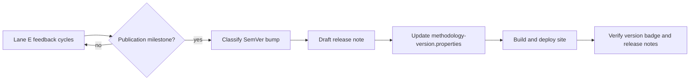

# Methodology Publication and Versioning

## Purpose

This document defines how the **publishable methodology product** is versioned, released, and
presented on `methodology.ezkey.org`.

It is separate from the Ezkey monorepo Maven version. Methodology versioning tracks the public
method-and-templates product that adopters consume through the explorer and download pack.

## When to use this workflow

Use this workflow when you decide the public methodology site should be updated after one or more
Lane E feedback cycles (or equivalent accumulated improvements).

Do **not** bump the methodology version for every internal methodology decision. Decisions are
living institutional memory; the version number marks **published snapshots** that external readers
should notice.

## Canonical version source

File: [`../methodology-version.properties`](../methodology-version.properties)

```properties
version=1.0.0
released=2026-06-02
```

Update this file only as part of a publication release.

## Semantic versioning rules

| Level | Meaning for adopters | Typical triggers |
| --- | --- | --- |
| **MAJOR** | Prior guidance may no longer apply as written | Breaking lane/workflow rename, removed artifact type, incompatible template restructuring |
| **MINOR** | New capability; existing workflows still valid | New template, skill, workflow doc, substantive public decision |
| **PATCH** | Same workflow; clearer or corrected wording | Rephrase, example fix, precision in a skill, typo |

Tie-breaker: if a new template or skill shipped, prefer **MINOR**. If only prose changed, prefer
**PATCH**.

## Publication release workflow



### Steps

1. **Collect signal** — Review recent `methodology/decisions/` (especially `public: true`), template
   changes, new or updated skills, and workflow doc edits since the last release.
2. **Classify the bump** — Apply the SemVer table above. When stuck, invoke the
   `methodology-release` skill.
3. **Instantiate the release note** — Copy
   [`../templates/methodology-release-note.template.md`](../templates/methodology-release-note.template.md)
   into `methodology/release-notes/YYYY-MM-DD-<semver>.md`.
4. **Update the version file** — Set `version` and `released` in
   `methodology-version.properties`.
5. **Build and preview** — From `product-docs/site`: `npm run build` (or `npm start` for local
   preview). Confirm the top-bar version badge and release-notes navigation.
6. **Deploy** — Follow the Cloudflare Pages workflow in the repository's site handoff notes
   (`product-docs/site/HANDOFF-PHASE-4.md`, repo-only).

## Release notes conventions

- **Location:** `methodology/release-notes/`
- **Naming:** `YYYY-MM-DD-<semver>.md` — publication date + version number; no slug.
- **Ordering:** Newest release note first in the site navigation.
- **Tone:** Short, factual, scannable. Link to methodology decisions for rationale; do not
  duplicate full decision text.
- **Scope:** Summarize what changed for an external reader applying the method — not Ezkey product
  delivery items from `product-docs/global/`.

## What this workflow is not

- Not a substitute for Lane E methodology decisions.
- Not tied to Ezkey software releases or Maven `${revision}`.
- Not a per-file changelog. One release note per publication milestone is enough.

## Skill entry point

Prompt:

`Run methodology-release. Review changes since the last methodology version, recommend the SemVer bump, draft the release note, and update methodology-version.properties.`

The skill lives at `.cursor/skills/methodology-release/SKILL.md` in the source repository; the
public explorer exposes a derived copy under **Skills → methodology-release**.

## Related documents

- [`decisions/2026-06-02-methodology-semantic-versioning-and-release-notes.md`](decisions/2026-06-02-methodology-semantic-versioning-and-release-notes.md)
- [`release-notes/README.md`](release-notes/README.md)
- [`README.md`](README.md) — methodology pack entry point
- Site pipeline notes live under `product-docs/site/` in the source repository (repo-only).
