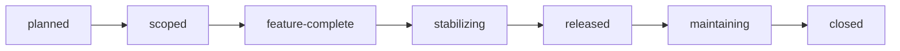

# Release Management Workflow

## Purpose

This workflow defines a lightweight release-management path for repository-native, Evergreen
projects.

It is meant for small to medium projects where releases move forward over time, usually with one
main active line and at most a short-lived stabilization or patch line. It is not a full enterprise
release-train model, long-term-support policy, or multi-product portfolio process.

## When to use this workflow

Use this workflow when a project needs to declare a release boundary:

- a version is being named;
- a set of completed work is being grouped for publication;
- a stabilization branch or release tag is needed;
- release readiness must be reviewed separately from normal feature closeout.

Do not use it for every merged change. A release brief is useful when it clarifies what is included,
what is excluded, and what evidence supports publication.

## Evergreen release model

The default model is **Evergreen**:

- `main` keeps moving forward as the canonical development line.
- A release groups completed and traceable work at a point in time.
- A release branch may be opened for stabilization after feature completion.
- Patch fixes may land on the release branch and should normally be forward-ported to `main`.
- A release branch is not a permanent maintenance universe unless the project explicitly adopts a
  support-window policy.

This keeps release management proportional to projects that evolve continuously, including SaaS-like
deployments, open-source projects with regular forward motion, and small product teams that do not
need multiple long-lived maintenance lines.

## Release brief

Instantiate [`../templates/release-brief.template.md`](../templates/release-brief.template.md) for
each release that needs explicit scope and readiness tracking.

Recommended project-local location:

```text
product-docs/global/releases/REL-YYYY-MM-DD-v<semver>-<slug>.md
```

The release brief is the durable release coordination artifact. It should link to the completed
methodology artifacts that justify inclusion: `I-*`, `TB-*`, test plans, component design notes,
closeout notes, and relevant decisions.

## Lifecycle

| Status | Meaning |
| --- | --- |
| `planned` | Release intent exists, but scope is still forming. |
| `scoped` | Candidate contents are listed and traceable. |
| `feature-complete` | Included work is merged to `main`, closed out, and no new features are expected. |
| `stabilizing` | Release branch or stabilization window is active; fixes and verification continue. |
| `released` | Artifacts were published or deployed. |
| `maintaining` | Patch fixes may still be accepted for this release line. |
| `closed` | No further work is expected on this release line. |

The lightweight path is:



For very small releases, `feature-complete`, `stabilizing`, and `released` may happen in one short
session. Keep the status honest; do not add ceremony for its own sake.

## Scope gate

Before a work item is listed as included in the release:

- the relevant artifact is linked;
- implementation is merged to `main`, or the exception is explicit;
- closeout has updated status and traceability;
- minimum test evidence is recorded;
- known exclusions and residual risks are listed.

The release brief should distinguish:

- **Included** — expected to ship in this release;
- **Excluded** — deliberately not part of this release;
- **Deferred** — still valid, but moved to a later release or normal backlog;
- **Risk / watch item** — included or adjacent work that needs stabilization attention.

## Release branch and tag

Open a release branch when stabilization needs isolation from ongoing work on `main`.

Suggested branch:

```text
release/v<semver>
```

Suggested tag after publication:

```text
v<semver>
```

Project-specific ecosystems may adapt the prefix, but the release brief should record the actual
branch and tag names.

## Patch and hotfix posture

For the Evergreen model:

- patch fixes on a release branch should normally be forward-ported to `main`;
- if a fix is intentionally not forward-ported, record the reason in the release brief;
- if a release-line fix is superseded by a different decision on `main`, link the decision or
  successor artifact;
- urgent fixes may use the shortest safe path, but closeout must restore traceability afterward.

Do not introduce a separate release-maintenance skill until a project has repeated evidence that
manual tracking is drifting.

## Exit criteria

A release is ready to mark `released` when:

- version, date, branch, and tag posture are explicit;
- included work has traceable evidence;
- release notes or operator-facing notes exist when users need them;
- rollback or mitigation posture is known;
- residual risks are accepted or deferred;
- publication or deployment evidence is recorded.

## Related documents

- [`minimum-viable-method.md`](minimum-viable-method.md)
- [`workflow-overview.md`](workflow-overview.md)
- [`artifact-identity-and-review.md`](artifact-identity-and-review.md)
- [`github-issues-workflow.md`](github-issues-workflow.md)
- [`decisions/2026-06-04-evergreen-release-management.md`](decisions/2026-06-04-evergreen-release-management.md)
