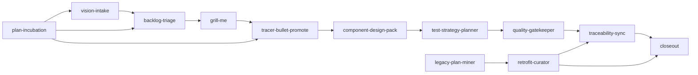

# Skills Explorer

<section class="skills-hero">
  
Derived public layer

  

    This section exposes the methodology skills as a public navigation layer inside the methodology
    site.
  

  

    The source of truth remains <code>.cursor/skills/</code>. The pages here are derived views
    packaged for discoverability, traceability, and public explanation.
  

</section>

## Why skills belong here

- the methodology already depends on named skill boundaries,
- the public site should show how human and AI collaboration becomes operational,
- public discoverability should not require browsing editor-local folders,
- the published view should stay derived so the source of truth remains singular.

## Common boundary contract

Every published skill answers the same four questions:

| Field | Meaning |
| --- | --- |
| Enter when | What condition makes the skill useful now. |
| Exit when | What evidence means the skill has completed its job. |
| Call next | What skill or workflow step usually follows. |
| Not needed when | What condition preserves the fast path. |

See [AI Collaboration Model](#/methodology/ai-collaboration-model.md) for the canonical protocol.

## Skill map

## Workflow skills

  <article class="skill-card skill-card--workflow">
    

      01
      Workflow skill
    

    <h3><a href="#/skills/vision-intake.md"><code>vision-intake</code></a></h3>
    
Captures raw product direction into structured vision notes and backlog-ready seeds. Use when the user shares strategic ideas, product intent evolution, or early feature thoughts.

    

      
<strong>Enter when</strong> the user shares strategic direction, product intent, or early feature ideas.

      
<strong>Call next</strong> <a href="#/skills/backlog-triage.md">backlog-triage</a>, <a href="#/skills/grill-me.md">grill-me</a>

      
<strong>Not needed when</strong> the idea is already a bounded implementation slice ready for TB-* planning.

    

    
<a href="#/skills/vision-intake.md">Open detail</a>

  </article>
  <article class="skill-card skill-card--workflow">
    

      02
      Workflow skill
    

    <h3><a href="#/skills/backlog-triage.md"><code>backlog-triage</code></a></h3>
    
Triages backlog ideas into clear scope, value, risk, and status with standardized metadata. Use when refining I-* entries before promotion to tracer bullet planning.

    

      
<strong>Enter when</strong> an I-* exists or a vision note has enough actionable scope to become one.

      
<strong>Call next</strong> <a href="#/skills/grill-me.md">grill-me</a>, <a href="#/skills/tracer-bullet-promote.md">tracer-bullet-promote</a>

      
<strong>Not needed when</strong> the item is still pure orientation, or the slice is already fully scoped and validated.

    

    
<a href="#/skills/backlog-triage.md">Open detail</a>

  </article>
  <article class="skill-card skill-card--workflow">
    

      03
      Workflow skill
    

    <h3><a href="#/skills/grill-me.md"><code>grill-me</code></a></h3>
    
Runs structured critical questioning on ideas and plans to expose assumptions, exception paths, and hidden risks. Use during analysis before committing to design or execution.

    

      
<strong>Enter when</strong> assumptions, exception paths, lifecycle effects, or boundary risks need pressure-testing.

      
<strong>Call next</strong> <a href="#/skills/backlog-triage.md">backlog-triage</a>, <a href="#/skills/tracer-bullet-promote.md">tracer-bullet-promote</a>, <a href="#/skills/component-design-pack.md">component-design-pack</a>

      
<strong>Not needed when</strong> the change is low-risk, already bounded, and has known validation criteria.

    

    
<a href="#/skills/grill-me.md">Open detail</a>

  </article>
  <article class="skill-card skill-card--workflow">
    

      04
      Workflow skill
    

    <h3><a href="#/skills/tracer-bullet-promote.md"><code>tracer-bullet-promote</code></a></h3>
    
Promotes ready ideas into bounded tracer bullets with vertical-slice scope, boundaries, and evidence criteria. Use when an I-* item is ready for execution planning.

    

      
<strong>Enter when</strong> an I-* is ready and execution needs a bounded vertical slice.

      
<strong>Call next</strong> <a href="#/skills/component-design-pack.md">component-design-pack</a>, <a href="#/skills/test-strategy-planner.md">test-strategy-planner</a>

      
<strong>Not needed when</strong> the item still lacks direction, or the change is a tiny code/doc fix with no workflow slice.

    

    
<a href="#/skills/tracer-bullet-promote.md">Open detail</a>

  </article>
  <article class="skill-card skill-card--workflow">
    

      05
      Workflow skill
    

    <h3><a href="#/skills/component-design-pack.md"><code>component-design-pack</code></a></h3>
    
Builds component-focused design briefs for impacted boundaries, mappings, validation rules, and error handling. Use after tracer bullet definition and before implementation.

    

      
<strong>Enter when</strong> a TB-* or feature scope touches component boundaries, mappings, validations, lifecycle/state behavior, or error behavior.

      
<strong>Call next</strong> <a href="#/skills/test-strategy-planner.md">test-strategy-planner</a>, <a href="#/skills/quality-gatekeeper.md">quality-gatekeeper</a>

      
<strong>Not needed when</strong> the change is local, internal, and does not alter component responsibilities or observable behavior.

    

    
<a href="#/skills/component-design-pack.md">Open detail</a>

  </article>
  <article class="skill-card skill-card--workflow">
    

      06
      Workflow skill
    

    <h3><a href="#/skills/test-strategy-planner.md"><code>test-strategy-planner</code></a></h3>
    
Plans a risk-based test strategy for a bounded change slice across unit, functional, elective, operational, and UI layers. Use when preparing analysis/design, tracer bullets, or implementation plans and when deciding which tests are necessary, relevant, cheap, and high-confidence.

    

      
<strong>Enter when</strong> a change has known risks and needs explicit test-layer selection.

      
<strong>Call next</strong> <a href="#/skills/quality-gatekeeper.md">quality-gatekeeper</a>, <a href="#/skills/traceability-sync.md">traceability-sync</a>

      
<strong>Not needed when</strong> the change is purely editorial and does not affect behavior, contracts, workflows, or validation.

    

    
<a href="#/skills/test-strategy-planner.md">Open detail</a>

  </article>
  <article class="skill-card skill-card--workflow">
    

      07
      Workflow skill
    

    <h3><a href="#/skills/quality-gatekeeper.md"><code>quality-gatekeeper</code></a></h3>
    
Applies quality gates across analysis, design, implementation, tests, and documentation traceability. Use before execution and before closing work to prevent drift.

    

      
<strong>Enter when</strong> work is about to move from analysis to execution, or from execution to closeout.

      
<strong>Call next</strong> implementation after go, or targeted design/test/traceability work after no-go.

      
<strong>Not needed when</strong> the task is a trivial change with no analysis, contract, test, or traceability impact.

    

    
<a href="#/skills/quality-gatekeeper.md">Open detail</a>

  </article>
  <article class="skill-card skill-card--workflow">
    

      08
      Workflow skill
    

    <h3><a href="#/skills/traceability-sync.md"><code>traceability-sync</code></a></h3>
    
Synchronizes feature, specification, and test traceability across global and component documentation. Use when feature status, behavior, or validation evidence changes.

    

      
<strong>Enter when</strong> feature status, behavior, specs, tests, or validation evidence changed.

      
<strong>Call next</strong> <a href="#/skills/closeout.md">closeout</a>

      
<strong>Not needed when</strong> no observable behavior, contract, feature status, or validation evidence changed.

    

    
<a href="#/skills/traceability-sync.md">Open detail</a>

  </article>
  <article class="skill-card skill-card--workflow">
    

      09
      Workflow skill
    

    <h3><a href="#/skills/closeout.md"><code>closeout</code></a></h3>
    
Closes workflow slices with explicit status transitions, residual risk notes, and next-step clarity. Use at the end of tracer bullets, feature slices, or implementation cycles.

    

      
<strong>Enter when</strong> a TB-*, feature slice, blitz integration, retrofit slice, or implementation cycle is ending.

      
<strong>Call next</strong> no next skill by default; reopen triage, traceability sync, or retrofit only for named follow-up work.

      
<strong>Not needed when</strong> the work is still actively changing or required evidence is not yet available.

    

    
<a href="#/skills/closeout.md">Open detail</a>

  </article>
  <article class="skill-card skill-card--workflow">
    

      10
      Workflow skill
    

    <h3><a href="#/skills/plan-incubation.md"><code>plan-incubation</code></a></h3>
    
Incubates a live working plan, then materializes durable output into product-docs with mandatory bidirectional traceability. Use when starting from a current-session plan under .cursor/plans/, plans/, or .github/prompts/plan-*.prompt.md before creating V-*, I-*, or TB-* artifacts.

    

      
<strong>Enter when</strong> the operator deliberately starts from a current-session working plan before canonical docs.

      
<strong>Call next</strong> <a href="#/skills/vision-intake.md">vision-intake</a>, <a href="#/skills/backlog-triage.md">backlog-triage</a>, <a href="#/skills/tracer-bullet-promote.md">tracer-bullet-promote</a>

      
<strong>Not needed when</strong> the source is historical retrofit input or the request is already a direct implementation task.

    

    
<a href="#/skills/plan-incubation.md">Open detail</a>

  </article>

## Legacy retrofit skills

  <article class="skill-card skill-card--retrofit">
    

      11
      Legacy retrofit skill
    

    <h3><a href="#/skills/legacy-plan-miner.md"><code>legacy-plan-miner</code></a></h3>
    
Mines legacy project knowledge (historical plans, verbal briefings, ad hoc implementation history) to extract decisions, invariants, patterns, risks, and test signal. Use for weekly or opportunistic retrofit sessions.

    

      
<strong>Enter when</strong> historical plans, verbal history, or ad hoc implementation history contain reusable signal.

      
<strong>Call next</strong> <a href="#/skills/retrofit-curator.md">retrofit-curator</a>

      
<strong>Not needed when</strong> the source is a current-session working plan, which belongs to plan-incubation.

    

    
<a href="#/skills/legacy-plan-miner.md">Open detail</a>

  </article>
  <article class="skill-card skill-card--retrofit">
    

      12
      Legacy retrofit skill
    

    <h3><a href="#/skills/retrofit-curator.md"><code>retrofit-curator</code></a></h3>
    
Curates legacy retrofit slices by mapping extracted signal (plans, verbal, ad hoc) into canonical product-docs destinations, recording residual gaps, and promoting principle candidates when relevant.

    

      
<strong>Enter when</strong> mined historical signal needs mapping into canonical product-docs destinations.

      
<strong>Call next</strong> <a href="#/skills/traceability-sync.md">traceability-sync</a>, <a href="#/skills/closeout.md">closeout</a>

      
<strong>Not needed when</strong> there is no reusable signal, or the source already lives in current canonical docs.

    

    
<a href="#/skills/retrofit-curator.md">Open detail</a>

  </article>

## Additional skills

  <article class="skill-card skill-card--additional">
    

      13
      Method skill
    

    <h3><a href="#/skills/methodology-release.md"><code>methodology-release</code></a></h3>
    
Classifies a methodology SemVer bump, drafts a release note, and updates the canonical version file when publishing to methodology.ezkey.org. Use after a publication milestone following Lane E feedback cycles.

    

      
<strong>Enter when</strong> a publication milestone is declared — enough methodology improvements justify

      
<strong>Call next</strong> site build/preview, then Cloudflare deploy per product-docs/site/HANDOFF-PHASE-4.md.

      
<strong>Not needed when</strong> changes are repo-only Lane E decisions with no public site update planned,

    

    
<a href="#/skills/methodology-release.md">Open detail</a>

  </article>

## Method links

- [Methodology Pack](#/methodology/README.md)
- [Session Start Guide](#/methodology/session-start-guide.md)
- [AI Collaboration Model](#/methodology/ai-collaboration-model.md)
- [Rich methodology view](#/methodology/view/index.html)
