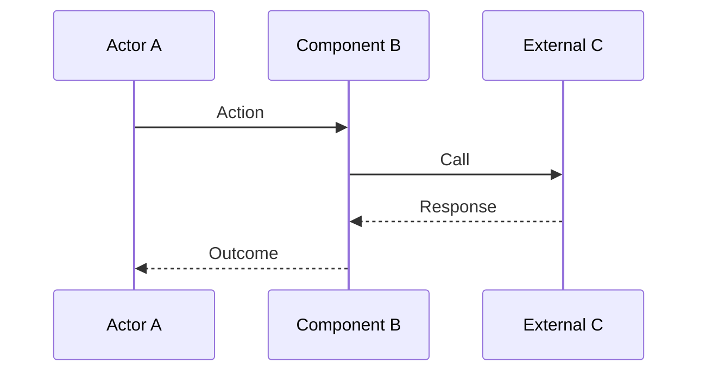

# Functional Workflow — `<workflow-id>` `<workflow name>`

> Template for a single workflow inside a component's `functional-flows.md`. Remove this blockquote on instantiation.

## Intent

One short paragraph describing what this workflow accomplishes and who triggers it.

## Actors

- **`<actor>`** — short description (user, operator role, component, external system).

## Preconditions

Bulleted list of conditions that must hold before the workflow can start.

## Postconditions

Bulleted list of conditions that must hold after a successful run.

## Nominal Flow

Describe the step-by-step nominal flow. Prefer a numbered list followed by a sequence diagram when the flow crosses multiple actors.

1. Actor performs action.
2. Component reacts and transitions state.
3. ...

## Decision Points

Where the flow branches based on state or input.

| Decision | Condition | Branch |
|----------|-----------|--------|
| `<decision name>` | `<condition>` | Go to step `<n>` / sub-workflow `<id>`. |

## Exception Paths

For each exception:

### `<exception-id>` `<short name>`

- **Trigger.** Condition that causes the exception.
- **Outcome.** User-visible or system-visible outcome.
- **Recovery.** What the user, operator, or system can do next.
- **Reference.** Link to [`exception-and-error-model.md#<anchor>`](exception-and-error-model.md#<anchor>).

## Boundaries Crossed

List the boundaries this workflow traverses and link to their mapping matrices.

- `<component>` ↔ `<external API or module>` — [`api-and-boundary-mappings.md#<anchor>`](api-and-boundary-mappings.md#<anchor>).

## Persistence Interactions

Short list of persistence effects. Link to [`data-model-and-persistence.md`](data-model-and-persistence.md) entries.

- Writes to `<entity>` when `<condition>`.

## Acceptance Criteria

- Observable criteria that define a successful run of this workflow.

## Related Documents

- Feature entries in [`../../global/features-and-phases.md`](../../global/features-and-phases.md).
- Spec and test entries in [`spec-test-traceability.md`](spec-test-traceability.md).
