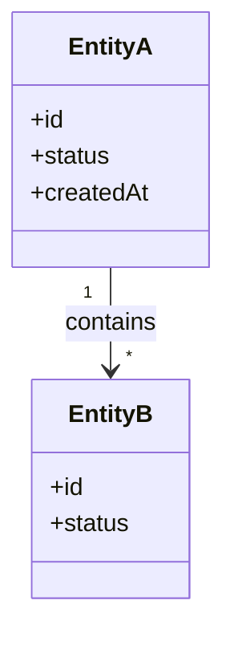
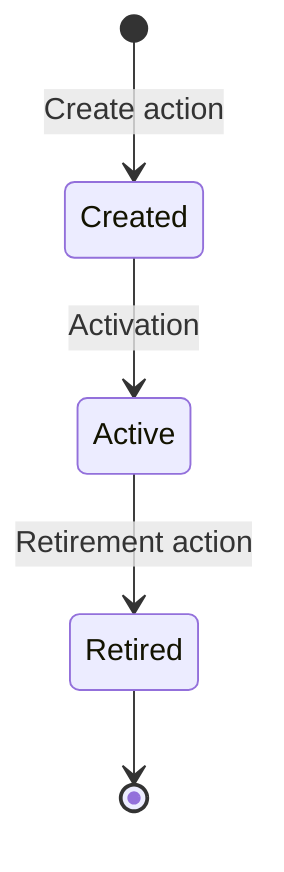

# Persistence and Lifecycle — `<component>`

> Template for a component's `data-model-and-persistence.md`, or for the global `lifecycle-model.md`. Remove this blockquote on instantiation.

## Intent

One short paragraph describing what this document covers: the entities this component owns, their persistence characteristics, and their lifecycle rules.

## Ownership and Boundaries

- **Owned entities.** Entities whose source of truth lives in this component.
- **Referenced entities.** Entities owned elsewhere but referenced here. Link to the owning component.

## Conceptual Data Model

Describe entities in prose first, then a diagram. Keep attributes minimal — only the ones that matter for understanding intent.

## Entity Reference

For each entity:

### `<EntityName>`

- **Purpose.** One line describing the entity's role.
- **Source of truth.** Where the entity is persisted.
- **Key attributes.** Bulleted list of the attributes that matter for understanding lifecycle and mappings.
- **Relationships.** Parent, children, and cross-references.
- **Lifecycle.** See the lifecycle section below.

## Lifecycle Rules

Describe the lifecycle of each entity that has non-trivial state transitions.

### `<EntityName>` Lifecycle

- **States.** Short description of each state and when it applies.
- **Transitions.** What triggers each transition (action, event, scheduler).
- **Guards.** Conditions that must hold for a transition to occur.
- **Reason policy.** Whether a written reason is required and why.
- **Audit behavior.** Which transitions are audited and how.

## Persistence Rules

- **Storage technology.** Database, keystore, secure storage, in-memory only.
- **Encryption at rest.** If applicable, link to the encryption key documentation.
- **Retention.** How long data is kept; what triggers archival or deletion.
- **Consistency.** Transactional expectations and concurrency rules.

## Cross-Boundary Effects

When persistence effects span components, describe how consistency is maintained.

- **Propagation rules.** How changes reach other components.
- **Eventual vs transactional.** Which path applies to which change.
- **Compensation.** How failures are reconciled.

## Related Documents

- [Functional flows](functional-flows.md) that produce these persistence effects.
- [Mapping matrices](api-and-boundary-mappings.md) that translate persisted state across boundaries.
- [Exception and error model](exception-and-error-model.md) for state conflicts and persistence failures.
- [Global lifecycle model](../../global/lifecycle-model.md) when the entity is part of the product-wide lifecycle.
