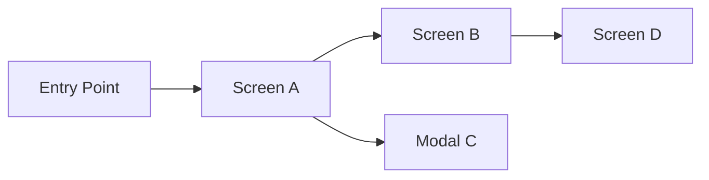

# Screens and Wireflow — `<component>`

> Template for a UI-bearing component's `screens-and-wireflow.md` (Admin UI, Mobile). Remove this blockquote on instantiation.

## Intent

One short paragraph describing what this document answers: what screens exist, how they connect, and what each screen is responsible for.

## Navigation Model

Describe the navigation model (routing, stacks, tabs, modals). Keep the description technology-neutral; link to the stack document for implementation details.

## Screen Inventory

For each primary screen:

### `<screen-id>` `<screen name>`

- **Route or path.** `<route>` when applicable.
- **Primary actor.** Role (Global Admin, Tenant Admin, end user, anonymous).
- **Purpose.** One short paragraph.
- **Primary actions.** Bulleted list of the main actions the screen exposes.
- **Displayed data.** What the screen shows and where that data comes from.
- **Visibility and gating.** Role-based visibility, feature flags, lifecycle gating.
- **Related workflow.** Link to the workflow in [`functional-flows.md`](functional-flows.md).
- **Related mappings.** Link to the mapping matrix in [`api-and-boundary-mappings.md`](api-and-boundary-mappings.md).

## Wireflow Patterns

Describe recurring patterns (list + detail, create dialog, wizard, approval panel). Keep patterns general and link to concrete screens as examples.

## Accessibility and Internationalization

- Language support (locales, fallback rules).
- Accessibility expectations (keyboard navigation, focus management, minimum contrast).

## Visual Identity (optional)

Short summary of the visual identity for this component. Prefer linking to the authoritative design asset instead of describing it here in full.

## Related Documents

- [Functional flows](functional-flows.md).
- [Mapping matrices](api-and-boundary-mappings.md).
- [Exception and error model](exception-and-error-model.md).
