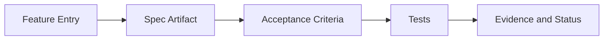

# Spec-Test Traceability — `<scope>`

> Template for a product-wide or component-level `spec-test-traceability.md`. Remove this
> blockquote on instantiation.

## Intent

One short paragraph describing what this traceability covers and how it supports spec-first, test-driven work.

## Traceability Model

The traceability links four artifacts:

1. **Feature** — an entry in the product feature catalog (or the global catalog for a global
    matrix).
2. **Spec** — the artifact that defines expected behavior (OpenAPI operation, internal spec section, workflow document, mapping matrix).
3. **Acceptance criteria** — observable criteria from the feature brief or workflow document.
4. **Tests** — the suites that verify the acceptance criteria.

## Traceability Matrix

| Feature        | Spec          | Acceptance criterion     | Test suite | Test identifier | Status                    |
| -------------- | ------------- | ------------------------ | ---------- | --------------- | ------------------------- |
| `<feature-id>` | `<spec link>` | `<observable criterion>` | `<suite>`  | `<test id>`     | `planned` / `implemented` |

## Coverage Summary

- **Feature count.** Total features in scope of this matrix.
- **Covered features.** Features with at least one passing test for each criterion.
- **Gaps.** Features with missing tests or specs.

## Open Gaps

List unresolved gaps with an owner and a proposed next step. Remove entries when resolved.

- `<feature-id>` — `<gap description>` — owner: `<role>` — next: `<action>`.

## Update Cadence

- When a feature is added or modified, update this matrix in the same change set.
- When a test is added or removed, update the matrix in the same change set.
- Review the matrix at the start and end of each milestone or bounded delivery cycle.

## Related Documents

- product feature catalog
- product roadmap
- component-level matrices
