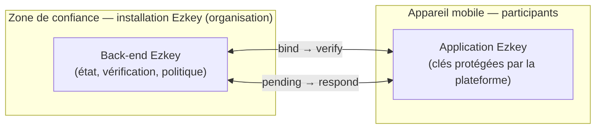

# Ezkey en un coup d’œil — zone de confiance, mobile et flux essentiels

<!-- ezkey-org:exclude-start
Note rédaction : statut / canal de publication — ne pas reprendre tel quel dans le HTML public (le HTML peut afficher une ligne « brouillon » séparée si besoin).
**Statut :** brouillon de travail (révision collaborative). Texte destiné à une publication sur ezkey.org (fr).
ezkey-org:exclude-end -->

## Mise en contexte

Ezkey est une plateforme MFA cryptographique **open source**, pensée pour les équipes qui veulent une authentification forte **sans la réduire à une histoire de navigateur ni à l’empilement de protocoles généralistes complexes**. La proposition est volontairement **backend-first** : la confiance repose sur des APIs claires, un état serveur explicite et une **continuité cryptographique** entre les acteurs — avec un mobile qui participe à la chaîne de manière **concrète et vérifiable**.

<!-- ezkey-org:exclude-start
Objectif rédactionnel (positionnement) — ne pas publier dans le HTML :
Objectif : un schéma mental lisible — où vit la confiance, qui échange quoi — pour un lecteur avec des **notions informatiques générales**, sans détails d’implémentation.
ezkey-org:exclude-end -->

---

## La chaîne de confiance : deux socles

Au niveau le plus global, la confiance dans Ezkey repose sur **deux références complémentaires** :

1. **L’organisation comme référence de confiance**  
   C’est l’**installation Ezkey** déployée **dans l’environnement de l’organisation** (on-prem ou équivalent). Elle définit **où** s’exerce la politique, **qui** administre le service, et **quel** back-end porte la vérité opérationnelle et cryptographique pour les intégrations. Conceptuellement, c’est le **socle institutionnel** : l’équipe sait qu’elle s’appuie sur **son** instance, **sous son contrôle**, et non sur une médiation opaque ou extérieure.

2. **La confiance liée au participant et à son appareil**  
   Chaque utilisateur s’appuie sur une **clé cryptographique** associée à son appareil, protégée par les **mécanismes de sécurisation que la plateforme mobile offre** (stockage matériel ou fortement isolé selon les capacités du terminal). Ce n’est pas un détail cosmétique : c’est le **socle utilisateur** de la chaîne — la garantie que l’identité et les preuves présentées depuis le mobile **restent liées à un matériel et à un contexte** que l’utilisateur peut raisonnablement considérer comme dignes de confiance.

Ces deux socles ne se substituent pas l’un à l’autre : ils **s’articulent**. Le back-end Ezkey **vérifie** et **orchestre** ; le mobile **détient** et **utilise** des clés dans un environnement **conçu pour les protéger** — ce qui fait du mobile un **acteur à part entière** de la zone de confiance, pas un simple « écran » à côté du serveur.

---

## Côté organisation : une installation, une zone de confiance

**Une installation Ezkey = la zone de confiance de l’organisation** : socle serveur pour l’état, les vérifications et les politiques — **sous contrôle** de l’organisation.

<!-- ezkey-org:exclude-start
Note rédaction : ne pas détailler l’infra dans cet article (équivalent de l’ancienne mention « détail d’infra volontairement hors cadre ici »).
ezkey-org:exclude-end -->

---

## Côté mobile : sécurisation native et participation à la vérité

L’application mobile Ezkey **s’appuie sur les API et abstractions de sécurisation inhérentes aux plateformes mobiles** — en particulier le **stockage protégé des clés** (y compris, lorsque le matériel le permet, des chemins renforcés du type matériel dédié à la protection cryptographique). Sans entrer dans le jargon fournisseur, l’idée est simple : **le participant peut avoir confiance que l’usage du mobile, dans ce modèle, ajoute une couche de protection réelle** — celle que le système d’exploitation et le matériel associent à la **garde des secrets** et à leur utilisation contrôlée.

Ce choix fait partie de l’**ADN d’Ezkey** : le produit **réutilise** ce que les plateformes font déjà bien pour l’identité locale sur l’appareil, au lieu de prétendre que l’interface seule suffit. Le mobile n’est donc pas un intermédiaire faible : il est **le lieu** où la preuve utilisateur prend sens **dans un environnement durci**, en cohérence avec le back-end qui **valide** cette preuve dans le flux global.

Beaucoup d’« authenticateurs » se contentent d’un **code à recopier** ou d’une **confirmation par tap** : la sécurité repose alors sur le **canal humain** (lecture, copie, dictée), pas sur une **preuve liée cryptographiquement** à la tentative en cours. L’app Ezkey ne joue pas ce rôle : les **réponses** s’inscrivent dans le protocole et les **clés** protégées sur l’appareil — ce n’est pas un **code à six chiffres renouvelé** qu’on peut **recopier hors du flux** comme avec les générateurs habituels, ni un « oui » **découplé** du contexte serveur.

---

## Les flux essentiels

<!-- ezkey-org:exclude-start
Titre de travail alternatif (plus long) : « Les flux au sommaire (sans sur-détailler) » — le qualificatif « sans sur-détailler » est une consigne rédactionnelle, pas un titre public.
ezkey-org:exclude-end -->

**Inscription / rattachement d’un appareil**  
- **`bind`** puis **`verify`** : établissement d’une relation **cryptographiquement liée** entre le contexte d’intégration, le back-end et l’appareil.

**Authentification**  
- **`pending`** puis **`respond`** : création d’une tentative côté serveur, notification côté mobile, réponse avec preuve adaptée ; le back-end **vérifie** et **tranche** l’état final.

<!-- ezkey-org:exclude-start
Schéma : source Mermaid pour illustration ; le HTML publié utilise un diagramme statique équivalent.
Schéma logique (à transposer en illustration) :

ezkey-org:exclude-end -->

---

## Pourquoi cette approche

<!-- ezkey-org:exclude-start
Sous-titre de travail : « (bénéfices, concis) » — consigne de ton / longueur, pas titre public.
ezkey-org:exclude-end -->

- **APIs REST simples et bien documentées** pour les équipes qui les intègrent.  
- **Deux niveaux de confiance clairs** : **référence organisationnelle** (l’instance Ezkey) et **référence utilisateur/appareil** (clés protégées par les mécanismes natifs du mobile).  
- **Continuité cryptographique** : `bind`/`verify` et `pending`/`respond` **établissent** des **liens de preuve** **signés** et **validés formellement** par le processus cryptographique — ce ne sont pas de simples libellés.  
- **Maîtrise et transparence** : déploiement **dans la zone de l’organisation**, produit **inspectable** (open source).

---

## Conclusion — positionnement

Ezkey se positionne comme une alternative **backend-first** à une MFA centrée navigateur, médiateurs ou standards généralistes : **API-first**, **auto-hébergée**, **cryptographiquement continue** — serveur qui **porte la référence organisationnelle**, mobile qui **exploite les garanties plateforme** pour les clés. Ce n’est pas une promesse d’interface : un **modèle à deux socles** (organisation + participant/appareil), **pragmatique** pour **comprendre, intégrer et opérer** sans la complexité d’un écosystème imposé.
